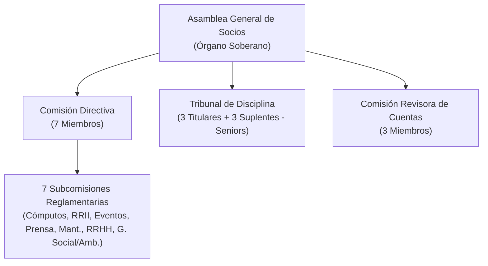
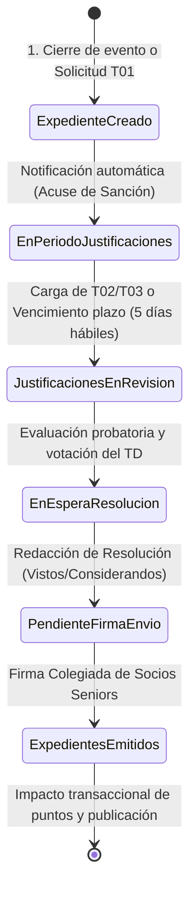

# SGD-AVEIT — Sistema de Gestión del Tribunal de Disciplina y Premiaciones

<div align="center">

[](https://www.frc.utn.edu.ar/)
[](#contexto-académico)
[](#metodología-de-desarrollo)
[](#stack-tecnológico)
[](#stack-tecnológico)
[](#stack-tecnológico)
[](LICENSE)

**Trabajo Práctico Integrador — Cátedra de Seminario Integrador**  
*Carrera de Analista Desarrollador Universitario de Sistemas de Información*  
**Universidad Tecnológica Nacional — Facultad Regional Córdoba (UTN FRC)**

</div>

---

## 📋 Tabla de Contenidos

- [Descripción General](#-descripción-general)
- [Contexto Institucional (A.V.E.I.T.)](#-contexto-institucional-aveit)
- [Objetivos del Sistema](#-objetivos-del-sistema)
- [Funcionalidades Principales](#-funcionalidades-principales)
- [Flujo Procesal del Expediente](#-flujo-procesal-del-expediente)
- [Formularios y Competencias Administrativas](#-formularios-y-competencias-administrativas)
- [Régimen Disciplinario y Sistema de Puntos](#-régimen-disciplinario-y-sistema-de-puntos)
- [Arquitectura y Stack Tecnológico](#-arquitectura-y-stack-tecnológico)
- [Estructura del Repositorio e Índice de Carpetas](#-estructura-del-repositorio-e-índice-de-carpetas)
- [Equipo de Desarrollo](#-equipo-de-desarrollo)
- [Metodología de Trabajo](#-metodología-de-trabajo)
- [Licencia](#-licencia)

---

## 📖 Descripción General

**SGD-AVEIT** es una plataforma de software **100% Web y Responsive Mobile** orientada a sistematizar, auditar y transparentar la gestión integral de expedientes disciplinarios y reconocimientos al mérito de la **Asociación Vocacional de Estudiantes e Ingenieros Tecnológicos (A.V.E.I.T.)** en la UTN FRC.

El sistema reemplaza el uso fragmentado de planillas de cálculo y la manipulación manual de registros, automatizando:
- La tramitación digital de expedientes según el **Reglamento Procesal Disciplinario 2026**.
- La gestión de descargos y justificaciones tipificadas (**Formularios T01, T02 y T03**) con adjuntos digitales.
- El control automático de plazos preclusivos (**5 días hábiles**).
- La deliberación y votación remota con **firma colegiada** de Socios Seniors.
- El cómputo algorítmico y transaccional de saldos de puntos (+/-), prohibiendo modificaciones no auditadas.
- La activación de alertas escalonadas (7 pts preventivo y 10 pts crítico por pérdida de condición de socio).
- La emisión instantánea de **Balances Cuatrimestrales de Auditoría Interna** (Art. 137 del Reglamento Interno).

---

## 🏛 Contexto Institucional (A.V.E.I.T.)

Fundada en **1965**, la **Asociación Vocacional de Estudiantes e Ingenieros Tecnológicos** es una asociación civil autogestionada de la UTN FRC con más de 500 socios activos. Su programa formativo complementa la instrucción técnica con competencias blandas, liderazgo y trabajo en equipo, teniendo como eje pedagógico cumbre un **Viaje Técnico-Cultural de tres meses por centros industriales y científicos de Europa**.

### Estructura Orgánica y Masa Societaria



- **Segmentación Estatutaria de Socios:**
  - **Socios Juniors (1º y 2º año social):** Etapa formativa y de integración institucional.
  - **Socios Seniors (3º a 6º año social):** Conducción operativa en subcomisiones, elegibilidad para órganos estatutarios (TD/CD) y preparación al Viaje Final de Estudios.
- **Tribunal de Disciplina (TD):** Órgano jurisdiccional independiente de 6 miembros (3 titulares, 3 suplentes) electos por Asamblea entre los Socios Seniors, responsable de velar por la convivencia, juzgar infracciones y otorgar premios.

---

## 🎯 Objetivos del Sistema

1. **Garantizar la Integridad y Transaccionalidad:** Eliminar sentencias `UPDATE` directas sobre la base de datos MySQL y la dispersión en Google Sheets, registrando pistas de auditoría inalterables en cada operación.
2. **Promover la Transparencia Pública:** Proveer un portal web accesible desde smartphones y ordenadores para que los socios consulten su historial de puntos, sanciones y resoluciones fundamentadas.
3. **Optimizar el Cumplimiento de Plazos:** Automatizar el cómputo de plazos procesales improrrogables (5 días hábiles) con sellado de tiempo y despacho automático de notificaciones por email.
4. **Facilitar el Trabajo Remoto / Mobile del TD:** Dotar al Tribunal de herramientas para sustanciar sesiones virtuales, emitir votos nominales fundados y formalizar resoluciones con firma colegiada digital.
5. **Cumplir con el Marco Estatutario:** Automatizar la generación de balances cuatrimestrales de auditoría (Art. 137) clasificados por socio, subcomisión y grupo social (Juniors/Seniors).

---

## ⚙️ Funcionalidades Principales

| Módulo / Función | Descripción |
| :--- | :--- |
| 📱 **Portal "Mis Expedientes" (Responsive)** | Consulta en tiempo real de saldos de puntos, expedientes en curso, historial de resoluciones y alertas tempranas. |
| 📝 **Digitalización T01 / Anexo** | Inicio formal de solicitudes de sanción o premiación por autoridades competentes con validación de atribuciones. |
| 📎 **Descargos Digitales (T02 / T03)** | Carga de justificaciones tipificadas (médicas, académicas, viajes) y descargos extraordinarios con adjuntos en PDF/imágenes. |
| ⏱️ **Control de Plazos Preclusivos** | Cronómetro regresivo de 5 días hábiles desde la notificación del acuse de sanción. |
| 🗳️ **Sesión Virtual y Firma Colegiada** | Votación nominal de los miembros del TD, redacción jurídica (Vistos, Considerandos, Resolución) y firma colegiada de Seniors. |
| 🧮 **Motor de Cómputo y Pistas de Auditoría** | Actualización algorítmica de saldos, registro de rectificaciones auditadas y prohibición de modificaciones arbitrarias. |
| 🚨 **Sistema de Alertas Escalonadas** | Alerta preventiva amarilla (7 pts negativos) y alerta roja crítica de pérdida automática de condición de socio (10 pts negativos). |
| 📊 **Generador de Balances Cuatrimestrales** | Emisión automática de informes de auditoría interna consolidados por períodos semestrales para Asambleas y CD. |

---

## 🔄 Flujo Procesal del Expediente

El sistema implementa de forma estricta los **seis (6) estados oficiales del expediente** definidos en el Reglamento Procesal Disciplinario 2026 (Art. 12):



---

## 📑 Formularios y Competencias Administrativas

### Catálogo de Formularios Oficiales
* **Formulario T01 + Anexo:** Solicitud formal de sanción o premiación elevada por una autoridad habilitada.
* **Formulario T02 (Justificación Tipificada):** Descargo basado en causales reglamentarias (enfermedad con certificado, exámenes, viajes de fuerza mayor con pasajes).
* **Formulario T03 (Descargo Extraordinario):** Exposición de circunstancias extraordinarias sujetas a la sana crítica del TD y jurisprudencia interna.
* **Circular 001/2026:** Baremos y pautas normativas de graduación de puntos fijadas por el TD.

### Mapa de Competencias de Inicio (Arts. 21 a 26)
* **Comisión Directiva:** Sobre cualquier socio activo (Junior/Senior) o equipo, excepto miembros de su propio cuerpo.
* **Comisión Fiscalizadora:** Sobre socios activos, CD, Comisión Revisora y miembros del TD.
* **Tribunal de Disciplina:** Actuación de oficio o rectificación (con abstención de juzgamiento del solicitante).
* **Presidentes de Subcomisión:** Sobre miembros ordinarios o voluntarios a su cargo.
* **Jefes de Equipos Temporales:** Sobre los integrantes directos de su grupo de trabajo.

---

## ⚖️ Régimen Disciplinario y Sistema de Puntos

- **Escala de Premios (Puntos Positivos):**
  - Leve: +0.5 a +1 pto
  - Media: +1 a +2 ptos
  - Sobresaliente: +2 a +4 ptos
- **Escala de Sanciones (Puntos Negativos):**
  - Inasistencia injustificada a Reunión Obligatoria: **-1.0 pto**
  - Inasistencia injustificada a Asamblea: **-2.0 ptos**
  - Omisión de tareas de Mantenimiento / Limpieza: **-2.0 ptos**
  - Omisión / Incumplimiento de Tareas Asignadas en Subcomisión: **Llamado de atención hasta -2.0 ptos**
  - Llegadas tarde / retiros anticipados: **Llamado de atención o -0.5 ptos**
- **Límite Crítico Estatutario (Art. 93 Reglamento Interno):**  
  > ⚠️ **Pérdida Automática de la Condición de Socio:** Todo socio que alcance o supere **diez (10) puntos negativos netos** pierde automáticamente su pertenencia a AVEIT.

---

## 💻 Arquitectura y Stack Tecnológico

La solución se concibe como una extensión modular e integrada al ecosistema informático institucional preexistente de AVEIT:

```
+─────────────────────────────────────────────────────────+
|                  CLIENTE / FRONTEND                     |
|      100% Web & Responsive Mobile (Desktop / Mobile)    |
+────────────────────────────┬────────────────────────────+
                             │ HTTPS / REST API
+────────────────────────────v────────────────────────────+
|                  BACKEND INSTITUCIONAL                  |
|          Servicios Web & Lógica de Negocio (Python)      |
+────────────────────────────┬────────────────────────────+
                             │ ORM / Conector SQL
+────────────────────────────v────────────────────────────+
|                   BASE DE DATOS                         |
|             Base de Datos Relacional (MySQL)            |
|       Integridad Referencial y Auditoría Transaccional  |
+─────────────────────────────────────────────────────────+
```

- **Plataforma:** Aplicación Web Responsive (Mobile-First) apta para navegación fluida en smartphones Android/iOS y navegadores desktop.
- **Backend:** Python (Integración con servicios centrales institucionales).
- **Base de Datos:** MySQL (Servidor central AVEIT, almacenamiento transaccional y padrón de socios).
- **Infraestructura:** Servidor Central ubicado en la Sede Social AVEIT (Red UTN FRC) con soporte para acceso remoto seguro.

---

## 📂 Estructura del Repositorio e Índice de Carpetas

```text
seminario-integrador/
├── .github/                                     # Gobernanza y plantillas de issues para desarrollo y testing
│   └── ISSUE_TEMPLATE/                         # Plantillas para tareas de sprint y reportes de incidencias
├── backend/                                     # Servicios API REST en Python / Django (Spec 001 - En desarrollo)
├── frontend/                                    # SPA de producción en Angular 14 + Material Dashboard PRO
├── prototipos/                                 # Prototipos interactivos de alta fidelidad en HTML5/CSS/JS puro
│   ├── t01-solicitud-puntos/                   # Maqueta del Formulario T01 y Anexo Circunstanciado
│   ├── index.html                              # Portal del Tribunal de Disciplina y Premiaciones
│   ├── app.js                                  # Lógica interactiva del prototipo (5 estados y votación)
│   └── styles.css                              # Tokens visuales y estilos del prototipo
├── docs/                                       # Documentación funcional, técnica, formal y normativa
│   ├── analisis-proceso-actual/                # Análisis del sistema/proceso actual (AS-IS) y antecedentes
│   │   ├── reglamentos-aveit/                  # Marco normativo y estatutario oficial de A.V.E.I.T.
│   │   │   ├── NOR_Estatuto_AVEIT_Reforma_2026.pdf
│   │   │   ├── NOR_Reglamento_Interno_Disciplina_AVEIT_2026.pdf
│   │   │   ├── NOR_REGLAMENTO PROCESAL DISCIPLINARIO (version 2026).pdf
│   │   │   └── NOR_REGLAMENTO PROCESAL DISCIPLINARIO (version 2018).pdf
│   │   ├── TPI_Estudio_Inicial_SGD_AVEIT.md    # Estudio Inicial y diagnóstico del sistema previo
│   │   ├── BPMN_Proceso_Operativo_Tribunal.md  # Modelo BPMN 2.0 del proceso operativo actual
│   │   ├── ACTORES_DEL_SISTEMA_SGD_AVEIT.md    # Catálogo de actores y competencias reglamentarias
│   │   ├── modulo-tribunal-stack-y-modelos.md  # Referencia técnica del sistema legado a reemplazar
│   │   └── extracted_requirements.json         # Requerimientos extraídos del relevamiento
│   ├── especificaciones/                       # Especificaciones de ingeniería de software (TO-BE)
│   │   ├── ERS-SGD-AVEIT.md                    # Especificación de Requerimientos de Software completa
│   │   ├── ERS_Especificacion_Requerimientos_Tribunal.md  # Requerimientos del módulo Tribunal
│   │   ├── Escenarios_Calidad_ISO25010_Tribunal.md        # Escenarios de calidad ISO/IEC 25010
│   │   ├── MODELO_DOMINIO_SGD_AVEIT.md         # Diagrama de clases de dominio y diccionario de datos
│   │   └── PLANTILLA_CASO_DE_USO.md            # Plantilla institucional para especificación de CU-XX
│   ├── gestion-proyecto/                       # Gestión ágil, planificación y acuerdos metodológicos
│   │   ├── PLAN_DE_PROYECTO_SGD_AVEIT.md       # Plan de proyecto institucional
│   │   └── Seguimiento de Proyecto.md          # Acuerdos de trabajo ágil, DoD/DoR y Product Backlog
│   ├── formales/                               # Entregables académicos oficiales para tutor/cátedra
│   │   ├── Estudio_Inicial.docx / .odt / .pdf
│   │   ├── Plan_de_Proyecto.docx / .odt / .pdf
│   │   └── assets/                             # Logotipos institucionales y organigramas de A.V.E.I.T.
│   └── constitution.md                         # Principios innegociables y constitución del proyecto
├── specs/                                      # Especificaciones ejecutables bajo Spec-Driven Development (SDD)
│   └── 001-walking-skeleton/                   # Spec, plan técnico y desglose atómico de tareas del Walking Skeleton
├── AGENTS.md                                   # Guía operativa para agentes de IA y desarrolladores humanos
├── DESIGN.md                                   # Sistema de diseño institucional, tokens de color y tipografía
├── TASK.md                                     # Matriz de trazabilidad y seguimiento granular de tareas
├── docker-compose.yml                          # Orquestación de contenedores (MySQL 8.0, Django, Angular)
├── LICENSE                                     # Licencia de código abierto del proyecto (MIT)
└── README.md                                   # Presentación y guía principal del repositorio
```

### 🗂️ Índice Detallado por Carpeta

| Carpeta / Ruta | Descripción y Contenido |
| :--- | :--- |
| **`docs/analisis-proceso-actual/`** | **Análisis del Sistema y Proceso Actual (AS-IS).** Relevamiento diagnóstico de las planillas de cálculo, procesos operativos en BPMN 2.0, catálogo de actores, antecedentes del sistema legado a reemplazar y marco normativo oficial (`reglamentos-aveit/`). |
| **`docs/especificaciones/`** | **Especificaciones de Ingeniería de Software (TO-BE).** Documentos técnicos del nuevo sistema: ERS consolidada y por módulo, atributos de calidad ISO/IEC 25010, modelo conceptual de dominio y plantillas de casos de uso. |
| **`docs/gestion-proyecto/`** | **Gestión Ágil y Planificación del Proyecto.** Acuerdos de trabajo del equipo (Working Agreements, DoD, DoR), calendario maestro de sprints, estimaciones y Product Backlog priorizado. |
| **`docs/formales/`** | **Documentos Entregables Institucionales y Académicos.** Versiones formales presentables del Estudio Inicial y Plan de Proyecto en formatos Word (`.docx`), OpenDocument (`.odt`) y PDF (`.pdf`), junto con recursos gráficos (`assets/`). |
| **`frontend/`** | **SPA Web de Producción.** Aplicación cliente en Angular 14.2+ basada en Material Dashboard PRO, con componentes modulares, tipado TypeScript estricto y configuración Docker. |
| **`prototipos/`** | **Prototipos de Interfaz y Experiencia de Usuario (UX/UI).** Maquetas interactivas navegables en HTML5, CSS y JavaScript puro para validación temprana de flujos (Formulario T01 y panel colegiado del Tribunal). |
| **`specs/`** | **Especificaciones y Tareas SDD.** Módulos de desarrollo organizados bajo la metodología Spec-Driven Development (`spec.md`, `plan.md`, `tasks.md`). |
| **`.github/`** | **Gobernanza y Automatización en GitHub.** Contiene plantillas estandarizadas para la creación de tareas de sprint (`tarea_sprint.md`) y reportes de incidencias (`reporte_incidencia.md`). |

### 📑 Guía de Documentos Clave

* 📘 **Estudio Inicial SGD-AVEIT** ([Markdown](docs/analisis-proceso-actual/TPI_Estudio_Inicial_SGD_AVEIT.md) \| [PDF Formal](docs/formales/Estudio_Inicial.pdf) \| [DOCX](docs/formales/Estudio_Inicial.docx)): Diagnóstico de la situación actual, relevamiento institucional de A.V.E.I.T., análisis de problemas de las planillas de cálculo, objetivos, entrevistas a autoridades, modelo de procesos y arquitectura propuesta.
* 👥 **Catálogo de Actores y Roles** ([Markdown](docs/analisis-proceso-actual/ACTORES_DEL_SISTEMA_SGD_AVEIT.md)): Definición formal de los 7 actores clave del sistema (5 humanos y 2 automatizados), delimitación competencial y matriz de control de acceso basada en roles (RBAC).
* 📝 **Plantilla Estándar de Casos de Uso** ([Markdown](docs/especificaciones/PLANTILLA_CASO_DE_USO.md)): Estructura formal para especificación de Casos de Uso (CU-XX) con ficha técnica, precondiciones, disparador, flujos principal/alternativos/excepción, reglas de negocio (RN), contratos de interfaz/API y criterios de aceptación BDD (Gherkin).
* ⚖️ **[Reglamentos Oficiales de AVEIT](docs/analisis-proceso-actual/reglamentos-aveit/)** (`docs/analisis-proceso-actual/reglamentos-aveit/`):
  * `NOR_Estatuto_AVEIT_Reforma_2026.pdf`: Estatuto Social general y categorías estatutarias (Juniors y Seniors).
  * `NOR_Reglamento_Interno_Disciplina_AVEIT_2026.pdf`: Régimen disciplinario, tipificación de faltas y límite de 10 puntos negativos (Art. 93).
  * `NOR_REGLAMENTO PROCESAL DISCIPLINARIO (version 2026).pdf`: Procedimiento procesal del Tribunal de Disciplina, plazos de 5 días hábiles, descargos T02/T03 y resoluciones colegiadas.
  * `NOR_REGLAMENTO PROCESAL DISCIPLINARIO (version 2018).pdf`: Versión previa del reglamento procesal disciplinario.

---

## 👥 Equipo de Desarrollo

| Integrante | Legajo | Email / Contacto |
| :--- | :---: | :--- |
| **Sanchez, Diego Gabriel** | 87414 | diegogabriel.stm@gmail.com |
| **Guillén, Lucas Martín** | 85194 | — |
| **Rosales, Nicolás** | 408917 | — |
| **Gastiaburu, Lucas** | 74907 | — |
| **Villegas, Axel Rene** | 403655 | — |
| **Urviola, Luis** | 409953 | — |
| **Quiroz, Tomas Augusto** | 415327 | — |

- **Cátedra:** Seminario Integrador — Ciclo Lectivo 2026
- **Curso:** 3K2
- **Institución:** Universidad Tecnológica Nacional — Facultad Regional Córdoba (UTN FRC)

---

## 🚀 Metodología de Trabajo

El proyecto se desarrolla bajo el marco de **Metodologías Ágiles (Scrum)**:
- **Sprints e Incrementos Iterativos:** Ciclos de desarrollo orientados a entregar módulos funcionales testeados.
- **Gestión de Versiones:** Flujo de trabajo basado en Git y control de versiones semántico.
- **Trazabilidad de Requerimientos:** Alineación continua con los requerimientos de la cátedra de Seminario Integrador y las autoridades del Tribunal de Disciplina de AVEIT.

---

## 📄 Licencia

Este proyecto se distribuye bajo los términos de la licencia [MIT](LICENSE).
