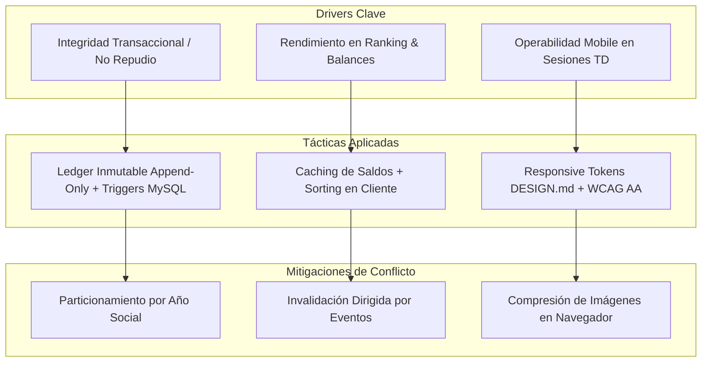

# ESCENARIOS DE CALIDAD Y TÁCTICAS ARQUITECTÓNICAS (ISO/IEC 25010)
## Módulo Unificado de Tribunal de Disciplina y Premiaciones (SGD-AVEIT)

---

### DATOS DEL DOCUMENTO

| Atributo | Especificación |
| :--- | :--- |
| **Organización** | Asociación Vocacional de Estudiantes e Ingenieros Tecnológicos (A.V.E.I.T.) - UTN FRC |
| **Sistema** | SGD-AVEIT |
| **Módulo** | Tribunal de Disciplina y Premiaciones |
| **Estándar** | ISO/IEC 25000 (SQuaRE) / ISO/IEC 25010 / Escenarios SEI de 6 Partes (Bass, Clements & Kazman) |
| **Fecha** | 03/09/2026 |

---

## 1. INTRODUCCIÓN Y ESTRATEGIA DE ARQUITECTURA

En el diseño arquitectónico de **SGD-AVEIT**, los Atributos de Calidad gobiernan las decisiones críticas de persistencia, seguridad, rendimiento y experiencia de usuario. El sistema debe erradicar la manipulación manual de datos en hojas de cálculo, garantizar la inmutabilidad de los saldos de puntos de los socios, proveer respuesta instantánea en el ordenamiento del ranking y permitir la deliberación remota en sesiones virtuales mediante dispositivos móviles.

A continuación se formalizan los **Escenarios de Calidad de 6 Partes** y sus correspondientes **Tácticas Arquitectónicas de Diseño**.

---

## 2. CATÁLOGO FORMAL DE ESCENARIOS DE CALIDAD

### Escenario 1: Seguridad e Integridad Transaccional (`ESC-SEG-01`)
* **Característica ISO 25010:** Seguridad ──► **Integridad, Responsabilidad / Trazabilidad y No Repudio**.
* **Driver Arquitectónico:** Erradicación definitiva de modificaciones directas de puntos (`UPDATE`) en MySQL sin expediente formal.

| Componente del Escenario | Especificación Formal |
| :--- | :--- |
| **Identificador** | `ESC-SEG-01` |
| **1. Fuente del Estímulo** | Usuario administrador, operador de base de datos o atacante interno que intenta modificar el saldo de puntos de un socio de forma manual o arbitraria. |
| **2. Estímulo** | Intento de ejecución de sentencia SQL directa (`UPDATE socios SET puntos = ...`) o solicitud de ajuste sin resolución firmada. |
| **3. Entorno** | Operación normal del sistema en producción. |
| **4. Artefacto Afectado** | Motor de Base de Datos MySQL, Capa de Servicios Backend y Ledger Transaccional de Puntos. |
| **5. Respuesta del Sistema** | 1. Bloquear y rechazar cualquier mutación que no provenga del servicio transaccional autenticado. 2. Exigir la vinculación unívoca a una resolución disciplinaria emitida con firma colegiada tripartita. 3. Registrar el movimiento mediante inserción inmutable (*append-only*) en la tabla histórica con sello de tiempo UTC y hash de auditoría. |
| **6. Medida de Respuesta** | **100% de intentos de modificación directa bloqueados.** Cero (0) transacciones de puntos huérfanas en la base de datos. Pista de auditoría generada en menos de 10 ms. |
| **Tácticas Arquitectónicas** | • **Resistir ataques:** Restricción de permisos DML a nivel usuario de base de datos (revocación de privilegios `UPDATE` en tablas de puntos para usuarios de aplicación; solo inserts vía Stored Procedures autorizados). • **Registro inmutable:** Implementación del patrón *Transaction Ledger* (libro contable append-only). • **No Repudio:** Firma digital colegiada de resoluciones con hash SHA-256 de los jueces firmantes. |
| **Trade-offs / Conflictos** | La inmutabilidad requiere mayor almacenamiento en disco por el crecimiento del histórico, mitigado mediante índices compuestos y particionamiento por año social. |

---

### Escenario 2: Eficiencia de Desempeño en Ranking y Balances (`ESC-REND-01`)
* **Característica ISO 25010:** Eficiencia de Desempeño ──► **Comportamiento Temporal y Capacidad**.
* **Driver Arquitectónico:** Ordenamiento instantáneo del ranking (ascendente/descendente) y generación fluida de balances cuatrimestrales.

| Componente del Escenario | Especificación Formal |
| :--- | :--- |
| **Identificador** | `ESC-REND-01` |
| **1. Fuente del Estímulo** | 150 socios concurrentes y miembros del TD consultando y ordenando el Ranking General de Socios tras la emisión de una resolución o durante una asamblea. |
| **2. Estímulo** | Peticiones simultáneas de ordenamiento ascendente/descendente sobre el padrón de más de 500 socios con filtros por subcomisión y categoría Junior/Senior. |
| **3. Entorno** | Momento de alta demanda informativa (pico de tráfico post-asamblea). |
| **4. Artefacto Afectado** | Módulo de Ranking, API REST Backend y Consultas Agregadas MySQL. |
| **5. Respuesta del Sistema** | El backend resuelve la consulta utilizando una vista materializada indexada o caché en memoria con invalidación selectiva por eventos de resolución, retornando los datos en formato JSON ligero. |
| **6. Medida de Respuesta** | **Tiempo de respuesta p95 <= 250 ms.** Tiempo de conmutación ascendente/descendente en la interfaz de usuario **<= 50 ms** (ordenamiento en cliente). Cero caídas de conexión. |
| **Tácticas Arquitectónicas** | • **Administración de Recursos:** Caché de saldos consolidados en memoria de aplicación, invalidada únicamente cuando se emite una nueva resolución. • **Granularidad y Optimización de Carga:** Transferencia de DTOs compactos con renderizado optimizado en frontend. • **Particionamiento y Filtros en Memoria:** Ordenamiento en cliente para respuestas inmediatas sin latencia de red recurrente. |
| **Trade-offs / Conflictos** | El caching requiere garantizar la sincronización exacta cuando se firma una resolución, resuelto con invalidación dirigida (*Cache-Eviction on Event*). |

---

### Escenario 3: Usabilidad y Agilidad Operativa Mobile-First (`ESC-USA-01`)
* **Característica ISO 25010:** Usabilidad ──► **Operabilidad, Reconocimiento de Adecuación y Protección contra Errores**.
* **Driver Arquitectónico:** Simplicidad en la carga de justificaciones (T02/T03 unificado) y asistencia digital en eventos ("pasar el dedo").

| Componente del Escenario | Especificación Formal |
| :--- | :--- |
| **Identificador** | `ESC-USA-01` |
| **1. Fuente del Estímulo** | Socio Ordinario operando desde su teléfono móvil tras recibir la notificación de inasistencia a una reunión o asamblea. |
| **2. Estímulo** | El socio ingresa a "Mis Expedientes", abre el formulario unificado de justificación y adjunta una fotografía de su certificado médico o constancia universitaria. |
| **3. Entorno** | Conexión móvil (4G/Wi-Fi variable) en dispositivo smartphone con pantalla táctil. |
| **4. Artefacto Afectado** | Interfaz Web Responsive Mobile (Formulario Unificado T02/T03). |
| **5. Respuesta del Sistema** | Interfaz adaptada que detecta la cámara/archivos del móvil, comprime la imagen en el cliente antes de la subida, valida los campos obligatorios en tiempo real y emite una constancia digital con acuse inmediato. |
| **6. Medida de Respuesta** | **Tiempo total de carga de justificación <= 60 segundos.** Tasa de éxito al primer intento **>= 95%**. Número máximo de toques de pantalla **<= 4 toques**. Contraste WCAG 2.2 AA verificado en el 100% de elementos. |
| **Tácticas Arquitectónicas** | • **Prevención de Errores en Cliente:** Validación visual de archivos adjuntos antes del envío; deshabilitación preventiva del botón de envío si falta el certificado en causal tipificada. • **Diseño Universal y Responsive:** Maquetación fluida con Tailwind CSS siguiendo los tokens de [DESIGN.md](file:///g:/My%20Drive/Estudios/Seminario/Repositorio/seminario-integrador/DESIGN.md). • **Feedback Inmediato:** Indicador visual de progreso de carga y confirmación de recepción con sello de tiempo. |
| **Trade-offs / Conflictos** | La compresión de imágenes en el cliente consume ciclos leves de CPU en móviles de gama baja, pero ahorra más del 80% de ancho de banda y acelera el despacho. |

---

### Escenario 4: Confiabilidad y Gestión de Plazos Preclusivos (`ESC-CONF-01`)
* **Característica ISO 25010:** Confiabilidad / Fiabilidad ──► **Madurez y Tolerancia a Fallos**.
* **Driver Arquitectónico:** Cumplimiento estricto del plazo de 5 días hábiles sin manipulación humana.

| Componente del Escenario | Especificación Formal |
| :--- | :--- |
| **Identificador** | `ESC-CONF-01` |
| **1. Fuente del Estímulo** | Expiración del plazo de 120 horas hábiles asignado a un expediente en estado *En período de justificaciones*. |
| **2. Estímulo** | Cumplimiento del timestamp de vencimiento calculado según el calendario oficial de días hábiles. |
| **3. Entorno** | Ejecución en segundo plano del servicio daemon del sistema (Cron Background Worker). |
| **4. Artefacto Afectado** | Motor de Estados de Expedientes y Servicio de Tareas Programadas. |
| **5. Respuesta del Sistema** | El daemon detecta el vencimiento, bloquea de forma atómica la posibilidad de subir descargos para ese expediente, cambia el estado a *Justificaciones en revisión* y registra la novedad en el log de auditoría. |
| **6. Medida de Respuesta** | **Precisión de corte de plazo: 100% en la hora programada.** Cero (0) formularios admitidos fuera de término. Notificación de preclusión despachada al TD en menos de 30 segundos. |
| **Tácticas Arquitectónicas** | • **Detección Periódica:** Tarea programada ejecutada con frecuencia configurable (cada 15 minutos). • **Transacciones Atómicas:** Cambio de estado encapsulado en una transacción ACID para evitar condiciones de carrera (*race conditions*) si el socio intenta enviar en el último segundo. |
| **Trade-offs / Conflictos** | Requiere sincronización horaria garantizada mediante protocolo NTP en el servidor central. |

---

## 3. MATRIZ DE COMPENSACIONES (TRADE-OFFS) Y SÍNTESIS ARQUITECTÓNICA

---
*Documento formalizado para la Cátedra de Seminario Integrador - UTN FRC - Ciclo Lectivo 2026.*
