# UNIVERSIDAD TECNOLÓGICA NACIONAL
## FACULTAD REGIONAL CÓRDOBA
### Carrera: Analista Desarrollador Universitario de Sistemas de Información
### Cátedra: Seminario Integrador (Curso 3K2) - Ciclo Lectivo 2026
**Proyecto:** Sistema de Gestión del Tribunal de Disciplina y Premiaciones de A.V.E.I.T. (SGD-AVEIT)  
**Documento:** Modelo de Dominio Conceptual (MDD) - Especificación Formal con Patrones ASI  
**Versión:** 1.0.0-final  
**Fecha:** 01/09/2026  

---

# Modelo de Dominio: SGD-AVEIT (Tribunal de Disciplina y Premiaciones)

El presente documento formaliza el **Modelo de Dominio Conceptual** para el **Sistema de Gestión del Tribunal de Disciplina y Premiaciones de A.V.E.I.T. (SGD-AVEIT)**, delimitando estricta y exclusivamente las clases conceptuales necesarias para la solución planteada en el Plan de Proyecto, el Estudio Inicial y la Especificación de Requerimientos (ERS).

El modelo ha sido diseñado bajo las reglas del paradigma orientado a objetos conceptual puro, aplicando de manera sistemática el catálogo canónico de **Patrones de Dominio de Análisis de Sistemas de Información (ASI)**, erradicando claves foráneas como atributos, estableciendo multiplicidades exactas y dotando a cada clase de sus métodos y responsabilidades conceptuales de negocio.

---

## 1. Resumen Ejecutivo y Matriz de Patrones de Dominio Aplicados

| Patrón ASI Canónico | Clases Participantes | Justificación y Regla de Negocio Soportada |
| :--- | :--- | :--- |
| **1. Ítem - Descriptor de Ítem** *(Item - Item Descriptor)* | • `CategoriaSocio` (1) $\leftarrow$ (*) `Socio` • `TipificacionFaltaMerito` (1) $\leftarrow$ (*) `SolicitudT01` / `DetalleImputacion` • `TipoCausalJustificacion` (1) $\leftarrow$ (*) `FormularioT02` • `Subcomision` (1) $\leftarrow$ (*) `MembresiaSubcomision` | Desacopla la caracterización estática, normativa y de catálogo (escalas de puntos, causales tipificadas de justificación médica/académica, categorías Juniors vs Seniors con sus prerrogativas estatutarias) de las instancias transaccionales u operativas concretas, garantizando coherencia con el Reglamento Procesal 2026 y la Circular 001/2026 (`RN-08`, `RN-10`). |
| **2. Encabezado - Detalle** *(Master - Detail)* | • `ExpedienteDisciplinario` (1) *-- (1..*) `DetalleImputacion` (*) $\rightarrow$ (1) `Socio` • `ResolucionDisciplinaria` (1) *-- (1..*) `DetalleResolucionSocio` (*) $\rightarrow$ (1) `Socio` • `ResolucionDisciplinaria` (1) *-- (1..*) `FirmaColegiada` (*) $\rightarrow$ (1) `MiembroTribunal` • `ExpedienteDisciplinario` (1) *-- (0..*) `VotoNominal` (*) $\rightarrow$ (1) `MiembroTribunal` • `FormularioJustificacion` (1) *-- (0..*) `ComprobanteAdjunto` | Modela la composición atómica de transacciones complejas: un expediente puede imputar a múltiples socios por un mismo hecho; la resolución dictamina los puntos definitivos individuales de cada socio involucrado; y se registra la deliberación nominal individual y la firma colegiada indelegable exigida por estatuto (`RN-04`, `RN-06`, `RN-08`). |
| **3. Historial de Estados con Vigencia Temporal** *(`[fechaHoraDesde, fechaHoraHasta]`)* | • `ExpedienteDisciplinario` (1) *-- (1..*) `CambioEstadoExpediente` (*) $\rightarrow$ (1) `EstadoExpediente` • `Socio` (1) *-- (1..*) `CambioEstadoSocio` (*) $\rightarrow$ (1) `EstadoSocio` | Otorga auditoría cronológica absoluta y trazabilidad inalterable con intervalos de vigencia temporal (`fechaHoraDesde` y `fechaHoraHasta = null` para el estado actual vigente). Soporta los seis (6) estados oficiales del expediente (Art. 12 del Reglamento 2026) y el ciclo de vida del socio (Activo, Alerta Amarilla 7 pts, Pérdida Automática de Condición 10 pts) (`RN-01`, `RN-02`, `RN-03`, `RN-06`, `RN-11`). |
| **4. Rol / Tipo de Rol** *(Party - Role)* | • `Socio` (1) *-- (1..*) `RolInstitucional` $\ll$abstract$\gg$ `RolInstitucional` $\leftarrow$ `MiembroTribunal`, `MiembroComisionDirectiva`, `MiembroComisionFiscalizadora`, `MiembroComisionRevisora`, `JefeEquipo` | Permite que un mismo socio físico desempeñe diferentes roles institucionales simultáneamente o en diferentes mandatos sin duplicar su identidad ni generar herencia múltiple. Facilita la validación estricta de competencias para solicitar expedientes (Arts. 21 a 26) y la detección de incompatibilidades/inhibiciones (`RN-05`, `RN-07`, `RN-10`). |
| **5. Clase de Asociación / Reificación** | • `Socio` (1) $\leftarrow$ (*) `MembresiaSubcomision` (*) $\rightarrow$ (1) `Subcomision` • `ResolucionDisciplinaria` (1) $\leftarrow$ (*) `MovimientoPuntos` (*) $\rightarrow$ (1) `Socio` | Captura los atributos propios de la relación entre un socio y una subcomisión (cargo, período de vigencia) y reifica la transacción del libro mayor de puntos inmutable entre la resolución emitida y el socio afectado (`RN-07`, `RN-11`). |
| **6. Transacciones Subsiguientes** *(Temporal Business Flow)* | `SolicitudT01` (1) $\rightarrow$ (1) `ExpedienteDisciplinario` (1) $\rightarrow$ (0..*) `NotificacionAcuseSancion` (1) $\rightarrow$ (0..1) `FormularioJustificacion` (`T02`/`T03`) $\rightarrow$ (1) `ResolucionDisciplinaria` (1) $\rightarrow$ (1..*) `MovimientoPuntos` | Representa la secuencia temporal y formal del debido proceso asociativo: desde la detección/solicitud formal, notificación fehaciente con plazo perentorio de 5 días hábiles, presentación de descargos probatorios, deliberación/dictamen formal colegiado, hasta el impacto transaccional inmutable en el saldo neto del socio (`RN-03`, `RN-04`, `RN-06`, `RN-11`). |
| **7. Contenedor - Contenido / Agregación** | `BalanceCuatrimestral` (1) *-- (1..*) `DetalleBalanceSubcomision` (*) $\rightarrow$ (1) `Subcomision` | Modela la estructura consolidada de auditoría interna cuatrimestral exigida por el Art. 137 del Reglamento Interno de Disciplina de AVEIT, desglosando métricas cuantitativas por subcomisión y grupo social (`RN-09`). |

---

## 2. Diagrama de Clases de Dominio (Mermaid)

```mermaid
classDiagram
    direction TB

    %% ========================================================
    %% PAQUETE: SOCIO, CATEGORÍA Y ESTRUCTURA ASOCIATIVA
    %% ========================================================
    class Socio {
        -String numeroLegajoUTN
        -Integer numeroSocioAVEIT
        -String nombre
        -String apellido
        -String emailInstitucional
        -String telefono
        -Date fechaIngreso
        -Float saldoPuntosActual
        +conocerEstadoActual() EstadoSocio
        +calcularSaldoPuntos() Float
        +esSenior() Boolean
        +esJunior() Boolean
        +tieneAlertaAmarilla() Boolean
        +tieneAlertaRoja() Boolean
        +cambiarEstado(nuevoEstado, motivo)
        +impactarMovimientoPuntos(variacion, concepto, usuario)
    }

    class CategoriaSocio {
        -String denominacion
        -Integer anioSocialMinimo
        -Integer anioSocialMaximo
        -Boolean permiteIntegrarTD
        -Boolean permitePresidirSubcomision
        -String descripcion
        +esElegibleParaTD() Boolean
        +esElegibleParaPresidencia() Boolean
    }

    class EstadoSocio {
        -String nombreEstado
        -String descripcion
        -Boolean esSocioPleno
        +esActivo() Boolean
        +esPerdidaAutomatica() Boolean
    }

    class CambioEstadoSocio {
        -DateTime fechaHoraDesde
        -DateTime fechaHoraHasta
        -String motivo
        +esActual() Boolean
        +finalizarVigencia(fechaHora)
    }

    class Subcomision {
        -String codigoSubcomision
        -String nombreSubcomision
        -String descripcion
        -Boolean esActiva
        +estaActiva() Boolean
    }

    class MembresiaSubcomision {
        -Date fechaDesde
        -Date fechaHasta
        -String cargo
        -Boolean esActivo
        +esAutoridadHabilitada() Boolean
        +esVigente() Boolean
    }

    CategoriaSocio "1" <-- "0..*" Socio : categoriza
    Socio "1" *-- "1..*" CambioEstadoSocio : registra historial
    CambioEstadoSocio "0..*" --> "1" EstadoSocio : tipifica
    Socio "1" <-- "0..*" MembresiaSubcomision : integra
    Subcomision "1" <-- "0..*" MembresiaSubcomision : cuenta con

    %% ========================================================
    %% PAQUETE: ROLES INSTITUCIONALES Y COMPETENCIAS (PARTY-ROLE)
    %% ========================================================
    class RolInstitucional {
        <<abstract>>
        -Date fechaInicioMandato
        -Date fechaFinMandato
        -Boolean activo
        +esVigente() Boolean
        +validarCompetenciaAccion(tipoAccion, imputado) Boolean
    }

    class MiembroTribunal {
        -Boolean esTitular
        -Integer grupoSocialRepresentado
        +esSeniorHabilitadoFirma() Boolean
    }

    class MiembroComisionDirectiva {
        -String cargoCD
        +esPresidenteOVice() Boolean
    }

    class MiembroComisionFiscalizadora {
        -Boolean esPresidente
    }

    class MiembroComisionRevisora {
        -Boolean esPresidente
    }

    class JefeEquipo {
        -String nombreEquipoTrabajo
        -String objetivoMision
    }

    Socio "1" *-- "1..*" RolInstitucional : desempena
    RolInstitucional <|-- MiembroTribunal
    RolInstitucional <|-- MiembroComisionDirectiva
    RolInstitucional <|-- MiembroComisionFiscalizadora
    RolInstitucional <|-- MiembroComisionRevisora
    RolInstitucional <|-- JefeEquipo

    %% ========================================================
    %% PAQUETE: SOLICITUD Y TIPIFICACIÓN (CIRCULAR 001/2026)
    %% ========================================================
    class TipificacionFaltaMerito {
        -String codigoTipificacion
        -String denominacion
        -String tipoAccion
        -Float puntosReferencia
        -Float puntosMinimos
        -Float puntosMaximos
        -String normativaRespaldo
        -String descripcion
        +esPuntajeValido(puntos) Boolean
        +esSancion() Boolean
        +esPremio() Boolean
    }

    class SolicitudT01 {
        -Integer numeroSolicitud
        -DateTime fechaHoraPresentacion
        -String hechosCircunstanciadosAnexo
        -Float cuantiaPuntosPropuesta
        -String observaciones
        +validarCompetenciaSolicitante() Boolean
    }

    TipificacionFaltaMerito "1" <-- "0..*" SolicitudT01 : encuadra en
    RolInstitucional "1" <-- "0..*" SolicitudT01 : promovida por

    %% ========================================================
    %% PAQUETE: EXPEDIENTE DISCIPLINARIO Y 6 ESTADOS OFICIALES
    %% ========================================================
    class ExpedienteDisciplinario {
        -String numeroExpediente
        -DateTime fechaHoraCreacion
        -String tipoCausa
        -DateTime fechaHoraVencimientoDescargo
        -Boolean esRectificatorio
        +conocerEstadoActual() EstadoExpediente
        +cambiarEstado(nuevoEstado, motivo, usuario)
        +calcularPlazoPreclusivo(fechaHoraInicio, diasHabiles) DateTime
        +estaEnPlazoDescargo() Boolean
        +tieneQuorumVotacion() Boolean
        +calcularMayoriaVotacion() Boolean
    }

    class DetalleImputacion {
        -Float puntosPropuestos
        -String motivoIndividual
        +getPuntosPropuestos() Float
    }

    class EstadoExpediente {
        -String nombreEstado
        -String descripcion
        -Integer ordenSecuencial
        +esEmitido() Boolean
        +esPeriodoDescargo() Boolean
    }

    class CambioEstadoExpediente {
        -DateTime fechaHoraDesde
        -DateTime fechaHoraHasta
        -String motivo
        -String usuarioResponsable
        +esActual() Boolean
        +cerrarVigencia(fechaHora)
    }

    SolicitudT01 "0..1" --> "1" ExpedienteDisciplinario : formaliza
    ExpedienteDisciplinario "1" *-- "1..*" DetalleImputacion : imputa a
    DetalleImputacion "0..*" --> "1" Socio : involucra
    DetalleImputacion "0..*" --> "1" TipificacionFaltaMerito : tipifica con
    ExpedienteDisciplinario "1" *-- "1..*" CambioEstadoExpediente : audita ciclo de vida
    CambioEstadoExpediente "0..*" --> "1" EstadoExpediente : corresponde a

    %% ========================================================
    %% PAQUETE: NOTIFICACIONES, JUSTIFICACIONES Y DESCARGOS
    %% ========================================================
    class NotificacionAcuseSancion {
        -Integer numeroNotificacion
        -DateTime fechaHoraDespacho
        -String destinatarioEmail
        -DateTime fechaHoraLimiteDescargo
        -String asunto
        -String cuerpoMensaje
        -String estadoEnvio
        +calcularPlazoPreclusivo() DateTime
        +estaVencida() Boolean
    }

    class FormularioJustificacion {
        <<abstract>>
        -Integer numeroFormulario
        -DateTime fechaHoraPresentacion
        -String observaciones
        -String dictamenTD
        -String fundamentacionDictamen
        +esPresentadoEnTermino(fechaLimite) Boolean
        +estaAprobado() Boolean
    }

    class FormularioT02 {
        -String descripcionSancionImputada
    }

    class TipoCausalJustificacion {
        -String codigoCausal
        -String denominacion
        -Boolean requiereComprobanteObligatorio
        -String articuloReglamentario
        +requiereAdjunto() Boolean
    }

    class FormularioT03 {
        -String exposicionHechosExtraordinarios
        -String fundamentacionCircunstanciada
    }

    class ComprobanteAdjunto {
        -String nombreArchivo
        -String tipoDocumento
        -String extension
        -Integer tamanioBytes
        -String urlAlmacenamiento
        -String hashIntegridad
        -DateTime fechaHoraCarga
        +verificarIntegridad() Boolean
    }

    ExpedienteDisciplinario "1" *-- "0..*" NotificacionAcuseSancion : despacha
    NotificacionAcuseSancion "0..*" --> "1" Socio : notifica a
    ExpedienteDisciplinario "1" *-- "0..*" FormularioJustificacion : contiene descargos
    FormularioJustificacion "0..*" --> "1" Socio : presentado por
    FormularioJustificacion <|-- FormularioT02
    FormularioJustificacion <|-- FormularioT03
    TipoCausalJustificacion "1" <-- "0..*" FormularioT02 : fundamentado en
    FormularioJustificacion "1" *-- "0..*" ComprobanteAdjunto : respalda con

    %% ========================================================
    %% PAQUETE: DELIBERACIÓN, RESOLUCIÓN, FIRMA Y LIBRO MAYOR
    %% ========================================================
    class VotoNominal {
        -DateTime fechaHoraVoto
        -String sentidoVoto
        -String fundamentacionJuridica
        -Float puntosDictaminados
        +esAfirmativo() Boolean
        +esInhibicion() Boolean
    }

    class ResolucionDisciplinaria {
        -String numeroResolucion
        -DateTime fechaHoraEmision
        -String vistos
        -String considerandos
        -String parteDispositiva
        -Boolean esPublica
        -String hashFirmaDigital
        +estaCompletamenteFirmada() Boolean
        +publicarResolucion()
    }

    class DetalleResolucionSocio {
        -Float puntosDefinitivos
        -String sancionAplicada
        -String consideracionIndividual
        +esPuntajeValido() Boolean
    }

    class FirmaColegiada {
        -DateTime fechaHoraFirma
        -String selloDigital
        -String rolFirmante
        +esFirmaValida() Boolean
    }

    class MovimientoPuntos {
        -Integer numeroMovimiento
        -DateTime fechaHora
        -Float puntosVariacion
        -Float saldoAnterior
        -Float saldoPosterior
        -String concepto
        -String usuarioResponsable
        +esInalterable() Boolean
    }

    ExpedienteDisciplinario "1" *-- "0..*" VotoNominal : registra deliberacion
    VotoNominal "0..*" --> "1" MiembroTribunal : emitido por
    ExpedienteDisciplinario "1" --> "0..1" ResolucionDisciplinaria : culmina en
    ResolucionDisciplinaria "1" *-- "1..*" DetalleResolucionSocio : resuelve sobre
    DetalleResolucionSocio "0..*" --> "1" Socio : sanciona o premia a
    ResolucionDisciplinaria "1" *-- "1..*" FirmaColegiada : avalada por
    FirmaColegiada "0..*" --> "1" MiembroTribunal : suscripta por
    ResolucionDisciplinaria "1" --> "1..*" MovimientoPuntos : genera impacto
    MovimientoPuntos "0..*" --> "1" Socio : imputado en libro mayor

    %% ========================================================
    %% PAQUETE: BALANCES CUATRIMESTRALES DE AUDITORÍA (ART. 137)
    %% ========================================================
    class BalanceCuatrimestral {
        -Integer numeroBalance
        -String periodoCuatrimestre
        -Integer anioSocial
        -DateTime fechaHoraGeneracion
        -Integer totalSancionesEmitidas
        -Integer totalPremiosOtorgados
        -Float totalPuntosNegativosNetos
        -Float totalPuntosPositivosNetos
        -Integer cantidadSociosAlertaRoja
        -Integer cantidadSociosAlertaAmarilla
        -Boolean aprobadoPorAsamblea
        +calcularMetricasGenerales()
        +exportarInformePDF()
    }

    class DetalleBalanceSubcomision {
        -Integer totalSancionesSubcomision
        -Integer totalPremiosSubcomision
        -Float saldoNetoSubcomision
        -Integer cantidadSociosAfectados
        +calcularSaldoSubcomision() Float
    }

    BalanceCuatrimestral "1" *-- "1..*" DetalleBalanceSubcomision : desglosa por subcomision
    DetalleBalanceSubcomision "0..*" --> "1" Subcomision : consolida datos de
```

---

## 3. Diagrama de Clases de Dominio (PlantUML)

```plantuml
@startuml
skinparam classAttributeIconSize 0
skinparam monochrome false
skinparam shadowing true
skinparam linetype ortho
skinparam packageBackgroundColor #F8F9FA
skinparam packageBorderColor #6C757D

title Modelo de Dominio Conceptual - SGD-AVEIT (ASI Patterns)

package "Estructura Societaria y Categorización (Item - Item Descriptor)" {
    class Socio {
        - numeroLegajoUTN: String
        - numeroSocioAVEIT: Integer
        - nombre: String
        - apellido: String
        - emailInstitucional: String
        - telefono: String
        - fechaIngreso: Date
        - saldoPuntosActual: Float
        + conocerEstadoActual(): EstadoSocio
        + calcularSaldoPuntos(): Float
        + esSenior(): Boolean
        + esJunior(): Boolean
        + tieneAlertaAmarilla(): Boolean
        + tieneAlertaRoja(): Boolean
        + cambiarEstado(nuevoEstado: EstadoSocio, motivo: String): void
        + impactarMovimientoPuntos(variacion: Float, concepto: String, usuario: String): void
    }

    class CategoriaSocio {
        - denominacion: String
        - anioSocialMinimo: Integer
        - anioSocialMaximo: Integer
        - permiteIntegrarTD: Boolean
        - permitePresidirSubcomision: Boolean
        - descripcion: String
        + esElegibleParaTD(): Boolean
        + esElegibleParaPresidencia(): Boolean
    }

    class EstadoSocio {
        - nombreEstado: String
        - descripcion: String
        - esSocioPleno: Boolean
        + esActivo(): Boolean
        + esPerdidaAutomatica(): Boolean
    }

    class CambioEstadoSocio {
        - fechaHoraDesde: DateTime
        - fechaHoraHasta: DateTime
        - motivo: String
        + esActual(): Boolean
        + finalizarVigencia(fechaHora: DateTime): void
    }

    class Subcomision {
        - codigoSubcomision: String
        - nombreSubcomision: String
        - descripcion: String
        - esActiva: Boolean
        + estaActiva(): Boolean
    }

    class MembresiaSubcomision {
        - fechaDesde: Date
        - fechaHasta: Date
        - cargo: String
        - esActivo: Boolean
        + esAutoridadHabilitada(): Boolean
        + esVigente(): Boolean
    }

    CategoriaSocio "1" <-- "0..*" Socio : categoriza
    Socio "1" *-- "1..*" CambioEstadoSocio : audita estado
    CambioEstadoSocio "0..*" --> "1" EstadoSocio : tipifica
    Socio "1" <-- "0..*" MembresiaSubcomision : integra
    Subcomision "1" <-- "0..*" MembresiaSubcomision : asignada en
}

package "Roles Institucionales y Competencias (Party - Role)" {
    abstract class RolInstitucional {
        - fechaInicioMandato: Date
        - fechaFinMandato: Date
        - activo: Boolean
        + esVigente(): Boolean
        + validarCompetenciaAccion(tipoAccion: String, imputado: Socio): Boolean
    }

    class MiembroTribunal {
        - esTitular: Boolean
        - grupoSocialRepresentado: Integer
        + esSeniorHabilitadoFirma(): Boolean
    }

    class MiembroComisionDirectiva {
        - cargoCD: String
        + esPresidenteOVice(): Boolean
    }

    class MiembroComisionFiscalizadora {
        - esPresidente: Boolean
    }

    class MiembroComisionRevisora {
        - esPresidente: Boolean
    }

    class JefeEquipo {
        - nombreEquipoTrabajo: String
        - objetivoMision: String
    }

    Socio "1" *-- "1..*" RolInstitucional : desempena
    RolInstitucional <|-- MiembroTribunal
    RolInstitucional <|-- MiembroComisionDirectiva
    RolInstitucional <|-- MiembroComisionFiscalizadora
    RolInstitucional <|-- MiembroComisionRevisora
    RolInstitucional <|-- JefeEquipo
}

package "Tipificación Normativa y Solicitud (Circular 001/2026)" {
    class TipificacionFaltaMerito {
        - codigoTipificacion: String
        - denominacion: String
        - tipoAccion: String
        - puntosReferencia: Float
        - puntosMinimos: Float
        - puntosMaximos: Float
        - normativaRespaldo: String
        - descripcion: String
        + esPuntajeValido(puntos: Float): Boolean
        + esSancion(): Boolean
        + esPremio(): Boolean
    }

    class SolicitudT01 {
        - numeroSolicitud: Integer
        - fechaHoraPresentacion: DateTime
        - hechosCircunstanciadosAnexo: String
        - cuantiaPuntosPropuesta: Float
        - observaciones: String
        + validarCompetenciaSolicitante(): Boolean
    }

    TipificacionFaltaMerito "1" <-- "0..*" SolicitudT01 : tipifica
    RolInstitucional "1" <-- "0..*" SolicitudT01 : promovida por
}

package "Gestión de Expedientes y 6 Estados Oficiales (Master - Detail)" {
    class ExpedienteDisciplinario {
        - numeroExpediente: String
        - fechaHoraCreacion: DateTime
        - tipoCausa: String
        - fechaHoraVencimientoDescargo: DateTime
        - esRectificatorio: Boolean
        + conocerEstadoActual(): EstadoExpediente
        + cambiarEstado(nuevoEstado: EstadoExpediente, motivo: String, usuario: String): void
        + calcularPlazoPreclusivo(fechaHoraInicio: DateTime, diasHabiles: Integer): DateTime
        + estaEnPlazoDescargo(): Boolean
        + tieneQuorumVotacion(): Boolean
        + calcularMayoriaVotacion(): Boolean
    }

    class DetalleImputacion {
        - puntosPropuestos: Float
        - motivoIndividual: String
        + getPuntosPropuestos(): Float
    }

    class EstadoExpediente {
        - nombreEstado: String
        - descripcion: String
        - ordenSecuencial: Integer
        + esEmitido(): Boolean
        + esPeriodoDescargo(): Boolean
    }

    class CambioEstadoExpediente {
        - fechaHoraDesde: DateTime
        - fechaHoraHasta: DateTime
        - motivo: String
        - usuarioResponsable: String
        + esActual(): Boolean
        + cerrarVigencia(fechaHora: DateTime): void
    }

    SolicitudT01 "0..1" --> "1" ExpedienteDisciplinario : formaliza en
    ExpedienteDisciplinario "1" *-- "1..*" DetalleImputacion : desglosa
    DetalleImputacion "0..*" --> "1" Socio : imputa a
    DetalleImputacion "0..*" --> "1" TipificacionFaltaMerito : encuadra en
    ExpedienteDisciplinario "1" *-- "1..*" CambioEstadoExpediente : audita avance
    CambioEstadoExpediente "0..*" --> "1" EstadoExpediente : corresponde a
}

package "Descargos, Notificaciones y Comprobantes (T02 / T03)" {
    class NotificacionAcuseSancion {
        - numeroNotificacion: Integer
        - fechaHoraDespacho: DateTime
        - destinatarioEmail: String
        - fechaHoraLimiteDescargo: DateTime
        - asunto: String
        - cuerpoMensaje: String
        - estadoEnvio: String
        + calcularPlazoPreclusivo(): DateTime
        + estaVencida(): Boolean
    }

    abstract class FormularioJustificacion {
        - numeroFormulario: Integer
        - fechaHoraPresentacion: DateTime
        - observaciones: String
        - dictamenTD: String
        - fundamentacionDictamen: String
        + esPresentadoEnTermino(fechaLimite: DateTime): Boolean
        + estaAprobado(): Boolean
    }

    class FormularioT02 {
        - descripcionSancionImputada: String
    }

    class TipoCausalJustificacion {
        - codigoCausal: String
        - denominacion: String
        - requiereComprobanteObligatorio: Boolean
        - articuloReglamentario: String
        + requiereAdjunto(): Boolean
    }

    class FormularioT03 {
        - exposicionHechosExtraordinarios: String
        - fundamentacionCircunstanciada: String
    }

    class ComprobanteAdjunto {
        - nombreArchivo: String
        - tipoDocumento: String
        - extension: String
        - tamanioBytes: Integer
        - urlAlmacenamiento: String
        - hashIntegridad: String
        - fechaHoraCarga: DateTime
        + verificarIntegridad(): Boolean
    }

    ExpedienteDisciplinario "1" *-- "0..*" NotificacionAcuseSancion : notifica
    NotificacionAcuseSancion "0..*" --> "1" Socio : enviada a
    ExpedienteDisciplinario "1" *-- "0..*" FormularioJustificacion : recepciona
    FormularioJustificacion "0..*" --> "1" Socio : presentado por
    FormularioJustificacion <|-- FormularioT02
    FormularioJustificacion <|-- FormularioT03
    TipoCausalJustificacion "1" <-- "0..*" FormularioT02 : causal
    FormularioJustificacion "1" *-- "0..*" ComprobanteAdjunto : adjunta
}

package "Deliberación, Resolución, Firma Colegiada y Libro Mayor" {
    class VotoNominal {
        - fechaHoraVoto: DateTime
        - sentidoVoto: String
        - fundamentacionJuridica: String
        - puntosDictaminados: Float
        + esAfirmativo(): Boolean
        + esInhibicion(): Boolean
    }

    class ResolucionDisciplinaria {
        - numeroResolucion: String
        - fechaHoraEmision: DateTime
        - vistos: String
        - considerandos: String
        - parteDispositiva: String
        - esPublica: Boolean
        - hashFirmaDigital: String
        + estaCompletamenteFirmada(): Boolean
        + publicarResolucion(): void
    }

    class DetalleResolucionSocio {
        - puntosDefinitivos: Float
        - sancionAplicada: String
        - consideracionIndividual: String
        + esPuntajeValido(): Boolean
    }

    class FirmaColegiada {
        - fechaHoraFirma: DateTime
        - selloDigital: String
        - rolFirmante: String
        + esFirmaValida(): Boolean
    }

    class MovimientoPuntos {
        - numeroMovimiento: Integer
        - fechaHora: DateTime
        - puntosVariacion: Float
        - saldoAnterior: Float
        - saldoPosterior: Float
        - concepto: String
        - usuarioResponsable: String
        + esInalterable(): Boolean
    }

    ExpedienteDisciplinario "1" *-- "0..*" VotoNominal : delibera con
    VotoNominal "0..*" --> "1" MiembroTribunal : registrado por
    ExpedienteDisciplinario "1" --> "0..1" ResolucionDisciplinaria : concluye en
    ResolucionDisciplinaria "1" *-- "1..*" DetalleResolucionSocio : dispone sobre
    DetalleResolucionSocio "0..*" --> "1" Socio : aplica a
    ResolucionDisciplinaria "1" *-- "1..*" FirmaColegiada : respaldada por
    FirmaColegiada "0..*" --> "1" MiembroTribunal : firmada por
    ResolucionDisciplinaria "1" --> "1..*" MovimientoPuntos : genera asiento
    MovimientoPuntos "0..*" --> "1" Socio : asienta en
}

package "Auditoría Interna y Balances Cuatrimestrales (Art. 137)" {
    class BalanceCuatrimestral {
        - numeroBalance: Integer
        - periodoCuatrimestre: String
        - anioSocial: Integer
        - fechaHoraGeneracion: DateTime
        - totalSancionesEmitidas: Integer
        - totalPremiosOtorgados: Integer
        - totalPuntosNegativosNetos: Float
        - totalPuntosPositivosNetos: Float
        - cantidadSociosAlertaRoja: Integer
        - cantidadSociosAlertaAmarilla: Integer
        - aprobadoPorAsamblea: Boolean
        + calcularMetricasGenerales(): void
        + exportarInformePDF(): void
    }

    class DetalleBalanceSubcomision {
        - totalSancionesSubcomision: Integer
        - totalPremiosSubcomision: Integer
        - saldoNetoSubcomision: Float
        - cantidadSociosAfectados: Integer
        + calcularSaldoSubcomision(): Float
    }

    BalanceCuatrimestral "1" *-- "1..*" DetalleBalanceSubcomision : totaliza
    DetalleBalanceSubcomision "0..*" --> "1" Subcomision : reporta sobre
}

@enduml
```

---

## 4. Diccionario de Datos del Dominio (Data Dictionary)

A continuación se presentan las **Fichas Técnicas Formales** de cada una de las clases conceptuales que componen el Modelo de Dominio de SGD-AVEIT.

---

### 4.1. Ficha Técnica: `Socio`
* **Patrón ASI:** Entidad Maestra del Dominio / Objeto Central Auditado.
* **Propósito:** Representa a la persona física asociada a AVEIT sobre la cual recaen las obligaciones estatutarias, cómputos de puntos (+/-), expedientes disciplinarios y reconocimientos al mérito.
* **Atributos:**
  | Atributo | Tipo | Descripción | Restricciones / Reglas |
  | :--- | :--- | :--- | :--- |
  | `numeroLegajoUTN` | `String` | Legajo de estudiante de la UTN FRC. | Formato numérico de 5 a 6 dígitos, Único, No Nulo. |
  | `numeroSocioAVEIT` | `Integer` | Número identificador societario en AVEIT. | Positivo correlativo, Único, No Nulo. |
  | `nombre` | `String` | Nombres del socio. | 2 a 60 caracteres alfabéticos. |
  | `apellido` | `String` | Apellidos del socio. | 2 a 60 caracteres alfabéticos. |
  | `emailInstitucional` | `String` | Correo electrónico para notificaciones formales. | Formato de email válido, No Nulo. |
  | `telefono` | `String` | Teléfono móvil de contacto. | Formato internacional / nacional. |
  | `fechaIngreso` | `Date` | Fecha en que fue admitido como socio en AVEIT. | $\le$ Fecha Actual. |
  | `saldoPuntosActual` | `Float` | Saldo neto acumulado de puntos (+/-). | Cuantificado en múltiplos de 0.5 (`RN-08`). |
* **Métodos Conceptuales:**
  - `conocerEstadoActual(): EstadoSocio`: Retorna el estado vigente (aquel cuyo `CambioEstadoSocio.fechaHoraHasta == null`).
  - `calcularSaldoPuntos(): Float`: Totaliza algebraicamente los asientos en `MovimientoPuntos`.
  - `esSenior(): Boolean`: Evalúa si pertenece a la categoría Senior (3º a 6º año social).
  - `tieneAlertaAmarilla(): Boolean`: Evalúa si `saldoPuntosActual` $\le -7.0$ y $> -10.0$ (`RN-02`).
  - `tieneAlertaRoja(): Boolean`: Evalúa si `saldoPuntosActual` $\le -10.0$ (`RN-01`).
  - `cambiarEstado(nuevoEstado, motivo)`: Cierra la vigencia del estado actual y genera una nueva instancia de `CambioEstadoSocio`.
* **Relaciones:**
  - `categoriza` $\leftarrow$ `CategoriaSocio` (0..* a 1).
  - `registra historial` *-- `CambioEstadoSocio` (1 a 1..* - Composición).
  - `integra` $\leftarrow$ `MembresiaSubcomision` (1 a 0..*).
  - `desempena` *-- `RolInstitucional` (1 a 1..* - Composición).
  - `involucra` $\leftarrow$ `DetalleImputacion` (1 a 0..*).
  - `presentado por` $\leftarrow$ `FormularioJustificacion` (1 a 0..*).
  - `sanciona o premia a` $\leftarrow$ `DetalleResolucionSocio` (1 a 0..*).
  - `asienta en` $\leftarrow$ `MovimientoPuntos` (1 a 0..*).

---

### 4.2. Ficha Técnica: `CategoriaSocio`
* **Patrón ASI:** Descriptor de Ítem (Item Descriptor).
* **Propósito:** Almacena la caracterización estandarizada de las categorías societarias (Socios Juniors vs. Socios Seniors) y sus atribuciones normativas según el Estatuto 2026.
* **Atributos:**
  | Atributo | Tipo | Descripción | Restricciones / Reglas |
  | :--- | :--- | :--- | :--- |
  | `denominacion` | `String` | Nombre de la categoría ("Junior", "Senior"). | Único ("Junior" / "Senior"). |
  | `anioSocialMinimo` | `Integer` | Año social inicial de la categoría (1 para Junior, 3 para Senior). | Entre 1 y 6. |
  | `anioSocialMaximo` | `Integer` | Año social final de la categoría (2 para Junior, 6 para Senior). | $\ge$ `anioSocialMinimo`. |
  | `permiteIntegrarTD` | `Boolean` | Habilitación estatutaria para ser electo en el TD. | `false` para Juniors, `true` para Seniors (`RN-10`). |
  | `permitePresidirSubcomision` | `Boolean` | Habilitación estatutaria para presidir subcomisiones. | `false` para Juniors, `true` para Seniors (`RN-10`). |
  | `descripcion` | `String` | Alcance y rol formativo de la categoría. | Texto explicativo. |
* **Relaciones:**
  - `categoriza` $\rightarrow$ `Socio` (1 a 0..*).

---

### 4.3. Ficha Técnica: `EstadoSocio`
* **Patrón ASI:** Catálogo de Estados (State Pattern).
* **Propósito:** Catálogo maestro de los estados posibles en el ciclo de vida de un socio en AVEIT.
* **Atributos:**
  | Atributo | Tipo | Descripción | Restricciones / Reglas |
  | :--- | :--- | :--- | :--- |
  | `nombreEstado` | `String` | Nombre del estado ("Activo Regular", "Alerta Preventiva Amarilla", "Perdida Automatica Condicion de Socio", "Inactivo / Pasivo"). | Único, No Nulo. |
  | `descripcion` | `String` | Detalle normativo y consecuencias jurídicas del estado. | No Nulo. |
  | `esSocioPleno` | `Boolean` | Indica si goza de todos los derechos societarios activos. | Booleano. |
* **Relaciones:**
  - `tipifica` $\leftarrow$ `CambioEstadoSocio` (1 a 0..*).

---

### 4.4. Ficha Técnica: `CambioEstadoSocio`
* **Patrón ASI:** Historial de Estados con Vigencia Temporal.
* **Propósito:** Registra un período de vigencia durante el cual un socio permaneció en un estado determinado.
* **Atributos:**
  | Atributo | Tipo | Descripción | Restricciones / Reglas |
  | :--- | :--- | :--- | :--- |
  | `fechaHoraDesde` | `DateTime` | Inicio formal de vigencia del estado. | No Nulo. |
  | `fechaHoraHasta` | `DateTime` | Fin de vigencia del estado (`null` si es el estado actual). | Opcional / `null` si vigente; $\ge$ `fechaHoraDesde`. |
  | `motivo` | `String` | Causa reglamentaria o resolución que originó el cambio. | No Nulo. |
* **Métodos Conceptuales:**
  - `esActual(): Boolean`: Retorna `true` si `fechaHoraHasta == null`.
  - `finalizarVigencia(fechaHora)`: Asigna la fecha/hora de fin de vigencia.
* **Relaciones:**
  - `audita estado` $\leftarrow$ `Socio` (1..* a 1 - Composición).
  - `tipifica` $\rightarrow$ `EstadoSocio` (0..* a 1).

---

### 4.5. Ficha Técnica: `Subcomision`
* **Patrón ASI:** Entidad Maestra Organizacional / Contenedor.
* **Propósito:** Representa a cada una de las siete (7) subcomisiones reglamentarias de trabajo de AVEIT.
* **Atributos:**
  | Atributo | Tipo | Descripción | Restricciones / Reglas |
  | :--- | :--- | :--- | :--- |
  | `codigoSubcomision` | `String` | Código identificador (ej. "COMP", "RRII", "OYE", "PREN", "MANT", "RRHH", "GSA"). | Único, No Nulo. |
  | `nombreSubcomision` | `String` | Nombre completo oficial de la subcomisión. | No Nulo. |
  | `descripcion` | `String` | Objetivos operativos y responsabilidades de la subcomisión. | No Nulo. |
  | `esActiva` | `Boolean` | Estado operativo de la subcomisión. | Por defecto `true`. |
* **Relaciones:**
  - `asignada en` $\leftarrow$ `MembresiaSubcomision` (1 a 0..*).
  - `reporta sobre` $\leftarrow$ `DetalleBalanceSubcomision` (1 a 0..*).

---

### 4.6. Ficha Técnica: `MembresiaSubcomision`
* **Patrón ASI:** Clase de Asociación (Reificación N:M).
* **Propósito:** Reifica la pertenencia de un socio a una subcomisión, capturando su cargo y vigencia temporal.
* **Atributos:**
  | Atributo | Tipo | Descripción | Restricciones / Reglas |
  | :--- | :--- | :--- | :--- |
  | `fechaDesde` | `Date` | Fecha en que el socio se incorporó a la subcomisión. | No Nulo. |
  | `fechaHasta` | `Date` | Fecha de desvinculación de la subcomisión. | `null` si continúa activo. |
  | `cargo` | `String` | Cargo desempeñado ("Presidente", "Vicepresidente", "Miembro Ordinario", "Voluntario"). | Valor reglamentario. |
  | `esActivo` | `Boolean` | Estado de actividad en la subcomisión. | Booleano. |
* **Métodos Conceptuales:**
  - `esAutoridadHabilitada(): Boolean`: Retorna `true` si es "Presidente" o "Vicepresidente" para solicitar T01 (`RN-07`).
  - `esVigente(): Boolean`: Evalúa si `esActivo == true` y `fechaHasta == null`.
* **Relaciones:**
  - `integra` $\rightarrow$ `Socio` (0..* a 1).
  - `asignada en` $\rightarrow$ `Subcomision` (0..* a 1).

---

### 4.7. Ficha Técnica: `RolInstitucional` (y Subclases)
* **Patrón ASI:** Rol / Tipo de Rol (Party - Role).
* **Propósito:** Clase abstracta base y especializaciones que modelan los diferentes cargos y mandatos electivos o designados que los socios desempeñan en los órganos de gobierno y control de AVEIT.
* **Subclases:**
  1. `MiembroTribunal` (`esTitular: Boolean`, `grupoSocialRepresentado: Integer`)
  2. `MiembroComisionDirectiva` (`cargoCD: String` - ej. "Presidente", "Vicepresidente", "Tesorero")
  3. `MiembroComisionFiscalizadora` (`esPresidente: Boolean`)
  4. `MiembroComisionRevisora` (`esPresidente: Boolean`)
  5. `JefeEquipo` (`nombreEquipoTrabajo: String`, `objetivoMision: String`)
* **Atributos Comunes:**
  | Atributo | Tipo | Descripción | Restricciones / Reglas |
  | :--- | :--- | :--- | :--- |
  | `fechaInicioMandato` | `Date` | Fecha de toma de posesión del cargo. | No Nulo. |
  | `fechaFinMandato` | `Date` | Fecha de finalización estatutaria del mandato. | $\ge$ `fechaInicioMandato`. |
  | `activo` | `Boolean` | Estado de ejercicio del mandato. | Booleano. |
* **Métodos Conceptuales:**
  - `validarCompetenciaAccion(tipoAccion, imputado): Boolean`: Valida si el rol tiene potestad para solicitar la apertura del expediente conforme a los Arts. 21 a 26 (`RN-07`).
* **Relaciones:**
  - `desempena` $\leftarrow$ `Socio` (1..* a 1 - Composición).
  - `promovida por` $\leftarrow$ `SolicitudT01` (1 a 0..*).

---

### 4.8. Ficha Técnica: `TipificacionFaltaMerito`
* **Patrón ASI:** Descriptor de Ítem (Item Descriptor).
* **Propósito:** Catálogo normativo oficial de faltas disciplinarias y causales de premiación conforme a la Circular 001/2026 y el Reglamento Interno de Disciplina de AVEIT.
* **Atributos:**
  | Atributo | Tipo | Descripción | Restricciones / Reglas |
  | :--- | :--- | :--- | :--- |
  | `codigoTipificacion` | `String` | Código identificador (ej. "F-INA-REU", "F-INA-ASM", "F-INC-TAREA", "F-OM-LIMP", "P-MER-SOB"). | Único, No Nulo. |
  | `denominacion` | `String` | Título formal de la infracción o mérito. | No Nulo. |
  | `tipoAccion` | `String` | Tipo de movimiento ("Sancion", "Premio"). | "Sancion" o "Premio". |
  | `puntosReferencia` | `Float` | Cuantía tarifada estándar sugerida en puntos (+/-). | Fracciones de 0.5 (`RN-08`). |
  | `puntosMinimos` | `Float` | Escala mínima de puntos aplicables. | Múltiplo de 0.5. |
  | `puntosMaximos` | `Float` | Escala máxima de puntos aplicables. | Múltiplo de 0.5. |
  | `normativaRespaldo` | `String` | Artículo del estatuto o circular que respalda la causal. | No Nulo. |
  | `descripcion` | `String` | Detalle taxativo de la conducta punible o meritoria. | No Nulo. |
* **Relaciones:**
  - `tipifica` $\rightarrow$ `SolicitudT01` (1 a 0..*).
  - `encuadra en` $\leftarrow$ `DetalleImputacion` (1 a 0..*).

---

### 4.9. Ficha Técnica: `SolicitudT01`
* **Patrón ASI:** Transacción Inicial de Apertura.
* **Propósito:** Documento administrativo oficial mediante el cual una autoridad competente solicita la apertura de una causa disciplinaria o de premiación con su correspondiente Hoja Anexo circunstanciada.
* **Atributos:**
  | Atributo | Tipo | Descripción | Restricciones / Reglas |
  | :--- | :--- | :--- | :--- |
  | `numeroSolicitud` | `Integer` | Número correlativo anual de solicitud T01. | Único, Autoincremental. |
  | `fechaHoraPresentacion` | `DateTime` | Momento exacto de envío digital de la solicitud. | Sellado de tiempo del sistema. |
  | `hechosCircunstanciadosAnexo` | `String` | Relato fáctico detallado de tiempo, lugar y modo de la infracción/mérito (Hoja Anexo T01). | No Nulo, Mínimo 20 caracteres. |
  | `cuantiaPuntosPropuesta` | `Float` | Cantidad de puntos sugeridos por el solicitante. | Múltiplo de 0.5 (`RN-08`). |
  | `observaciones` | `String` | Aclaraciones adicionales del solicitante. | Opcional. |
* **Relaciones:**
  - `promovida por` $\rightarrow$ `RolInstitucional` (0..* a 1).
  - `tipifica` $\leftarrow$ `TipificacionFaltaMerito` (0..* a 1).
  - `formaliza en` $\rightarrow$ `ExpedienteDisciplinario` (0..1 a 1).

---

### 4.10. Ficha Técnica: `ExpedienteDisciplinario`
* **Patrón ASI:** Encabezado de Transacción Maestra (Master - Detail).
* **Propósito:** Unidad procesal central que agrupa las actuaciones, imputaciones, notificaciones, descargos, deliberaciones y resolución dictada sobre una presunta falta o premiación.
* **Atributos:**
  | Atributo | Tipo | Descripción | Restricciones / Reglas |
  | :--- | :--- | :--- | :--- |
  | `numeroExpediente` | `String` | Identificador unívoco del expediente (formato: `EXP-YYYY-NNNNN`). | Único, No Nulo. |
  | `fechaHoraCreacion` | `DateTime` | Momento de alta formal en el sistema. | Sellado de tiempo no nulo. |
  | `tipoCausa` | `String` | Clasificación ("Disciplinaria", "Premiacion", "Rectificacion"). | No Nulo. |
  | `fechaHoraVencimientoDescargo`| `DateTime` | Momento exacto en que expira el plazo preclusivo de 5 días hábiles. | Calculado a partir de la notificación (`RN-03`). |
  | `esRectificatorio` | `Boolean` | Indica si el expediente se tramita para rectificar un error material previo. | Booleano. |
* **Métodos Conceptuales:**
  - `conocerEstadoActual(): EstadoExpediente`: Devuelve el estado vigente en su colección `CambioEstadoExpediente`.
  - `calcularPlazoPreclusivo(fechaHoraInicio, diasHabiles)`: Computa 5 días hábiles excluyendo sábados, domingos y feriados (`RN-03`).
  - `estaEnPlazoDescargo(): Boolean`: Evalúa si `fechaActual` $\le$ `fechaHoraVencimientoDescargo`.
  - `tieneQuorumVotacion(): Boolean`: Verifica que hayan votado al menos 2 miembros habilitados del TD (`RN-04`).
  - `calcularMayoriaVotacion(): Boolean`: Determina si existe mayoría absoluta de votos afirmativos ($\ge 2$) (`RN-04`).
* **Relaciones:**
  - `formaliza en` $\leftarrow$ `SolicitudT01` (1 a 0..1).
  - `desglosa` *-- `DetalleImputacion` (1 a 1..* - Composición).
  - `audita avance` *-- `CambioEstadoExpediente` (1 a 1..* - Composición).
  - `notifica` *-- `NotificacionAcuseSancion` (1 a 0..* - Composición).
  - `recepciona` *-- `FormularioJustificacion` (1 a 0..* - Composición).
  - `delibera con` *-- `VotoNominal` (1 a 0..* - Composición).
  - `concluye en` $\rightarrow$ `ResolucionDisciplinaria` (1 a 0..1).

---

### 4.11. Ficha Técnica: `DetalleImputacion`
* **Patrón ASI:** Detalle de Transacción (Transaction Line Item).
* **Propósito:** Modela a cada socio imputado o postulado dentro de un expediente, permitiendo causas individuales o colectivas con tipificaciones particulares.
* **Atributos:**
  | Atributo | Tipo | Descripción | Restricciones / Reglas |
  | :--- | :--- | :--- | :--- |
  | `puntosPropuestos` | `Float` | Cuantía de puntos sugerida para este socio en particular. | Múltiplo de 0.5 (`RN-08`). |
  | `motivoIndividual` | `String` | Circunstancia fáctica atribuible al socio. | No Nulo. |
* **Relaciones:**
  - `desglosa` $\leftarrow$ `ExpedienteDisciplinario` (1..* a 1 - Composición).
  - `imputa a` $\rightarrow` `Socio` (0..* a 1).
  - `encuadra en` $\rightarrow$ `TipificacionFaltaMerito` (0..* a 1).

---

### 4.12. Ficha Técnica: `EstadoExpediente`
* **Patrón ASI:** Catálogo de Estados (State Pattern).
* **Propósito:** Catálogo oficial de los seis (6) estados procesales del expediente disciplinario estandarizados por el Art. 12 del Reglamento 2026.
* **Atributos:**
  | Atributo | Tipo | Descripción | Restricciones / Reglas |
  | :--- | :--- | :--- | :--- |
  | `nombreEstado` | `String` | Nombre canónico del estado: 1) "Expediente Creado", 2) "En período de subida de justificaciones (5 días hábiles)", 3) "Las justificaciones están siendo revisadas", 4) "En espera de resolución", 5) "Pendiente de firma y envío", 6) "Expedientes ya emitidos". | Único, No Nulo. |
  | `descripcion` | `String` | Alcance operativo y acciones habilitadas en este estado. | No Nulo. |
  | `ordenSecuencial` | `Integer` | Posición ordinal en el flujo procesal estándar (1 a 6). | Entre 1 y 6. |
* **Relaciones:**
  - `corresponde a` $\leftarrow$ `CambioEstadoExpediente` (1 a 0..*).

---

### 4.13. Ficha Técnica: `CambioEstadoExpediente`
* **Patrón ASI:** Historial de Estados con Vigencia Temporal.
* **Propósito:** Registra cronológicamente cada transición de estado del expediente con su intervalo de vigencia, motivo y usuario autorizante.
* **Atributos:**
  | Atributo | Tipo | Descripción | Restricciones / Reglas |
  | :--- | :--- | :--- | :--- |
  | `fechaHoraDesde` | `DateTime` | Inicio formal de la vigencia del estado procesal. | Sellado de tiempo no nulo. |
  | `fechaHoraHasta` | `DateTime` | Fin de la vigencia del estado procesal (`null` si es el estado actual). | Opcional / `null` mientras esté activo; $\ge$ `fechaHoraDesde`. |
  | `motivo` | `String` | Fundamentación u orden procesal que provocó la transición. | No Nulo. |
  | `usuarioResponsable` | `String` | Identificador del usuario que ejecutó la transición. | No Nulo. |
* **Métodos Conceptuales:**
  - `esActual(): Boolean`: Retorna `true` si `fechaHoraHasta == null`.
  - `cerrarVigencia(fechaHora)`: Registra el fin de vigencia del estado al producirse una nueva transición.
* **Relaciones:**
  - `audita avance` $\leftarrow$ `ExpedienteDisciplinario` (1..* a 1 - Composición).
  - `corresponde a` $\rightarrow$ `EstadoExpediente` (0..* a 1).

---

### 4.14. Ficha Técnica: `NotificacionAcuseSancion`
* **Patrón ASI:** Transacción Subsiguiente / Comunicación Procesal.
* **Propósito:** Documento digital de notificación formal despachado automáticamente por el sistema al socio imputado, con sellado de tiempo que perfecciona el inicio del cómputo de 5 días hábiles.
* **Atributos:**
  | Atributo | Tipo | Descripción | Restricciones / Reglas |
  | :--- | :--- | :--- | :--- |
  | `numeroNotificacion` | `Integer` | Identificador correlativo del acuse. | Único, Autoincremental. |
  | `fechaHoraDespacho` | `DateTime` | Momento exacto de envío del correo electrónico. | Sellado de tiempo no nulo. |
  | `destinatarioEmail` | `String` | Dirección de correo a la que fue enviado el acuse. | Formato de email válido. |
  | `fechaHoraLimiteDescargo` | `DateTime` | Vencimiento fatal calculado sumando 5 días hábiles (`RN-03`). | Sellado de tiempo inalterable. |
  | `asunto` | `String` | Asunto formal del mensaje. | No Nulo. |
  | `cuerpoMensaje` | `String` | Texto detallando la imputación y derechos procesales. | No Nulo. |
  | `estadoEnvio` | `String` | Estado de entrega ("Enviado", "Entregado", "Error"). | Valor controlado. |
* **Relaciones:**
  - `notifica` $\leftarrow$ `ExpedienteDisciplinario` (0..* a 1 - Composición).
  - `enviada a` $\rightarrow$ `Socio` (0..* a 1).

---

### 4.15. Ficha Técnica: `FormularioJustificacion` (y Subclases `FormularioT02` / `FormularioT03`)
* **Patrón ASI:** Transacción de Descargos / Polimorfismo de Formularios.
* **Propósito:** Clase abstracta y especializaciones para la presentación digital de descargos por parte del socio imputado dentro del plazo de 5 días hábiles.
* **Subclases:**
  1. `FormularioT02` (Justificación Tipificada - Art. 17): Vinculada a una `TipoCausalJustificacion` estandarizada.
  2. `FormularioT03` (Descargo Extraordinario - Art. 18): Para circunstancias especiales no tipificadas, fundamentadas bajo sana crítica.
* **Atributos Comunes:**
  | Atributo | Tipo | Descripción | Restricciones / Reglas |
  | :--- | :--- | :--- | :--- |
  | `numeroFormulario` | `Integer` | Número identificador del descargo presentado. | Único, Autoincremental. |
  | `fechaHoraPresentacion` | `DateTime` | Momento de registro digital por el socio. | $\le$ `fechaHoraLimiteDescargo` (`RN-03`). |
  | `observaciones` | `String` | Explicaciones y alegatos del socio. | No Nulo. |
  | `dictamenTD` | `String` | Resolución del TD sobre la admisibilidad ("Pendiente", "Aprobada", "Rechazada", "Parcialmente Aprobada"). | Valor de catálogo. |
  | `fundamentacionDictamen` | `String` | Argumentos reglamentarios del TD para avalar o desestimar el descargo. | No Nulo al dictaminar. |
* **Métodos Conceptuales:**
  - `esPresentadoEnTermino(fechaLimite): Boolean`: Evalúa si `fechaHoraPresentacion` $\le$ `fechaLimite` (`RN-03`).
* **Relaciones:**
  - `recepciona` $\leftarrow$ `ExpedienteDisciplinario` (0..* a 1 - Composición).
  - `presentado por` $\rightarrow$ `Socio` (0..* a 1).
  - `adjunta` *-- `ComprobanteAdjunto` (1 a 0..* - Composición).
  - `causal` $\leftarrow$ `TipoCausalJustificacion` (0..* a 1 - en `FormularioT02`).

---

### 4.16. Ficha Técnica: `TipoCausalJustificacion`
* **Patrón ASI:** Descriptor de Ítem (Item Descriptor).
* **Propósito:** Catálogo de causales de justificación reconocidas reglamentariamente (enfermedad con certificado médico, exámenes/obligaciones académicas, viajes de fuerza mayor con pasajes).
* **Atributos:**
  | Atributo | Tipo | Descripción | Restricciones / Reglas |
  | :--- | :--- | :--- | :--- |
  | `codigoCausal` | `String` | Código identificador (ej. "J-MED", "J-ACA", "J-VIA"). | Único, No Nulo. |
  | `denominacion` | `String` | Denominación formal de la causal. | No Nulo. |
  | `requiereComprobanteObligatorio` | `Boolean` | Exigencia de adjuntar archivo probatorio (PDF/JPG). | `true` para enfermedad/viaje. |
  | `articuloReglamentario` | `String` | Artículo del Reglamento Interno de Disciplina de AVEIT de respaldo. | No Nulo. |
* **Relaciones:**
  - `causal` $\rightarrow$ `FormularioT02` (1 a 0..*).

---

### 4.17. Ficha Técnica: `ComprobanteAdjunto`
* **Patrón ASI:** Detalle de Transacción / Evidencia Probatoria.
* **Propósito:** Representa los archivos digitales probatorios (certificados médicos, constancias de examen, pasajes aéreos/terrestres) adjuntados a los descargos o solicitudes.
* **Atributos:**
  | Atributo | Tipo | Descripción | Restricciones / Reglas |
  | :--- | :--- | :--- | :--- |
  | `nombreArchivo` | `String` | Nombre original del archivo digital. | No Nulo. |
  | `tipoDocumento` | `String` | Clasificación ("Certificado Medico", "Pasaje", "Constancia Academica", "Otro"). | No Nulo. |
  | `extension` | `String` | Extensión del archivo (ej. ".pdf", ".jpg", ".png"). | Extensiones seguras permitidas. |
  | `tamanioBytes` | `Integer` | Peso del archivo en bytes. | Máximo 10 MB (10.485.760 bytes). |
  | `urlAlmacenamiento` | `String` | Ruta segura en el servidor de almacenamiento. | No Nulo. |
  | `hashIntegridad` | `String` | Hash criptográfico SHA-256 para verificar no alteración. | 64 caracteres hexadecimales. |
  | `fechaHoraCarga` | `DateTime` | Momento exacto de subida al sistema. | Sellado de tiempo no nulo. |
* **Relaciones:**
  - `adjunta` $\leftarrow$ `FormularioJustificacion` (0..* a 1 - Composición).

---

### 4.18. Ficha Técnica: `VotoNominal`
* **Patrón ASI:** Detalle de Deliberación / Acto Colegiado.
* **Propósito:** Modela el voto individual y fundado emitido por cada integrante habilitado del Tribunal de Disciplina durante las sesiones de juzgamiento.
* **Atributos:**
  | Atributo | Tipo | Descripción | Restricciones / Reglas |
  | :--- | :--- | :--- | :--- |
  | `fechaHoraVoto` | `DateTime` | Momento de emisión del voto en sesión. | Sellado de tiempo no nulo. |
  | `sentidoVoto` | `String` | Posición del vocal ("Afirmativo", "Rechazo", "Disidencia", "Inhibido"). | Valor de catálogo (`RN-04`, `RN-05`). |
  | `fundamentacionJuridica` | `String` | Argumentos reglamentarios que respaldan la postura. | No Nulo. |
  | `puntosDictaminados` | `Float` | Cuantía de puntos que propone el vocal. | Múltiplo de 0.5 (`RN-08`). |
* **Métodos Conceptuales:**
  - `esAfirmativo(): Boolean`: Retorna `true` si `sentidoVoto == "Afirmativo"`.
  - `esInhibicion(): Boolean`: Retorna `true` si el vocal se inhibió por conflicto de interés (`RN-05`).
* **Relaciones:**
  - `delibera con` $\leftarrow$ `ExpedienteDisciplinario` (0..* a 1 - Composición).
  - `registrado por` $\rightarrow$ `MiembroTribunal` (0..* a 1).

---

### 4.19. Ficha Técnica: `ResolucionDisciplinaria`
* **Patrón ASI:** Encabezado Transaccional Definitivo / Acto Jurídico Formal.
* **Propósito:** Documento jurídico resolutivo emitido por el Tribunal de Disciplina con estructura formal preceptiva (VISTOS, CONSIDERANDOS y RESOLUCIÓN).
* **Atributos:**
  | Atributo | Tipo | Descripción | Restricciones / Reglas |
  | :--- | :--- | :--- | :--- |
  | `numeroResolucion` | `String` | Identificador formal unívoco (formato: `RES-TD-YYYY-NNNNN`). | Único, No Nulo. |
  | `fechaHoraEmision` | `DateTime` | Momento formal de emisión y promulgación. | Sellado de tiempo no nulo. |
  | `vistos` | `String` | Sección de antecedentes fácticos y actuaciones cumplidas. | No Nulo. |
  | `considerandos` | `String` | Fundamentación doctrinaria, reglamentaria y valoración probatoria. | No Nulo. |
  | `parteDispositiva` | `String` | Texto resolutivo vinculante (Artículos de la resolución). | No Nulo. |
  | `esPublica` | `Boolean` | Indicador de publicación en el panel de transparencia. | `true` por defecto. |
  | `hashFirmaDigital` | `String` | Firma criptográfica consolidada de los miembros seniors. | Inalterable (`RN-06`). |
* **Métodos Conceptuales:**
  - `estaCompletamenteFirmada(): Boolean`: Verifica que existan las firmas colegiadas reglamentarias de los miembros seniors (`RN-06`).
  - `publicarResolucion()`: Habilita la visibilidad en el módulo público y de transparencia.
* **Relaciones:**
  - `concluye en` $\leftarrow$ `ExpedienteDisciplinario` (0..1 a 1).
  - `dispone sobre` *-- `DetalleResolucionSocio` (1 a 1..* - Composición).
  - `respaldada por` *-- `FirmaColegiada` (1 a 1..* - Composición).
  - `genera asiento` $\rightarrow$ `MovimientoPuntos` (1 a 1..*).

---

### 4.20. Ficha Técnica: `DetalleResolucionSocio`
* **Patrón ASI:** Detalle de Transacción (Transaction Line Item).
* **Propósito:** Dictamen particularizado y puntos definitivos fijados para cada socio individual comprendido en la resolución.
* **Atributos:**
  | Atributo | Tipo | Descripción | Restricciones / Reglas |
  | :--- | :--- | :--- | :--- |
  | `puntosDefinitivos` | `Float` | Cuantía neta definitiva de puntos adjudicados (+/-). | Fracciones de 0.5 (`RN-08`). |
  | `sancionAplicada` | `String` | Tipificación final de la medida o reconocimiento. | No Nulo. |
  | `consideracionIndividual` | `String` | Ponderación particular de agravantes, atenuantes o descargos. | Opcional / No Nulo. |
* **Relaciones:**
  - `dispone sobre` $\leftarrow$ `ResolucionDisciplinaria` (1..* a 1 - Composición).
  - `aplica a` $\rightarrow$ `Socio` (0..* a 1).

---

### 4.21. Ficha Técnica: `FirmaColegiada`
* **Patrón ASI:** Detalle de Transacción / Aval Institucional.
* **Propósito:** Registra la suscripción formal y digital de cada integrante habilitado del TD en representación de los grupos sociales seniors para conferir eficacia jurídica al fallo.
* **Atributos:**
  | Atributo | Tipo | Descripción | Restricciones / Reglas |
  | :--- | :--- | :--- | :--- |
  | `fechaHoraFirma` | `DateTime` | Momento exacto de suscripción digital. | Sellado de tiempo no nulo. |
  | `selloDigital` | `String` | Firma digital / hash criptográfico del firmante. | Inalterable (`RN-06`). |
  | `rolFirmante` | `String` | Rol institucional con el que firma (ej. "Vocal Titular Senior"). | No Nulo (`RN-06`, `RN-10`). |
* **Relaciones:**
  - `respaldada por` $\leftarrow$ `ResolucionDisciplinaria` (1..* a 1 - Composición).
  - `firmada por` $\rightarrow$ `MiembroTribunal` (0..* a 1).

---

### 4.22. Ficha Técnica: `MovimientoPuntos`
* **Patrón ASI:** Libro Mayor Transaccional (Ledger Entry / Reificación Atómica).
* **Propósito:** Asiento atómico, inmutable e histórico que registra cada variación de puntos en el legajo del socio, garantizando auditoría total y eliminando las sentencias UPDATE en la base de datos MySQL.
* **Atributos:**
  | Atributo | Tipo | Descripción | Restricciones / Reglas |
  | :--- | :--- | :--- | :--- |
  | `numeroMovimiento` | `Integer` | Asiento correlativo unívoco del libro mayor. | Único, Autoincremental. |
  | `fechaHora` | `DateTime` | Momento del impacto transaccional. | Sellado de tiempo inmutable. |
  | `puntosVariacion` | `Float` | Cuantía de puntos acreditados (+) o debitados (-). | Múltiplo de 0.5 (`RN-08`). |
  | `saldoAnterior` | `Float` | Saldo neto que poseía el socio previo al impacto. | Exactitud decimal. |
  | `saldoPosterior` | `Float` | Saldo resultante tras aplicar la variación. | `saldoAnterior + puntosVariacion`. |
  | `concepto` | `String` | Reseña del acto o resolución que motivó el asiento. | No Nulo. |
  | `usuarioResponsable` | `String` | Usuario del sistema que generó la operación. | No Nulo (`RN-11`). |
* **Métodos Conceptuales:**
  - `esInalterable(): Boolean`: Garantiza que ningún registro del libro mayor pueda ser editado o eliminado (`RN-11`).
* **Relaciones:**
  - `genera asiento` $\leftarrow$ `ResolucionDisciplinaria` (1..* a 1).
  - `asienta en` $\rightarrow$ `Socio` (0..* a 1).

---

### 4.23. Ficha Técnica: `BalanceCuatrimestral`
* **Patrón ASI:** Encabezado de Auditoría (Art. 137 del Reglamento Interno de Disciplina de AVEIT).
* **Propósito:** Documento ejecutivo oficial de auditoría interna de premiaciones y sanciones generado semestralmente (dos veces por año social) para rendición de cuentas ante Comisión Directiva y Asamblea General.
* **Atributos:**
  | Atributo | Tipo | Descripción | Restricciones / Reglas |
  | :--- | :--- | :--- | :--- |
  | `numeroBalance` | `Integer` | Correlativo anual de balance. | Único, Autoincremental. |
  | `periodoCuatrimestre` | `String` | Período de corte ("Primer Cuatrimestre", "Segundo Cuatrimestre"). | Valor de catálogo (`RN-09`). |
  | `anioSocial` | `Integer` | Año lectivo/social correspondiente al ciclo (ej. 2026). | Entre 1965 y 2100. |
  | `fechaHoraGeneracion` | `DateTime` | Momento de consolidación algorítmica de métricas. | Sellado de tiempo no nulo. |
  | `totalSancionesEmitidas` | `Integer` | Sumatoria total de resoluciones sancionatorias del período. | $\ge 0$. |
  | `totalPremiosOtorgados` | `Integer` | Sumatoria total de reconocimientos al mérito del período. | $\ge 0$. |
  | `totalPuntosNegativosNetos` | `Float` | Sumatoria de puntos negativos aplicados en el cuatrimestre. | $\le 0$. |
  | `totalPuntosPositivosNetos` | `Float` | Sumatoria de puntos positivos otorgados en el cuatrimestre. | $\ge 0$. |
  | `cantidadSociosAlertaRoja` | `Integer` | Cantidad de socios con pérdida automática de condición ($\ge 10$ pts neg). | $\ge 0$ (`RN-01`). |
  | `cantidadSociosAlertaAmarilla` | `Integer` | Cantidad de socios con advertencia preventiva ($\ge 7$ pts neg). | $\ge 0$ (`RN-02`). |
  | `aprobadoPorAsamblea` | `Boolean` | Estado de tratamiento formal en Asamblea de Socios. | Por defecto `false`. |
* **Métodos Conceptuales:**
  - `calcularMetricasGenerales()`: Consolida las estadísticas de todos los expedientes y resoluciones firmadas en el cuatrimestre.
  - `exportarInformePDF()`: Genera el documento formal firmado digitalmente para su elevación a CD y Asamblea.
* **Relaciones:**
  - `totaliza` *-- `DetalleBalanceSubcomision` (1 a 1..* - Composición).

---

### 4.24. Ficha Técnica: `DetalleBalanceSubcomision`
* **Patrón ASI:** Detalle de Agregación y Desglose.
* **Propósito:** Desglosa los totales y saldos consolidados de infracciones y méritos para cada una de las 7 subcomisiones en el balance cuatrimestral.
* **Atributos:**
  | Atributo | Tipo | Descripción | Restricciones / Reglas |
  | :--- | :--- | :--- | :--- |
  | `totalSancionesSubcomision` | `Integer` | Cantidad de sanciones aplicadas a miembros de la subcomisión. | $\ge 0$. |
  | `totalPremiosSubcomision` | `Integer` | Cantidad de premios otorgados a miembros de la subcomisión. | $\ge 0$. |
  | `saldoNetoSubcomision` | `Float` | Balance neto de puntos de la subcomisión en el período. | Sumatoria algebraica. |
  | `cantidadSociosAfectados` | `Integer` | Cantidad de socios distintos involucrados en actuaciones. | $\ge 0$. |
* **Relaciones:**
  - `totaliza` $\leftarrow$ `BalanceCuatrimestral` (1..* a 1 - Composición).
  - `reporta sobre` $\rightarrow$ `Subcomision` (0..* a 1).

---

## 5. Trazabilidad con Requerimientos (RF) y Reglas de Negocio (RN)

| Regla / Requerimiento | Descripción | Clases y Métodos del Dominio Responsables |
| :--- | :--- | :--- |
| **`RN-01` (Art. 93 Reglamento Interno)** | Pérdida Automática de Condición de Socio al acumular $\ge 10$ puntos negativos. | • `Socio.tieneAlertaRoja()` • `Socio.cambiarEstado(EstadoSocio='Perdida Automatica Condicion de Socio')` • `BalanceCuatrimestral.cantidadSociosAlertaRoja` |
| **`RN-02` (Reglamento Interno)** | Alerta Preventiva Temprana al acumular $\ge 7$ y $< 10$ puntos negativos. | • `Socio.tieneAlertaAmarilla()` • `CambioEstadoSocio` / `EstadoSocio` • `BalanceCuatrimestral.cantidadSociosAlertaAmarilla` |
| **`RN-03` (Art. 12 Inc. 2 Reglamento 2026)** | Plazo Preclusivo fatal de 5 días hábiles para presentar descargos (T02/T03). | • `ExpedienteDisciplinario.calcularPlazoPreclusivo()` • `ExpedienteDisciplinario.estaEnPlazoDescargo()` • `NotificacionAcuseSancion.fechaHoraLimiteDescargo` • `FormularioJustificacion.esPresentadoEnTermino()` |
| **`RN-04` (Art. 96 Estatuto Social)** | Mayoría absoluta reglamentaria ($\ge 2$ votos) e irrecurribilidad en fallos del TD. | • `ExpedienteDisciplinario.tieneQuorumVotacion()` • `ExpedienteDisciplinario.calcularMayoriaVotacion()` • `VotoNominal.esAfirmativo()` |
| **`RN-05` (Art. 95 Estatuto / Art. 24)** | Inhibición obligatoria de vocal del TD con conflicto de interés o promotor de la acción. | • `VotoNominal.esInhibicion()` • `MiembroTribunal` • `RolInstitucional.validarCompetenciaAccion()` |
| **`RN-06` (Art. 12 Inc. 5 Reglamento 2026)** | Firma Colegiada digital de Socios Seniors previa a la emisión del fallo. | • `FirmaColegiada` • `MiembroTribunal.esSeniorHabilitadoFirma()` • `ResolucionDisciplinaria.estaCompletamenteFirmada()` |
| **`RN-07` (Arts. 21 a 26 Reglamento 2026)** | Delimitación estricta de competencias funcionales para solicitar apertura de causas. | • `RolInstitucional.validarCompetenciaAccion()` • `SolicitudT01.validarCompetenciaSolicitante()` • `MembresiaSubcomision.esAutoridadHabilitada()` |
| **`RN-08` (Circular 001/2026)** | Escalas tarifadas y fraccionamiento obligatorio en múltiplos de 0.5 puntos. | • `TipificacionFaltaMerito.esPuntajeValido()` • `DetalleImputacion.puntosPropuestos` • `DetalleResolucionSocio.esPuntajeValido()` • `MovimientoPuntos.puntosVariacion` |
| **`RN-09` (Art. 137 Reglamento Interno)** | Emisión de 2 Balances Cuatrimestrales de Auditoría Interna por año social. | • `BalanceCuatrimestral.calcularMetricasGenerales()` • `BalanceCuatrimestral.exportarInformePDF()` • `DetalleBalanceSubcomision` |
| **`RN-10` (Estatuto 2026)** | Segmentación Junior (1º-2º año) vs. Senior (3º-6º año) y derechos estatutarios. | • `CategoriaSocio.permiteIntegrarTD` • `CategoriaSocio.permitePresidirSubcomision` • `Socio.esSenior()` / `Socio.esJunior()` |
| **`RN-11` (Pistas de Auditoría)** | Inmutabilidad de saldos y erradicación total de sentencias SQL UPDATE directas. | • `MovimientoPuntos.esInalterable()` • `Socio.impactarMovimientoPuntos()` • `CambioEstadoExpediente` / `CambioEstadoSocio` |

---

## 6. Verificación de Calidad y Anti-Patrones

El presente Modelo de Dominio Conceptual ha sido sometido a la lista de verificación estricta de calidad arquitectónica de ASI:

* [x] **Cero Claves Foráneas como Atributos:** Se verificó que ninguna clase incluya atributos como `idSocio`, `fk_subcomision`, `codTipificacion` o `idEstado`. Todas las relaciones se modelan exclusivamente mediante asociaciones, agregaciones o composiciones orientadas a objetos.
* [x] **Multiplicidades Bidireccionales Explícitas:** Cada extremo de asociación cuenta con multiplicidad explícita (`1`, `0..1`, `1..*`, `0..*`), sin extremos huérfanos.
* [x] **Historiales de Estado Rigurosos:** Tanto en `ExpedienteDisciplinario` como en `Socio`, el ciclo de vida se modela con el patrón ASI `CambioEstado` (`fechaHoraDesde`, `fechaHoraHasta` con semántica de `null` para vigencia actual) y referencia `* --> 1` a su respectivo `Estado`.
* [x] **Composición Fuerte en Transacciones:** Las líneas de detalle (`DetalleImputacion`, `DetalleResolucionSocio`, `FirmaColegiada`, `VotoNominal`, `ComprobanteAdjunto`, `DetalleBalanceSubcomision`) están subordinadas por composición (`*--`) a sus respectivos encabezados.
* [x] **Ausencia de Clases Dios (God Classes):** Las responsabilidades están distribuidas coherentemente entre 24 clases cohesivas y desacopladas.
* [x] **Purga de Elementos de Infraestructura y UI:** No se incluyen controladores, DTOs, vistas ni conexiones a bases de datos; se trata de un modelo conceptual puro del dominio del negocio.

---
*Documento formalizado para la Cátedra de Seminario Integrador - UTN Facultad Regional Córdoba - Ciclo Lectivo 2026.*
