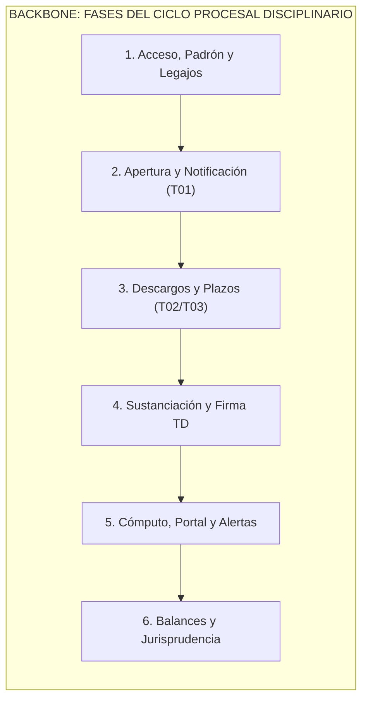

# UNIVERSIDAD TECNOLÓGICA NACIONAL
## FACULTAD REGIONAL CÓRDOBA
### Carrera: Analista Desarrollador Universitario de Sistemas de Información / Ingeniería en Sistemas de Información
### Cátedra: Seminario Integrador
**Ciclo Lectivo:** 2026  
**Curso:** 3K2 (Turno Tarde)  
**Equipo Docente:** Ing. Silvina Arenas, Ing. María Irene Mac William, Ing. Fernando Sanabria  

---

# SEGUIMIENTO DE PROYECTO
## Sistema de Gestión del Tribunal de Disciplina y Premiaciones de A.V.E.I.T. (SGD-AVEIT)

---

### DATOS DEL PROYECTO Y EQUIPO DE TRABAJO

| Campo | Detalle |
| :--- | :--- |
| **Organización de Aplicación** | Asociación Vocacional de Estudiantes e Ingenieros Tecnológicos (A.V.E.I.T.) - UTN FRC |
| **Nombre del Sistema** | SGD-AVEIT (Sistema de Gestión del Tribunal de Disciplina y Premiaciones de AVEIT) |
| **Documento** | Seguimiento de Proyecto y Marco Metodológico Ágil (Sprint 0 a Sprint N) |
| **Metodología Adoptada** | Marco Ágil Adaptativo Scrum / Scrumban |
| **Integrantes del Equipo** | • **Sanchez, Diego Gabriel** (Legajo: 87414) - Product Owner<br>• **Guillén, Lucas Martín** (Legajo: 85194) - Scrum Master<br>• **Rosales, Nicolás** (Legajo: 408917) - Equipo de Desarrollo<br>• **Gastiaburu, Lucas** (Legajo: 74907) - Equipo de Desarrollo<br>• **Villegas, Axel Rene** (Legajo: 403655) - Equipo de Desarrollo<br>• **Urviola, Luis** (Legajo: 409953) - Equipo de Desarrollo<br>• **Quiroz, Tomas Augusto** (Legajo: 415327) - Equipo de Desarrollo |

---

## HISTORIA DE REVISIÓN

| Versión | Fecha | Autor / Responsable | Descripción de Modificaciones |
| :---: | :---: | :--- | :--- |
| **1.0.0** | 01/09/2026 | Equipo de Proyecto SGD-AVEIT | Creación inicial del documento, bosquejo de acuerdos de trabajo, estimación horaria inicial y definición preliminar de roles. |
| **1.1.0** | 02/09/2026 | Equipo de Proyecto SGD-AVEIT | Formalización integral del **Sprint 0** conforme a la Guía de Documentación de la UTN FRC: calendario de sprints (14 días, finalización en diciembre 2026), ceremonias híbridas, acuerdos de trabajo (DoD y DoR), capacidad semanal del equipo (77 hs/sem), catálogo de herramientas, tecnologías y gobernanza de Inteligencia Artificial para pair programming, Product Backlog completo inicial (US-01 a US-19), User Story Map bidimensional, banco de consultas para la reunión de tutoría docente y estructura de seguimiento para Sprints 1 a N. |

---

## TABLA DE CONTENIDO (ÍNDICE)

1. [Propósito del Documento](#propósito-del-documento)
2. [Gestión por Iteración o por Sprint (Metodología Ágil - Scrum)](#gestión-por-iteración-o-por-sprint)
   - 2.1. [Sprint 0 (Definiciones Generales del Proyecto)](#sprint-0-definiciones-generales-del-proyecto)
     - 2.1.1. [Working Agreement (Acuerdos de Trabajo del Equipo)](#211-working-agreement-acuerdos-de-trabajo-del-equipo)
       - A. Definición de Sprints y Calendario Maestro
       - B. Eventos y Ceremonias Ágiles (Duración, Modalidad, Mecánica y Herramientas)
       - C. Acuerdos de Comunicación, Convivencia y Gestión de Bloqueos
       - D. Criterios de Calidad: Definition of Ready (DoR) y Definition of Done (DoD)
     - 2.1.2. [Capacidad del Equipo](#212-capacidad-del-equipo)
     - 2.1.3. [Definición de Roles del Equipo y Matriz RACI](#213-definición-de-roles-del-equipo)
     - 2.1.4. [Herramientas para la Gestión de Proyecto](#214-herramientas-para-la-gestión-de-proyecto)
     - 2.1.5. [Tecnologías para el Desarrollo del Producto y Política de Tratamiento de IA](#215-tecnologías-para-el-desarrollo-del-producto-y-política-de-ia)
     - 2.1.6. [Product Backlog (Completo Inicial)](#216-product-backlog-completo-inicial)
     - 2.1.7. [Story Map (User Story Mapping)](#217-story-map-user-story-mapping)
   - 2.2. [Estructura de Seguimiento para Sprints 1 a N](#22-estructura-de-seguimiento-para-sprints-1-a-n)
     - 2.2.1. [Plantilla de Planificación y Sprint Backlog](#221-plantilla-de-planificación-y-sprint-backlog)
     - 2.2.2. [Plantilla de Resultado Final del Sprint e Incremento](#222-plantilla-de-resultado-final-del-sprint)
     - 2.2.3. [Plantilla de Retrospectiva y Mejora Continua](#223-plantilla-de-retrospectiva)

---

## PROPÓSITO DEL DOCUMENTO

El presente documento de **Seguimiento de Proyecto** constituye el instrumento central de gobernanza y control metodológico para el desarrollo del **Sistema de Gestión del Tribunal de Disciplina y Premiaciones de A.V.E.I.T. (SGD-AVEIT)**, formalizado en el marco de la cátedra de Seminario Integrador de la carrera de Ingeniería en Sistemas de Información (UTN FRC).

Su propósito esencial radica en:
1. Establecer y documentar los consensos operativos, disciplinarios y metodológicos del equipo (**Working Agreement**).
2. Servir de bitácora continua para registrar la planificación, ejecución, métricas de velocidad, resultados tangibles y aprendizajes derivados de cada iteración (**Sprint Backlog, Incrementos y Retrospectivas**).
3. Asegurar la transparencia absoluta y la trazabilidad de los compromisos ante la Cátedra y los beneficiarios de la organización (**A.V.E.I.T.**), garantizando el cumplimiento de los plazos preclusivos y la entrega de un producto de software 100% funcional y probado al concluir el ciclo lectivo.

---

## GESTIÓN POR ITERACIÓN O POR SPRINT

### SPRINT 0 (Definiciones Generales del Proyecto)

El **Sprint 0** constituye la fase preparatoria y de cimentación técnica y organizativa del proyecto. A diferencia de los sprints de desarrollo posteriores, el Sprint 0 no tiene como objetivo central generar un incremento de software para producción, sino establecer las condiciones óptimas de viabilidad, arquitectura, alineación de requerimientos, configuración de entornos y consensos operativos que garanticen el flujo ininterrumpido en los sprints subsiguientes.

---

#### 2.1.1. Working Agreement (Acuerdos de Trabajo del Equipo)

El equipo de proyecto formaliza los siguientes acuerdos vinculantes de trabajo colaborativo:

##### A. Definición de Sprints y Calendario Maestro
* **Duración Estándar de Sprint:** **Catorce (14) días corridos (2 semanas)** por iteración. Este ciclo provee una cadencia óptima para articular las revisiones semanales de cursada con períodos de desarrollo continuo y pruebas funcionales.
* **Sprint 0 (Fundacional):** Desde el **18/08/2026** hasta el **08/09/2026** (3 semanas: relevamiento, formulación de Estudio Inicial, anteproyecto, especificación de requerimientos, acuerdos de equipo, backlog inicial y prototipado UX preliminar).
* **Fecha de Finalización y Entrega del Producto:** Se planifican **6 Sprints regulares de 14 días** tras el Sprint 0, proyectando finalizar el desarrollo y tener el producto **100% funcional y validado en los primeros días de diciembre de 2026**.

```
[Sprint 0: 18/08 al 08/09] -> Fundacional: Relevamiento, Backlog, DoD/DoR, Prototipo UX
     │
[Sprint 1: 09/09 al 22/09] -> Walking Skeleton: Auth, Roles RBAC, Ranking de Puntos y Legajos
     │
[Sprint 2: 23/09 al 06/10] -> Solicitud Formulario T01 con Anexo, Notificaciones y Tablero 6 Estados
     │
[Sprint 3: 07/10 al 20/10] -> Descargos T02/T03, Adjuntos Digitales y Temporizador 5 Días Hábiles
     │
[Sprint 4: 21/10 al 03/11] -> Módulo Justificaciones, Deliberación Virtual, Votación y Firma Colegiada
     │
[Sprint 5: 04/11 al 17/11] -> Cómputo Transaccional Inmutable, Publicación Transparente y Alertas 7/10 pts
     │
[Sprint 6: 18/11 al 01/12] -> Balances Cuatrimestrales Art. 137, Jurisprudencia, Homologación y Cierre
     │
[Diciembre 2026: Entrega 100% Funcional y Presentación Final]
```

##### B. Eventos y Ceremonias Ágiles (Duración, Modalidad, Mecánica y Herramientas)

Se adopta un esquema **híbrido optimizado**, compatibilizando los encuentros obligatorios de cursada con el trabajo asíncrono y la coordinación técnica:

| Ceremonia | Frecuencia y Momento | Duración | Modalidad / Herramienta | Participantes | Objetivo, Entradas y Salidas |
| :--- | :--- | :---: | :--- | :--- | :--- |
| **Daily Scrum (Día de Cursada)** | Martes y Miércoles al inicio de clase (14:55 hs) | 15 min | Presencial (Martes en aula UTN) / Virtual (Miércoles en Meet) | Todo el Equipo | **Objetivo:** Sincronización táctica del día y alineación con la cátedra.<br>**Entrada:** Tablero de Sprint en Jira.<br>**Salida:** Tareas priorizadas para la jornada y plan de consultas al tutor. |
| **Daily Scrum (Asíncrona)** | Lunes, Jueves y Sábados (antes de las 13:00 hs) | 5 min por miembro | Asíncrona (Canal dedicado en Discord / WhatsApp) | Todo el Equipo | **Objetivo:** Informar avance y destrabar bloqueos en días sin cursada.<br>**Mecánica:** Cada miembro reporta las 3 preguntas clásicas: *1) ¿Qué completé ayer? 2) ¿Qué haré hoy? 3) ¿Tengo algún impedimento?* |
| **Sprint Planning** | Primer Miércoles de cada Sprint (16:30 hs) | 90 min | Mixta / Virtual (Discord y Jira) | Product Owner, Scrum Master y Dev Team | **Objetivo:** Comprometer el Sprint Backlog y definir el Sprint Goal.<br>**Entrada:** Product Backlog refinado y priorizado por el PO con DoR cumplido.<br>**Salida:** Sprint Backlog comprometido, desglose de tareas técnicas y Sprint Goal formal. |
| **Jornada de Trabajo Colaborativo** | Todos los Viernes a las 15:00 hs | 180 min | Híbrida / Presencial flexible (Coworking sede AVEIT / Discord) | Dev Team y Scrum Master | **Objetivo:** Desarrollo conjunto, pair programming en componentes complejos, integración de módulos y resolución colaborativa de incidencias. |
| **Sprint Review (Demostración)** | Último Viernes de cada Sprint (17:30 hs) y validación los Miércoles de cursada | 60 min | Virtual (Discord / Google Meet con stakeholders) | Equipo Completo + Tutores / Autoridades AVEIT | **Objetivo:** Inspeccionar el Incremento potencialmente desplegable frente al Product Owner y tutores docentes.<br>**Entrada:** Incremento desplegado en Staging cumpliendo DoD.<br>**Salida:** Feedback registrado en Jira y ajuste del Product Backlog. |
| **Sprint Retrospective** | Último Viernes de cada Sprint (18:30 hs, tras la Review) | 45 min | Virtual (Miro / EasyRetro) | Scrum Master y Dev Team (PO invitado) | **Objetivo:** Inspeccionar el proceso, relaciones y herramientas; definir al menos 2 acciones concretas de mejora para el siguiente sprint.<br>**Dinámica:** *¿Qué funcionó bien? ¿Qué se puede mejorar? ¿Qué compromisos asumimos?* |

##### C. Acuerdos de Comunicación, Convivencia y Gestión de Bloqueos
1. **Canales Oficiales:**
   * **Discord:** Canal de comunicación técnica principal, salas de voz para pair programming y canal `#bloqueos` para alertas inmediatas.
   * **WhatsApp:** Canal para avisos institucionales urgentes, recordatorios de inicio de ceremonias y coordinación logística rápida.
   * **Jira Software:** Fuente única de la verdad para el estado de requerimientos, tareas, asignaciones e impedimentos.
   * **Google Drive:** Repositorio documental exclusivo para versiones presentables, normativas y actas.
2. **SLA de Respuesta Interna:** Máximo 4 horas en días de semana para responder consultas en Discord/WhatsApp vinculadas a tareas bloqueantes.
3. **Gestión Proactiva de Impedimentos:** Si un miembro se encuentra bloqueado por más de 2 horas en una tarea, debe notificarlo de inmediato en el canal `#bloqueos` de Discord etiquetando al Scrum Master para coordinar asistencia.
4. **Puntualidad en Ceremonias:** Tolerancia de 5 minutos para el inicio de las sesiones síncronas.

##### D. Criterios de Calidad: Definition of Ready (DoR) y Definition of Done (DoD)

###### Definition of Ready (DoR) — Criterios para ingresar una Historia de Usuario al Sprint:
* [ ] La Historia de Usuario está redactada bajo el estándar canónico: *"Como [rol], quiero [acción] para [beneficio]"*.
* [ ] Contiene al menos tres (3) **Criterios de Aceptación (UAT)** redactados bajo el formato *Given-When-Then* o checklist verificable.
* [ ] Las dependencias técnicas y normativas (reglamento de AVEIT aplicable) están identificadas y resueltas.
* [ ] Se dispone del diseño visual de interfaz o mockup de pantalla responsive validado.
* [ ] Ha sido estimada por el equipo de desarrollo en Story Points (escala Fibonacci).
* [ ] El alcance es realizable dentro del timebox de un único sprint de 14 días.

###### Definition of Done (DoD) — Criterios exhaustivos para considerar "Terminada" una Historia de Usuario:
* [ ] **Control de Versiones:** Código desarrollado en una rama específica (`feature/US-xx`) y mergeado a `develop` mediante Pull Request (PR).
* [ ] **Revisión por Pares (Peer Review):** PR revisado y aprobado por al menos un (1) integrante del equipo distinto del autor.
* [ ] **Pruebas Automatizadas:** Suite de pruebas unitarias e integración en Python (`pytest`) pasando exitosamente con una cobertura de código >= 80% sobre la lógica de negocio.
* [ ] **Responsive Mobile Check:** Interfaz verificada satisfactoriamente en viewports móviles estándar (360px a 414px) y desktop, validando que formularios y tablas no requieran scroll horizontal forzado.
* [ ] **Despliegue en Staging:** Funcionalidad desplegada y operativa en el entorno de pruebas independiente del equipo.
* [ ] **Validación de Criterios de Aceptación (UAT):** Demostración exitosa y aprobación formal del Product Owner (**Diego Sánchez**).
* [ ] **Documentación Técnica:** Bitácora de cambios actualizada, endpoints documentados (OpenAPI/Swagger) y comentarios de código significativos incorporados.

---

#### 2.1.2. Capacidad del Equipo

El dimensionamiento de la capacidad productiva del equipo se calcula con base en la dedicación formal de cada uno de sus siete (7) integrantes:

* **Dedicación por Miembro:** **11 horas semanales** distribuidas en:
  * **6 horas de cursada presencial/virtual:** Martes y Miércoles (14:55 a 18:05 hs).
  * **5 horas asíncronas / autónomas:** Viernes de trabajo colaborativo (3 hs) + 2 horas distribuidas entre desarrollo, testing y revisión de pares.
* **Capacidad Semanal Total del Equipo:**  
  $$7 \text{ miembros} \times 11 \text{ horas/semana} = \mathbf{77 \text{ horas/semana}}$$
* **Capacidad Nominal por Sprint (14 días / 2 semanas):**  
  $$77 \text{ horas/semana} \times 2 \text{ semanas} = \mathbf{154 \text{ horas-hombre / Sprint}}$$
* **Factor de Enfoque (Focus Factor):** Se adopta un factor de enfoque prudencial del **75%** para absorber contingencias académicas (exámenes parciales) y gestiones de cátedra:
  $$\text{Capacidad Efectiva de Desarrollo} = 154 \text{ hs} \times 0.75 \approx \mathbf{115.5 \text{ horas netas / Sprint}}$$

##### Distribución Nominal de Integrantes:

| Integrante | Legajo | Rol Principal | Horas Cursada | Horas Asíncronas | Total Semanal | Total Sprint (14 d) |
| :--- | :---: | :--- | :---: | :---: | :---: | :---: |
| **Sanchez, Diego Gabriel** | 87414 | Product Owner / Dev Backend | 6 hs | 5 hs | 11 hs | 22 hs |
| **Guillén, Lucas Martín** | 85194 | Scrum Master / Dev Fullstack | 6 hs | 5 hs | 11 hs | 22 hs |
| **Rosales, Nicolás** | 408917 | Dev Team / Frontend Responsive | 6 hs | 5 hs | 11 hs | 22 hs |
| **Gastiaburu, Lucas** | 74907 | Dev Team / Backend & Database | 6 hs | 5 hs | 11 hs | 22 hs |
| **Villegas, Axel Rene** | 403655 | Dev Team / Testing & QA | 6 hs | 5 hs | 11 hs | 22 hs |
| **Urviola, Luis** | 409953 | Dev Team / Frontend & UX | 6 hs | 5 hs | 11 hs | 22 hs |
| **Quiroz, Tomas Augusto** | 415327 | Dev Team / Backend & Integración | 6 hs | 5 hs | 11 hs | 22 hs |
| **TOTALES DEL EQUIPO** | — | — | **42 hs** | **35 hs** | **77 hs** | **154 hs** |

---

#### 2.1.3. Definición de Roles del Equipo y Matriz RACI

Conforme a la decisión de diseño acordada por el equipo, **los roles de Product Owner y Scrum Master se mantendrán fijos durante la totalidad de los sprints** para garantizar la coherencia arquitectónica, la estabilidad del flujo y la relación fluida con las autoridades de AVEIT.

##### 1. Product Owner (PO) — *Diego Gabriel Sánchez*
* **Responsabilidades:**
  * Representar la voz y necesidades del cliente institucional (Tribunal de Disciplina, Comisión Directiva y Masa Societaria de AVEIT).
  * Elaborar, priorizar y mantener el Product Backlog alineado a la normativa procesal 2026 y al Estatuto Social.
  * Definir claramente las Historias de Usuario y sus Criterios de Aceptación (UAT).
  * Validar los incrementos de software en la Sprint Review, aceptando o rechazando el trabajo con base en el DoD.
  * Facilitar el acceso a los datos del padrón institucional y documentación estatutaria.

##### 2. Scrum Master (SM) — *Lucas Martín Guillén*
* **Responsabilidades:**
  * Velar por el cumplimiento del marco ágil y de los acuerdos plasmados en el Working Agreement.
  * Facilitar la totalidad de las ceremonias del equipo (Dailies, Planning, Reviews, Retrospectivas).
  * Identificar, registrar y remover de forma proactiva cualquier impedimento técnico o de comunicación.
  * Proteger al equipo de desarrollo de interferencias o cambios de alcance a mitad de sprint.
  * Gestionar y actualizar las métricas de rendimiento en Jira (velocidad, burndown charts, tiempo de ciclo).

##### 3. Equipo de Desarrollo (Dev Team) — *Todo el Equipo*
*(Augusto Quiroz, Axel Villegas, Diego Sánchez, Lucas Gastiaburu, Luis Urviola, Martín Guillén, Nicolás Rosales)*
* **Responsabilidades:**
  * Autoorganizarse para diseñar, programar, probar y desplegar los incrementos de software comprometidos.
  * Realizar estimaciones de esfuerzo conjuntas en Story Points utilizando Planning Poker.
  * Garantizar la calidad técnica mediante revisión cruzada de código (PRs) y pruebas automatizadas (pytest).
  * Participar activamente en las ceremonias diarias y asumir la autoría y defensa de cada entrega.

##### Matriz RACI del Proyecto:

| Actividad / Entregable | Product Owner (Diego) | Scrum Master (Martín) | Dev Team (Todos) | Tutor Cátedra |
| :--- | :---: | :---: | :---: | :---: |
| Definición y Priorización del Product Backlog | **A / R** | C | C | I |
| Estimación de Historias de Usuario | C | F | **R** | I |
| Planificación del Sprint y Compromiso de Backlog | A | F | **R** | I |
| Desarrollo de Código y Pruebas Unitarias | C | C | **R / A** | I |
| Revisión por Pares (Pull Requests) | C | C | **R** | I |
| Despliegue en Staging y Pruebas de Sistema | C | C | **R** | I |
| Validación de Criterios de Aceptación (UAT) | **A / R** | C | C | C |
| Facilitación de Retrospectivas y Mejora Continua | C | **A / R** | R | I |
| Aprobación de Entregas de Regularidad | C | C | C | **A** |

*Referencias: **R** = Responsible (Ejecuta), **A** = Accountable (Aprueba/Responde), **C** = Consulted (Consultado), **I** = Informed (Informado), **F** = Facilitator (Facilitador).*

---

#### 2.1.4. Herramientas para la Gestión de Proyecto

| Herramienta | Finalidad y Alcance en el Proyecto | Mecánica de Uso por el Equipo |
| :--- | :--- | :--- |
| **Jira Software**<br>*(Instancia Oficial:* `https://guillenmartin94.atlassian.net`<br>*Proyecto:* `SCRUM` - *Equipo Seminario)* | **Plataforma Central para el Seguimiento Ágil Adaptativo (Scrumban):**<br>• Articula la gobernanza por iteraciones fijas de 14 días (Scrum) con la gestión de flujo visual y continuo mediante tablero con límites WIP (Kanban).<br>• Estructuración jerárquica de requerimientos: Epics institucionales, Historias de Usuario (US-01 a US-19) estimadas en Story Points, y subtareas técnicas.<br>• Tablero interactivo con flujo pull y **Límites de Trabajo en Progreso (WIP Limits)**:<br>&nbsp;&nbsp;1. *Por hacer / Sprint Backlog* (sin límite).<br>&nbsp;&nbsp;2. *En progreso / Desarrollo* (**WIP: 4** tareas simultáneas max).<br>&nbsp;&nbsp;3. *En Revisión / PR Peer Review* (**WIP: 3** PRs max).<br>&nbsp;&nbsp;4. *Testing / QA Staging* (**WIP: 2** historias max).<br>&nbsp;&nbsp;5. *Listo / Done* (100% DoD cumplido).<br>• Seguimiento de métricas integradas: velocidad por sprint y burndown charts (Scrum) junto con diagramas de flujo acumulado (CFD), tiempo de ciclo (*Cycle Time*) y tiempo de entrega (*Lead Time*). | Todo requerimiento, user story o corrección técnica debe registrarse como Issue formal en Jira con su prioridad y estimación. La actualización del estado de las tarjetas se realiza diariamente durante la Daily Scrum. El Scrum Master monitorea activamente que no se vulneren los límites WIP para prevenir cuellos de botella en QA o PR. |
| **GitHub** | • Control de versiones del código fuente y documentación técnica.<br>• Modelo de branching *GitFlow adaptado* (`main`, `develop`, `feature/US-xx`, `fix/xx`).<br>• Revisión colaborativa de código mediante Pull Requests obligatorios.<br>• GitHub Actions para ejecución automática de tests en cada push. | Prohibido el push directo a `main` o `develop`. Cada PR requiere al menos una aprobación de peer review y tests pasando en verde. |
| **Google Drive / Docs** | • Almacenamiento centralizado y compartido de la documentación institucional.<br>• Repositorio de normativas oficiales (Estatuto 2026, Reglamentos 2018/2026, Circulares del TD).<br>• Elaboración colaborativa de documentos oficiales para la Cátedra. | Estructura organizada de carpetas con control de acceso y versiones definitivas exportadas a PDF/Markdown. |
| **Discord** | • Hub de comunicación técnica y coordinación operativa en tiempo real.<br>• Canales temáticos: `#general`, `#desarrollo-backend`, `#frontend-ux`, `#bloqueos`, `#ia-pair-programming`.<br>• Salas de voz habilitadas para sesiones de pair programming y ceremonias virtuales. | Uso diario para consultas técnicas asíncronas y publicación del reporte de las 3 preguntas en días sin clase. |
| **WhatsApp** | • Canal de mensajería instantánea para contingencias operativas y alertas rápidas.<br>• Convocatorias y recordatorios puntuales de inicio de clases y entregas. | Exclusivo para coordinación ágil de alta prioridad; no se debaten decisiones técnicas de fondo por este medio. |

---

#### 2.1.5. Tecnologías para el Desarrollo del Producto y Política de IA

##### Stack Tecnológico Homologado:
* **Backend:** **Python 3.10+** con framework **Django** y **Django REST Framework (DRF)**. Provee arquitectura desacoplada, alta seguridad contra inyecciones SQL/CSRF, ORM robusto y compatibilidad plena con el backend preexistente en la infraestructura central de AVEIT.
* **Base de Datos:** **MySQL 8.0**, asegurando integridad referencial, transaccionalidad ACID y compatibilidad nativa con las tablas del padrón de socios del servidor de la Asociación.
* **Frontend Web:** **HTML5 semántico, CSS3 modular (con tokens de diseño predefinidos en `tokens.css`) y Vanilla JavaScript**, estructurado en vistas modulares responsive (`view-cd.js`, `view-td.js`, `view-socio.js`). Garantiza un diseño Mobile-First ligero, compatible con cualquier navegador de smartphone o PC sin dependencias pesadas.
* **Infraestructura y Staging:** Entorno de hosting independiente administrado por el equipo de desarrollo, aislando completamente las pruebas para garantizar **riesgo cero sobre el servidor de producción de AVEIT**.

##### Política y Gobernanza de Inteligencia Artificial (IA) para el Desarrollo:
En concordancia con los acuerdos del equipo, se formaliza la siguiente política:
1. **Libertad de Herramientas como Pair Programming:** Cada desarrollador tiene la facultad de utilizar el agente de Inteligencia Artificial de su preferencia (**Google Antigravity, GitHub Copilot, Gemini CLI, Claude, ChatGPT**, etc.) actuando en calidad de asistente o copiloto de programación en parejas (*Pair Programming*).
2. **Alineación Obligatoria con la Documentación Preexistente:** Todo código, función, modelo, clase, endpoint o arreglo (*fix/feature*) generado con asistencia de IA **debe ajustarse estricta e inexcusablemente a la documentación preexistente del proyecto** (`ERS-SGD-AVEIT.md`, `MODELO_DOMINIO_SGD_AVEIT.md`, `Procesos-BPMN-SGD-AVEIT.md`, `Estudio-Inicial-SGD-AVEIT.md` y normativas vigentes de AVEIT 2026). No se aceptarán implementaciones que se desvíen de los 6 estados del expediente, de los formularios T01/T02/T03 o de las escalas estatutarias.
3. **Seguridad y Privacidad de Datos:** Queda **terminantemente prohibido** ingresar en prompts o contextos de IA datos sensibles, secretos institucionales, contraseñas, claves privadas de API o registros reales confidenciales del padrón societario de AVEIT. Solo se utilizarán datos ficticios (*mock data / fixtures*) para pruebas.
4. **Responsabilidad y Autoría Humana:** El desarrollador humano es el único y absoluto responsable del código enviado a revisión. Ningún código generado por IA será admitido si el autor no comprende exhaustivamente su lógica, no acompaña las pruebas automatizadas correspondientes (`pytest`) o no puede defenderlo técnicamente en las instancias de evaluación de la Cátedra.

---

#### 2.1.6. Product Backlog (Completo Inicial)

El Product Backlog inicial consolida la totalidad de los requerimientos funcionales elicitados y formalizados en la Especificación de Requerimientos de Software (`ERS-SGD-AVEIT.md`), estructurados como Historias de Usuario, priorizados bajo el marco **MoSCoW** (Must have, Should have, Could have) y estimados en **Story Points (SP)** mediante la secuencia de Fibonacci (1, 2, 3, 5, 8, 13).

| ID | Epic Asociada | Título de la Historia de Usuario | Descripción (Como / Quiero / Para) | Prioridad | SP | Sprint Asignado |
| :---: | :--- | :--- | :--- | :---: | :---: | :---: |
| **US-01** | **EP-01:** Núcleo de Socios y Seguridad | Autenticación con Roles y Control RBAC | **Como** socio o autoridad de AVEIT, **quiero** autenticarme con mis credenciales institucionales y que el sistema identifique mi rol y categoría (Junior/Senior), **para** acceder de forma segura a las funciones que me competen estatutariamente. | **Must** | 5 | **Sprint 1** |
| **US-02** | **EP-01:** Núcleo de Socios y Seguridad | Visualización del Ranking Oficial de Puntos | **Como** integrante del TD o CD, **quiero** consultar el ranking consolidado de puntos (+/-) de los ~515 socios activos filtrando por categoría (Junior/Senior) y subcomisión, **para** supervisar el estado de cumplimiento y emitir informes ante Asambleas. | **Must** | 5 | **Sprint 1** |
| **US-03** | **EP-01:** Núcleo de Socios y Seguridad | Buscador Avanzado y Legajo Integral por Socio | **Como** miembro del TD o CD, **quiero** buscar a cualquier socio por nombre, legajo o subcomisión y abrir su legajo disciplinario completo, **para** auditar en una única vista todos sus antecedentes, causas, resoluciones y saldos. | **Must** | 5 | **Sprint 1** |
| **US-04** | **EP-02:** Gestión de Expedientes y Formularios | Solicitud de Apertura con Formulario T01 + Anexo | **Como** autoridad habilitada (CD, Fiscalizadora, Subcomisión), **quiero** cargar digitalmente una solicitud T01 con hoja de Anexo detallando los hechos probados y la sanción/premio propuesto, **para** abrir formalmente un expediente ante el TD. | **Must** | 8 | **Sprint 2** |
| **US-05** | **EP-02:** Gestión de Expedientes y Formularios | Validación Automática de Competencias de Inicio | **Como** sistema, **quiero** validar automáticamente que el solicitante del T01 posea competencia estatutaria sobre el imputado (Arts. 21 a 26), **para** rechazar de plano solicitudes improcedentes y evitar vicios procesales. | **Must** | 3 | **Sprint 2** |
| **US-06** | **EP-03:** Notificaciones y Plazos Procesales | Despacho Automático de Acuses de Sanción por Email | **Como** socio imputado, **quiero** recibir un correo electrónico formal con el acuse de sanción y enlace directo al sistema inmediatamente tras la apertura del expediente, **para** tomar conocimiento fehaciente del inicio del proceso. | **Must** | 5 | **Sprint 2** |
| **US-07** | **EP-02:** Gestión de Expedientes y Formularios | Tablero de Control de los 6 Estados Procesales | **Como** miembro del TD, **quiero** visualizar y administrar los expedientes en un tablero interactivo ordenado por sus 6 estados oficiales (Reglamento 2026), **para** dar seguimiento ágil al flujo de trabajo del Tribunal. | **Must** | 8 | **Sprint 2** |
| **US-08** | **EP-03:** Notificaciones y Plazos Procesales | Control y Temporizador de Plazos (5 Días Hábiles) | **Como** sistema, **quiero** computar automáticamente el plazo de 5 días hábiles a partir de la notificación y mostrar un reloj regresivo, **para** bloquear la carga extemporánea de descargos y cambiar el estado del expediente. | **Must** | 5 | **Sprint 3** |
| **US-09** | **EP-02:** Gestión de Expedientes y Formularios | Presentación de Justificación Tipificada (Form T02) | **Como** socio imputado, **quiero** completar el Formulario digital T02 en 4 bloques y adjuntar certificados médicos o pasajes en PDF/JPG desde mi smartphone, **para** ejercer mi derecho a defensa en faltas tipificadas. | **Must** | 8 | **Sprint 3** |
| **US-10** | **EP-02:** Gestión de Expedientes y Formularios | Presentación de Descargos Extraordinarios (Form T03) | **Como** socio imputado, **quiero** presentar un descargo T03 exponiendo circunstancias excepcionales no tipificadas con pruebas adjuntas, **para** que sean valoradas bajo sana crítica por el Tribunal. | **Must** | 5 | **Sprint 3** |
| **US-11** | **EP-04:** Sustanciación, Votación y Resoluciones | Módulo 'Justificaciones' y Sustanciación del TD | **Como** integrante del TD, **quiero** evaluar en un visor unificado la solicitud T01, los descargos T02/T03 y los comprobantes adjuntos, **para** dictaminar la aprobación o rechazo fundado de cada justificación. | **Must** | 8 | **Sprint 4** |
| **US-12** | **EP-04:** Sustanciación, Votación y Resoluciones | Gestión de Inhibiciones y Vocales Suplentes | **Como** miembro del TD, **quiero** registrar mi inhibición en expedientes donde haya promovido la acción de oficio o tenga conflicto de interés, **para** que el sistema inhabilite mi voto y asigne a un vocal suplente habilitado. | **Must** | 5 | **Sprint 4** |
| **US-13** | **EP-04:** Sustanciación, Votación y Resoluciones | Deliberación Remota y Votación Nominal Fundada | **Como** vocal del TD en sesión virtual, **quiero** registrar mi voto nominal fundamentado y redactar la resolución con Vistos, Considerandos y Puntuación, **para** alcanzar la mayoría absoluta estatutaria de forma remota. | **Must** | 8 | **Sprint 4** |
| **US-14** | **EP-04:** Sustanciación, Votación y Resoluciones | Formalización mediante Firma Colegiada de Seniors | **Como** vocal titular del TD (Socio Senior), **quiero** estampar mi firma colegiada digital reforzada sobre la resolución aprobada, **para** dar validez jurídica al dictamen y autorizar su promulgación oficial. | **Must** | 5 | **Sprint 4** |
| **US-15** | **EP-05:** Cómputo Seguro, Publicación y Alarmas | Cómputo Transaccional Inalterable de Puntos (+/-) | **Como** sistema, **quiero** actualizar de forma atómica y auditada el saldo del socio tras la firma de la resolución, **para** erradicar sentencias manuales `UPDATE` en MySQL y garantizar inmutabilidad histórica. | **Must** | 5 | **Sprint 5** |
| **US-16** | **EP-05:** Cómputo Seguro, Publicación y Alarmas | Portal 'Mis Expedientes' y Publicación Transparente | **Como** socio activo, **quiero** consultar desde mi celular mis expedientes en trámite y las resoluciones públicas promulgadas por el TD, **para** contar con máxima transparencia procesal. | **Must** | 5 | **Sprint 5** |
| **US-17** | **EP-05:** Cómputo Seguro, Publicación y Alarmas | Motor de Alarmas Escalonadas (7 y 10 Puntos) | **Como** sistema, **quiero** despachar alertas preventivas a los 7 puntos negativos y alertas críticas rojas de pérdida automática de condición de socio a los 10 puntos a CD y Fiscalizadora, **para** alertar riesgos críticos. | **Must** | 5 | **Sprint 5** |
| **US-18** | **EP-06:** Auditoría, Balances y Jurisprudencia | Generación de Balances Cuatrimestrales (Art. 137) | **Como** autoridad del TD, **quiero** generar con un clic el balance cuatrimestral consolidado de premios y sanciones desglosado por subcomisión y grupo social en PDF, **para** presentarlo ante la Comisión Directiva y Asamblea. | **Must** | 8 | **Sprint 6** |
| **US-19** | **EP-06:** Auditoría, Balances y Jurisprudencia | Repositorio de Antecedentes y Jurisprudencia | **Como** integrante del TD, **quiero** buscar resoluciones históricas por causal o palabra clave, **para** aplicar escalas de puntos homogéneas y previsibles conforme a la jurisprudencia interna de AVEIT. | **Should** | 5 | **Sprint 6** |

*Total de Story Points Estimados:* **116 SP**  
*Velocidad Promedio Proyectada:* **~19.3 SP por Sprint** (dentro del rango operativo para 154 hs de capacidad por sprint).

---

#### 2.1.7. Story Map (User Story Mapping)

El Story Map organiza las Historias de Usuario en dos dimensiones: el **eje horizontal** representa el viaje del usuario y las etapas del ciclo de vida procesal de la Asociación (**Backbone / Columna Vertebral**); el **eje vertical** agrupa las historias por prioridad y niveles de lanzamiento progresivo a través de los **seis (6) Sprints de 14 días**.



##### Matriz Bidimensional del User Story Map:

| Actividades del Backbone -> | 1. Acceso, Padrón y Legajos | 2. Apertura y Notificación (T01) | 3. Descargos y Plazos (T02/T03) | 4. Sustanciación y Firma TD | 5. Cómputo, Portal y Alertas | 6. Balances y Jurisprudencia |
| :--- | :--- | :--- | :--- | :--- | :--- | :--- |
| **Sprint 1**<br>*(Walking Skeleton: Auth & Visibilidad)* | • **US-01:** Auth RBAC y Roles<br>• **US-02:** Ranking Oficial Puntos<br>• **US-03:** Buscador y Legajo Socio | — | — | — | — | — |
| **Sprint 2**<br>*(Inicio y Trazabilidad de Causas)* | — | • **US-04:** Apertura Formulario T01<br>• **US-05:** Validación Competencias<br>• **US-06:** Acuse Sanción por Email<br>• **US-07:** Tablero de 6 Estados | — | — | — | — |
| **Sprint 3**<br>*(Defensa del Socio y Plazos)* | — | — | • **US-08:** Temporizador 5 Días<br>• **US-09:** Justificación Form T02<br>• **US-10:** Descargo Extraord. T03 | — | — | — |
| **Sprint 4**<br>*(Resolución Colegiada del TD)* | — | — | — | • **US-11:** Módulo Justificaciones<br>• **US-12:** Inhibiciones y Suplentes<br>• **US-13:** Deliberación y Votación<br>• **US-14:** Firma Colegiada Seniors | — | — |
| **Sprint 5**<br>*(Cómputo Seguro y Transparencia)* | — | — | — | — | • **US-15:** Cómputo Inalterable<br>• **US-16:** Portal 'Mis Expedientes'<br>• **US-17:** Alarmas Críticas 7/10 pts | — |
| **Sprint 6**<br>*(Auditoría, Cierre y Homologación)* | — | — | — | — | — | • **US-18:** Balances Art. 137<br>• **US-19:** Antecedentes Históricos<br>• **Integración & Pruebas E2E** |

---

---

### 2.2. Estructura de Seguimiento para Sprints 1 a N

A continuación se define la estructura estandarizada que el equipo completará iteración tras iteración para documentar la ejecución, seguimiento y aprendizaje de cada uno de los Sprints del proyecto:

#### 2.2.1. Plantilla de Planificación y Sprint Backlog
*(Se completará al inicio de cada Sprint durante la Sprint Planning)*

* **Sprint Nº:** [1 a 6]
* **Fecha de Inicio:** [dd/mm/aaaa] — **Fecha de Finalización:** [dd/mm/aaaa]
* **Scrum Master del Sprint:** Lucas Martín Guillén
* **Sprint Goal (Objetivo del Sprint):** [Declaración concisa del valor de negocio a entregar en el incremento]
* **Capacidad Disponible en el Sprint:** 154 horas-hombre brutas / ~115 horas efectivas.
* **Velocidad Comprometida:** [X] Story Points.
* **Sprint Backlog Comprometido:**

| ID US | Título de la Historia de Usuario | Tareas Técnicas Asociadas | Responsable(s) Asignado(s) | SP | Estado Inicial |
| :---: | :--- | :--- | :--- | :---: | :---: |
| US-xx | [Título] | 1. [Tarea técnica 1]<br>2. [Tarea técnica 2] | [Nombre del desarrollador] | [x] | To Do |

#### 2.2.2. Plantilla de Resultado Final del Sprint
*(Se completará al cierre del Sprint tras la Sprint Review)*

* **Sprint Goal Alcanzado:** [Sí / Parcial / No - Justificación]
* **Velocidad Real Lograda:** [Y] Story Points completados (vs [X] comprometidos).
* **Historias de Usuario Terminadas (cumpliendo 100% DoD):** [Listado de US pasadas a Done]
* **Historias de Usuario No Completadas (Deuda Técnica / Replanificación):** [Detalle de US no terminadas y motivo]
* **Incremento de Software Demostrado:** [Resumen funcional del incremento desplegado en Staging y validado por el PO]
* **Enlace a la Demostración / Capturas de Pantalla:** [Link a release de GitHub o entorno de pruebas]

#### 2.2.3. Plantilla de Retrospectiva
*(Se completará al cierre del Sprint durante la Sprint Retrospective)*

* **Fecha de la Retrospectiva:** [dd/mm/aaaa]
* **Técnica Utilizada:** [Mad-Sad-Glad / Barco de Vela / Estrella de Mar]
* **¿Qué funcionó bien durante el Sprint? (Mantener / Continuar haciendo):**
  * • [Punto fuerte 1]
  * • [Punto fuerte 2]
* **¿Qué no funcionó bien o generó fricciones? (Detener / Evitar):**
  * • [Punto débil 1]
  * • [Punto débil 2]
* **¿Qué nuevas ideas o enfoques podemos probar? (Empezar a hacer):**
  * • [Idea 1]
  * • [Idea 2]
* **Plan de Acción de Mejora Continua para el Siguiente Sprint:**

| Acción de Mejora Concreta | Responsable de Seguimiento | Criterio de Éxito / Medición |
| :--- | :--- | :--- |
| [Acción 1] | [Miembro del equipo] | [Métrica o resultado esperado] |
| [Acción 2] | [Miembro del equipo] | [Métrica o resultado esperado] |

---
*Documento de Seguimiento de Proyecto elaborado conforme a las directrices de la Cátedra de Seminario Integrador - UTN FRC - Ciclo Lectivo 2026.*
