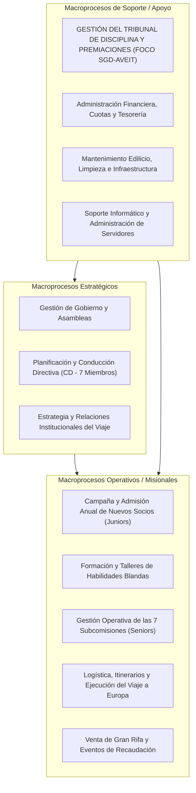

# UNIVERSIDAD TECNOLÓGICA NACIONAL
## FACULTAD REGIONAL CÓRDOBA
### Carrera: Analista Desarrollador Universitario de Sistemas de Información
### Cátedra: Seminario Integrador
**Ciclo Lectivo:** 2026  
**Curso:** 3K2  

---

# ESTUDIO INICIAL
## Sistema de Gestión del Tribunal de Disciplina y Premiaciones de A.V.E.I.T. (SGD-AVEIT)

---

### DATOS DEL PROYECTO Y EQUIPO DE TRABAJO

| Campo | Detalle |
| :--- | :--- |
| **Organización de Aplicación** | Asociación Vocacional de Estudiantes e Ingenieros Tecnológicos (A.V.E.I.T.) - UTN FRC |
| **Nombre del Sistema** | SGD-AVEIT (Sistema de Gestión del Tribunal de Disciplina y Premiaciones de AVEIT) |
| **Objetivo del Software** | Sistematizar, auditar y transparentar la gestión integral de expedientes disciplinarios, sustanciación de descargos (Formularios T01, T02, T03), cómputo algorítmico de puntajes (premios/sanciones), control de plazos preclusivos y generación automática de balances cuatrimestrales de auditoría mediante una plataforma 100% web y responsive mobile alineada al Estatuto Social y normativas procesales vigentes. |
| **Metodología Adoptada** | Metodología Ágil Adaptativa (Scrumban - PMI Agile Practice Guide) |
| **Integrantes del Equipo** | • **Sanchez, Diego Gabriel** (Legajo: 87414) - diegogabriel.stm@gmail.com<br>• **Guillén, Lucas Martín** (Legajo: 85194)<br>• **Rosales, Nicolás** (Legajo: 408917)<br>• **Gastiaburu, Lucas** (Legajo: 74907)<br>• **Villegas, Axel Rene** (Legajo: 403655)<br>• **Urviola, Luis** (Legajo: 409953)<br>• **Quiroz, Tomas Augusto** (Legajo: 415327) |
| **Cátedra / Docentes** | Seminario Integrador - UTN FRC |

---

## CONTROL DE VERSIONES / HISTORIAL DE REVISIONES

| Versión | Fecha | Autor / Responsable | Descripción de Modificaciones |
| :---: | :---: | :--- | :--- |
| **1.0.0** | 15/08/2026 | Equipo de Proyecto SGD-AVEIT | Elaboración inicial completa del documento de Estudio Inicial según Guía de Documentación UTN FRC. |
| **1.1.0** | 15/08/2026 | Equipo de Proyecto SGD-AVEIT | Ajuste de subcomisiones según Reglamento 2026 (7 subcomisiones), estructura de Comisión Directiva (7 miembros), especificación de base de datos MySQL, incorporación de la sanción por omisión de tareas asignadas (hasta -2 pts), modalidad de reuniones virtuales de TD y requerimiento de arquitectura 100% Web y Responsive Mobile. |
| **1.2.0** | 15/08/2026 | Equipo de Proyecto SGD-AVEIT | Incorporación del análisis comparativo entre el Reglamento Procesal Disciplinario 2018 (aprobado por Asamblea) y 2026 (flujo real). Estandarización de 6 estados del expediente, formularios T01, T02 y T03, delimitación de competencias de inicio y firma colegiada. |
| **1.3.0** | 16/08/2026 | Equipo de Proyecto SGD-AVEIT | Adecuación y armonización integral con el Estatuto Social 2026 respecto a la segmentación estatutaria de socios: categorización de Socios Juniors (1º y 2º año social) y Socios Seniors (3º a 6º año social), y su impacto en las responsabilidades asociativas y régimen disciplinario. |
| **1.4.0** | 18/08/2026 | Equipo de Proyecto SGD-AVEIT | Explicitación y estandarización de las fuentes documentales en la totalidad de las citas de artículos del documento (Estatuto Social de AVEIT, Reglamento Interno de Disciplina de AVEIT y Reglamento Procesal Disciplinario 2026). |
| **1.5.0** | 18/08/2026 | Equipo de Proyecto SGD-AVEIT | Adopción y formalización del marco metodológico **Scrumban** (integración adaptativa de flujo continuo pull, límites WIP de Kanban y gobernanza por hitos de Scrum) optimizado para el equipo de 7 integrantes y coordinación asíncrona. |

---

## TABLA DE CONTENIDO

1. [Glosario de Términos](#glosario-de-términos)
2. [Introducción General del Proyecto](#1-introducción-general-del-proyecto)
3. [Propósito del Documento](#2-propósito-del-documento)
4. [Descripción del Ámbito o Contexto de Aplicación (Organización)](#3-descripción-del-ámbito-o-contexto-de-aplicación)
   - 3.1. [Presentación de la Organización](#31-presentación-de-la-organización)
   - 3.2. [Objetivo de la Organización](#32-objetivo-de-la-organización)
   - 3.3. [Reseña Histórica](#33-reseña-histórica)
   - 3.4. [Dimensionamiento y Categorías de Socios](#34-dimensionamiento-y-categorías-de-socios)
   - 3.5. [Marco Normativo, Políticas Institucionales y Evolución Procesal (2018 vs 2026)](#35-marco-normativo-políticas-institucionales-y-evolución-procesal-2018-vs-2026)
   - 3.6. [Mapa Global de Procesos de la Organización](#36-mapa-global-de-procesos-de-la-organización)
   - 3.7. [Descripción de Procesos de Negocio Afectados por la Propuesta](#37-descripción-de-procesos-de-negocio-afectados-por-la-propuesta)
   - 3.8. [Recursos Informáticos Existentes y Modalidad Operativa](#38-recursos-informáticos-existentes-y-modalidad-operativa)
   - 3.9. [Lay-Out Físico y Dinámica Operativa de la Organización](#39-lay-out-físico-y-dinámica-operativa-de-la-organización)
5. [Problemas y Oportunidades](#4-problemas-y-oportunidades)
   - 4.1. [Problemas Detectados](#41-problemas-detectados)
   - 4.2. [Oportunidades de Mejora y Beneficios](#42-oportunidades-de-mejora-y-beneficios)

---

## GLOSARIO DE TÉRMINOS

* **A.V.E.I.T.:** Asociación Vocacional de Estudiantes e Ingenieros Tecnológicos de la Universidad Tecnológica Nacional – Facultad Regional Córdoba.
* **CD (Comisión Directiva):** Órgano ejecutivo de gobierno de AVEIT compuesto por 7 miembros (Presidente, Vicepresidente, Tesorero, Protesorero, Secretario General, Prosecretario y Secretario de Actas), responsable de la administración cotidiana, coordinación de subcomisiones y conducción institucional.
* **TD (Tribunal de Disciplina):** Órgano estatutario independiente encargado de juzgar las transgresiones reglamentarias, evaluar conductas, otorgar premios y aplicar sanciones a los socios (conformado por 3 miembros titulares y 3 suplentes electos por Asamblea entre los Socios Seniors).
* **Subcomisiones:** Órganos operativos de trabajo creados por estatuto y reglamento para áreas específicas (Cómputos, Relaciones Institucionales, Organización y Eventos, Prensa y Difusión, Mantenimiento, Recursos Humanos, y Gestión Social y Ambiental).
* **Socio Activo (u Ordinario):** Estudiante o graduado de la UTN FRC que participa de la vida asociativa, cumple con obligaciones sociales (cuotas, rifas, mantenimiento, reuniones) y acumula antigüedad social.
* **Socio Junior:** Socio ordinario perteneciente al **primer (1º) o segundo (2º) año social**, en etapa formativa y de integración a la vida institucional de la Asociación.
* **Socio Senior:** Socio ordinario perteneciente al **tercer (3º), cuarto (4º), quinto (5º) o sexto (6º) año social**, habiendo cumplimentado las obligaciones iniciales y requisitos académicos. Posee mayores atribuciones de gestión, asignación de tareas en subcomisiones y elegibilidad para órganos estatutarios de control y gobierno.
* **Socio Pasivo:** Socio que no tiene obligaciones de asistencia ni de tareas periódicas, pero mantiene su vínculo con la institución.
* **Año Social:** Período anual de permanencia y actividad formativa dentro de la estructura de grupos de AVEIT (del 1º al 6º año social).
* **Expediente Disciplinario:** Conjunto ordenado y sistemático de actuaciones, documentos, pruebas, descargos y dictámenes administrativos tramitados ante el TD para respaldar resoluciones institucionales.
* **Formulario T01 / Anexo T01:** Instrumento administrativo estandarizado mediante el cual una Autoridad, Presidente de Subcomisión o Jefe de Equipo solicita formalmente ante el TD la apertura de un expediente de premiación o sanción, detallando las causas circunstanciadas en su hoja de Anexo.
* **Formulario T02 (Justificación):** Formulario estandarizado utilizado por el socio imputado para justificar una inasistencia o incumplimiento en base a causales expresamente tipificadas en el reglamento (enfermedad con certificado, exámenes, viajes laborales/personales de fuerza mayor con pasajes).
* **Formulario T03 (Descargo):** Formulario de descargo especial utilizado para exponer circunstancias extraordinarias no tipificadas explícitamente en el reglamento, evaluadas por el TD conforme a antecedentes y sana crítica.
* **Resolución Disciplinaria:** Acto administrativo formal que da cierre al expediente, caracterizado por su estructura jurídica de VISTOS, CONSIDERANDOS y RESOLUCIÓN, y validado mediante firma colegiada por representantes de los grupos sociales seniors correspondientes.
* **Circular Normativa:** Documento emitido por el TD (ej. Circular 001/2026) que fija los criterios reglamentarios y escalas de solicitud de premios y sanciones.
* **Puntos Negativos (Sanciones):** Unidad de medida acumulativa (en fracciones mínimas de 0.5 puntos) aplicada a un socio por faltas, inasistencias u omisión de tareas asignadas. Al acumular diez (10) puntos negativos netos, el socio pierde automáticamente su condición institucional.
* **Puntos Positivos (Premios):** Unidad de medida acumulativa otorgada a socios o grupos en reconocimiento a desempeños sobresalientes, proactividad y aportes extraordinarios a la Asociación.
* **Balance Cuatrimestral de Disciplina:** Informe oficial y consolidado emitido dos veces al año que resume las actuaciones, auditorías y saldos de premios/sanciones de los socios y subcomisiones (Art. 137 del Reglamento Interno de Disciplina de AVEIT).
* **Viaje Técnico-Cultural:** Proyecto formativo cumbre de AVEIT que consiste en una estancia de estudios de aproximadamente tres meses por países de Europa, visitando centros de desarrollo científico-tecnológico, plantas industriales y universidades de primer nivel.
* **Responsive Mobile / Mobile-First:** Enfoque de diseño y arquitectura de software web que garantiza una usabilidad fluida y completa en dispositivos móviles (smartphones y tablets) así como en equipos de escritorio.

---

## 1. INTRODUCCIÓN GENERAL DEL PROYECTO

La formación académica de los futuros ingenieros en la Universidad Tecnológica Nacional (UTN FRC) se complementa de forma decisiva con el desarrollo de competencias interpersonales, habilidades blandas, liderazgo y visión internacional. En este marco, la **Asociación Vocacional de Estudiantes e Ingenieros Tecnológicos (A.V.E.I.T.)** desempeña un rol fundamental desde hace más de cinco décadas mediante una propuesta formativa vivencial que culmina con un Viaje Técnico-Cultural por Europa de tres meses de duración.

Para sustentar esta estructura asociativa, basada en el compromiso voluntario y el trabajo mancomunado de más de 500 socios (divididos orgánicamente entre Socios Juniors de 1º a 2º año y Socios Seniors de 3º a 6º año social), AVEIT cuenta con un estricto **Estatuto Social**, un **Reglamento Interno de Disciplina** y un **Reglamento Procesal Disciplinario** orientados a garantizar la equidad, el cumplimiento de los deberes sociales y la transparencia en la convivencia institucional. Dentro de este esquema, el **Tribunal de Disciplina (TD)** es el órgano clave responsable de dictaminar sobre faltas, administrar descargos y otorgar incentivos y penalizaciones a través de un sistema de puntaje acumulativo.

En la actualidad, la organización experimenta una dualidad procedimental: si bien el marco reglamentario formal aprobado por Asamblea responde a la versión 2018 (con procedimientos concebidos bajo una lógica física y en papel), la práctica cotidiana y la dinámica de trabajo real han evolucionado hacia las pautas del **Reglamento Procesal Disciplinario 2026**. Bajo esta modalidad operativa real, el TD sesiona y delibera de forma predominantemente virtual, requiriendo flujos ágiles para la tramitación de expedientes, recepción de formularios digitales (T01, T02, T03) y notificación por correo electrónico.

Sin embargo, el sistema informático institucional actual (con backend en Python y base de datos relacional MySQL) carece de un módulo disciplinario integrado. Esto obliga a las integrantes del TD a llevar el control mediante múltiples hojas de cálculo desconectadas en Google Sheets, generando opacidad hacia los socios, graves riesgos de seguridad (como la modificación manual de puntos en base de datos mediante sentencias `UPDATE`), demoras en los plazos procesales de 5 días y la imposibilidad operativa de emitir los balances cuatrimestrales exigidos estatutariamente.

El presente proyecto propone el diseño, desarrollo e implementación del **Sistema de Gestión del Tribunal de Disciplina y Premiaciones de AVEIT (SGD-AVEIT)** como una plataforma **100% web y responsive mobile** que articulará y consolidará el flujo de trabajo procesal 2026, automatizando la totalidad del ciclo de expedientes, recepción de descargos con adjuntos digitales, votación colegiada, cómputo algorítmico de saldos de puntos y generación instantánea de balances de auditoría.

---

## 2. PROPÓSITO DEL DOCUMENTO

El propósito de este documento de **Estudio Inicial** es establecer las bases funcionales, organizacionales, normativas y contextuales del proyecto de software, respondiendo formalmente a las directrices de la cátedra de Seminario Integrador de la UTN – Facultad Regional Córdoba.

Específicamente, este documento persigue los siguientes objetivos:
1. Describir formalmente la organización beneficiaria (**A.V.E.I.T.**), su estructura orgánica (Asamblea General, Comisión Directiva de 7 miembros, Tribunal de Disciplina de 6 miembros y 7 Subcomisiones reglamentarias), historia, dimensionamiento operativo, segmentación de socios Juniors (1º y 2º año) y Seniors (3º a 6º año), layout físico y políticas de gobierno.
2. Analizar el marco reglamentario procesal, contrastando la versión histórica 2018 con el flujo de trabajo vigente 2026, estandarizando los 6 estados del expediente, formularios (T01, T02, T03) y competencias institucionales.
3. Caracterizar el mapa global de procesos y detallar minuciosamente los procesos de negocio directamente afectados por la implementación del software.
4. Relevar el estado de los recursos informáticos, la infraestructura preexistente (servidor central, backend Python, MySQL, Google Sheets) y la modalidad operativa virtual del TD.
5. Identificar las problemáticas críticas que afectan la gestión disciplinaria actual y fundamentar las oportunidades de mejora tecnológica y organizacional que brindará el sistema **SGD-AVEIT**.
6. Servir como instrumento de alineación inicial entre el equipo de desarrollo, la cátedra y las autoridades de AVEIT para dar paso a las fases de Planificación y Especificación de Requerimientos.

---

## 3. DESCRIPCIÓN DEL ÁMBITO O CONTEXTO DE APLICACIÓN

### 3.1. Presentación de la Organización
* **Razón Social / Denominación Oficial:** Asociación Vocacional de Estudiantes e Ingenieros Tecnológicos (A.V.E.I.T.)
* **Personería Jurídica:** Asociación Civil sin fines de lucro vinculada a la comunidad de la Universidad Tecnológica Nacional – Facultad Regional Córdoba.
* **Ubicación Física / Emplazamiento:** Sede Social A.V.E.I.T., Predio UTN FRC – Ciudad Universitaria, Av. Cruz Roja Argentina esq. Maestro Marcelo López, Ciudad de Córdoba, Provincia de Córdoba, República Argentina.

```
+------------------------------------------------------------------------------------+
|                       ORGANIGRAMA INSTITUCIONAL DE A.V.E.I.T.                      |
+------------------------------------------------------------------------------------+
|                             ASAMBLEA GENERAL DE SOCIOS                             |
|                (Órgano Soberano: Ordinaria anual y Extraordinarias)                |
+-------------------------+--------------------------------+-------------------------+
                          |                                |
        +-----------------v----------------+    +----------v------------------+
        |        COMISIÓN DIRECTIVA        |    |    TRIBUNAL DE DISCIPLINA   |
        |           (7 Miembros:           |    |   (6 Miembros: 3 Titulares  |
        |  Presidente, Vicepresidente,     |    |   y 3 Suplentes electos     |
        |  Tesorero, Protesorero,          |    |   por Asamblea de Socios    |
        |  Secretario General,             |    |   Seniors)                  |
        |  Prosecretario y Sec. de Actas)  |    +-----------------------------+
        +-----------------+----------------+
                          |
  +-----------------------+-----------------------------------------------+
  |                       |                       |                       |
+-v-----------------+   +-v-----------------+   +-v-----------------+   +-v-----------------+
|  Subcomisión de   |   |  Subcomisión de   |   |  Subcomisión de   |   |  Subcomisión de   |
|     Cómputos      |   |  Relaciones Inst. |   |   Org. y Eventos  |   | Prensa y Difusión |
+-------------------+   +-------------------+   +-------------------+   +-------------------+
  |                       |                       |
+-v-----------------+   +-v-----------------+   +-v-----------------+
|  Subcomisión de   |   |  Subcomisión de   |   |  Subcomisión de   |
|   Mantenimiento   |   | Recursos Humanos  |   | G. Social y Amb.  |
+-------------------+   +-------------------+   +-------------------+
```

### 3.2. Objetivo de la Organización
La misión fundamental de A.V.E.I.T. es dotar a los estudiantes y graduados de las diversas especialidades de ingeniería de la UTN FRC de herramientas, competencias interpersonales, liderazgo y habilidades blandas (comunicación asertiva, resolución de conflictos, trabajo en equipo, oratoria, gestión de proyectos) que complementen su formación estrictamente técnico-analítica.

Como eje articulador y herramienta pedagógica central, la Asociación organiza y desarrolla un **Viaje Técnico-Cultural de Estudios por Europa**, de aproximadamente tres meses de duración, donde los socios visitan las plantas industriales, laboratorios y complejos científico-tecnológicos más avanzados del mundo, integrando conocimientos técnicos y vivencias multiculturales.

### 3.3. Reseña Histórica
Fundada en el año **1965** por un grupo visionario de estudiantes de la Universidad Tecnológica Nacional – Facultad Regional Córdoba, AVEIT nació bajo la convicción de que los futuros ingenieros necesitaban ampliar sus horizontes formativos más allá de las aulas convencionales. Inspirados en los modelos de formación dual y extensión universitaria de las principales escuelas técnicas internacionales, los miembros fundadores estructuraron una asociación autogestionada donde el esfuerzo colaborativo y el régimen de superación personal permitieran financiar y coordinar misiones de estudio internacionales.

A lo largo de más de seis décadas ininterrumpidas de trayectoria, la Asociación ha perfeccionado su marco normativo a través de sucesivas reformas estatutarias (con su última gran reforma integral consolidada en el Estatuto 2026 y el Reglamento Interno de Disciplina 2026). Decenas de promociones de graduados han recorrido centros tecnológicos globales, convirtiendo a AVEIT en una institución de referencia de la UTN FRC que fomenta la cultura del mérito, el trabajo en equipo y la responsabilidad cívica.

### 3.4. Dimensionamiento y Categorías de Socios
La escala operativa de AVEIT presenta una estructura asociativa de marcada envergadura:
* **Padrón de Socios Activos:** Aproximadamente **515 socios activos**, categorizados estatutariamente según su antigüedad social y avance curricular:
  * **Socios Juniors (1º y 2º año social):** Socios en etapa formativa y de inserción en la dinámica asociativa.
  * **Socios Seniors (3º, 4º, 5º y 6º año social):** Socios con mayor antigüedad que han cumplimentado las obligaciones formativas previas y requisitos académicos curriculares. Asumen responsabilidades de conducción operativa, integración de subcomisiones, elegibilidad en el Tribunal de Disciplina y preparación directa hacia el Viaje Final de Estudios (Grupo Viajero en 6º año).
* **Socios Pasivos y Honorarios:** Varias decenas de socios pasivos (quienes han completado su ciclo obligatorio o no poseen tareas semanales activas pero colaboran en actividades especiales).
* **Estructura Directiva, de Control y Subcomisiones:**
  * **Comisión Directiva:** 7 miembros (Presidente, Vicepresidente, Tesorero, Protesorero, Secretario General, Prosecretario y Secretario de Actas).
  * **Tribunal de Disciplina:** 6 miembros (3 titulares y 3 suplentes electos por Asamblea entre los Socios Seniors).
  * **Comisión Revisora de Cuentas:** 3 miembros.
  * **Subcomisiones Reglamentarias (7):** Cómputos, Relaciones Institucionales, Organización y Eventos, Prensa y Difusión, Mantenimiento, Recursos Humanos, y Gestión Social y Ambiental.
* **Volumen Operativo del Tribunal de Disciplina:**
  * Tratamiento de **decenas de expedientes anuales** por faltas a reuniones obligatorias, omisión de tareas asignadas en subcomisiones, incumplimientos en turnos de mantenimiento/limpieza y propuestas de reconocimiento al mérito.
  * Gestión de más de un centenar de solicitudes de justificación y descargos (T02 y T03) con certificados médicos o pasajes de viaje por período.
  * **Situación de los Balances Cuatrimestrales de Auditoría Interna:** Si bien el Art. 137 del Reglamento Interno de Disciplina de AVEIT estipula la emisión de dos (2) Informes y Balances Cuatrimestrales de Auditoría Interna de Premiaciones y Sanciones por año social, actualmente este proceso no se está llevando a cabo de manera regular debido a la excesiva carga operativa manual en hojas de cálculo. La plataforma SGD-AVEIT automatizará su generación para facilitar su presentación regular ante Comisión Directiva y Asambleas.

---

### 3.5. Marco Normativo, Políticas Institucionales y Evolución Procesal (2018 vs 2026)

#### 3.5.1. Dualidad Normativa, Realidad Operativa (2018 vs. 2026) y Validación Institucional
La gestión disciplinaria en AVEIT presenta un contexto normativo particular:
* **Reglamento Procesal Disciplinario (Versión 2018):** Es el último cuerpo procesal aprobado formalmente mediante Asamblea General. Establecía una dinámica fuertemente anclada en soporte físico de papel: entrega presencial de formularios T-02 y T-03 en la secretaría de la sede social en horarios acotados de atención, sellado y firmado manual, publicación de resoluciones en la *esterilla de corcho* del hall de entrada y apelaciones mediante figuras de "Disposiciones".
* **Reglamento Procesal Disciplinario (Versión 2026):** Representa la normativa procesal que plasma la **realidad y el flujo de trabajo efectivo de la Asociación**. Suprime la burocracia física, adopta la tramitación electrónica de expedientes, reconoce la modalidad de sesiones virtuales del TD (al menos 2 veces al mes) y estandariza los formularios digitales y los plazos perentorios de 5 días hábiles.
* **Validación Institucional del Procedimiento 2026 (Competencia del Órgano de Aplicación):**  
  Conforme al Estatuto Social de AVEIT (Arts. 94, 95 y 96), el **Tribunal de Disciplina es un órgano estatutario colegiado e independiente** de la Comisión Directiva, investido de facultades disciplinarias y jurisdiccionales privativas. En ejercicio de sus atribuciones normativas y para dotar de operatividad efectiva a las garantías del debido proceso consagradas en el Estatuto, el propio Tribunal de Disciplina dicta, aprueba y convalida su procedimiento operativo interno mediante la emisión formal de la **Circular Normativa 001/2026**. Por consiguiente, la adopción del procedimiento 2026 cuenta con plena legitimidad y competencia institucional emanada de la propia autoridad natural del fuero disciplinario de AVEIT, rigiendo válidamente como norma procesal especial y aplicable al ejercicio social en curso.

El sistema **SGD-AVEIT** toma como base estructural el flujo real del Reglamento 2026, asegurando al mismo tiempo la plena compatibilidad estatutaria y jurídica.

#### 3.5.2. Los Seis (6) Estados Oficiales del Expediente (Art. 12 del Reglamento Procesal Disciplinario 2026)
1. **Expediente Creado:** Se origina a partir del cierre de un evento obligatorio/sancionable en el sistema por la autoridad a cargo, o mediante la solicitud formal de un Formulario T01 con Anexo elevado por una autoridad competente.
2. **En período de subida de justificaciones (5 días hábiles):** Tras el cierre del evento o recepción del T01, el sistema envía automáticamente el *Acuse de Sanción* por correo electrónico. El socio dispone de un plazo improrrogable de **cinco (5) días hábiles** para ingresar al módulo "Mis Expedientes" y generar su justificación (Formulario T02) o descargo (Formulario T03) con los comprobantes digitales correspondientes.
3. **Las justificaciones están siendo revisadas:** Cumplido el plazo de 5 días, el Tribunal de Disciplina analiza las solicitudes en el módulo "Justificaciones", aprobando o rechazando formalmente cada justificación y evaluando las solicitudes T01 junto a sus descargos.
4. **En espera de resolución:** Concluida la revisión probatoria, el expediente queda habilitado para la redacción de la Resolución definitiva, indicando la fundamentación fáctica, los reglamentos respaldantes y la puntuación asignada.
5. **Pendiente de firma y envío:** La resolución redactada debe ser suscripta y avalada obligatoriamente por miembros del Tribunal en representación colegiada de los grupos sociales seniors.
6. **Expedientes ya emitidos:** Una vez firmada la resolución, el sistema remite automáticamente las notificaciones electrónicas con copia a los socios imputados, a la Comisión Directiva y al solicitante, impactando los puntos y publicando el dictamen.

#### 3.5.3. Catálogo de Formularios Administrativos Oficiales
* **Formulario T01 (Solicitud de Premiación o Sanción) y Hoja Anexo T01 (Arts. 16 y 16 BIS del Reglamento Procesal Disciplinario 2026):** Exclusivo para autoridades habilitadas. Permite describir formalmente las causas, hechos, pruebas y socios implicados, proponiendo la cuantía de puntos.
* **Formulario T02 (Justificación Tipificada - Art. 17 del Reglamento Procesal Disciplinario 2026):** Estructurado en 4 bloques: *Datos Personales, Descripción de la Sanción, Justificación* (causales tipificadas en el Reglamento Interno de Disciplina de AVEIT: enfermedad con certificado médico, viajes de fuerza mayor con pasajes, obligaciones académicas) y *Observaciones*.
* **Formulario T03 (Descargo Extraordinario - Art. 18 del Reglamento Procesal Disciplinario 2026):** Utilizado para circunstancias extraordinarias no tipificadas explícitamente en el reglamento, evaluadas bajo sana crítica del TD y antecedentes jurisprudenciales.
* **Circular 001/2026 del Tribunal de Disciplina (Arts. 20 y 20 BIS del Reglamento Procesal Disciplinario 2026):** Instrumento normativo del TD que estipula los criterios de graduación y pedidos de puntos.

#### 3.5.4. Competencia de Autoridades para el Inicio de Acciones (Arts. 21 a 26 del Reglamento Procesal Disciplinario 2026)
* **Comisión Directiva:** Puede iniciar acciones sobre cualquier socio activo (Junior o Senior), subcomisión o equipo, excepto sobre miembros de su propio cuerpo.
* **Comisión Fiscalizadora:** Puede iniciar acciones sobre socios activos, Comisión Directiva, Comisión Revisora y Tribunal de Disciplina.
* **Comisión Revisora de Cuentas:** Competente para iniciar acciones por faltas en el área de Tesorería.
* **Tribunal de Disciplina:** Puede actuar de oficio cuando ninguna otra autoridad haya accionado, o solicitar expedientes en concepto de "rectificación". El miembro del TD que solicite una medida no puede participar del juzgamiento de la misma.
* **Presidentes y Vicepresidentes de Subcomisión:** Pueden accionar exclusivamente sobre los socios a su cargo (miembros ordinarios o voluntarios), no sobre las demás autoridades de la subcomisión.
* **Jefes de Equipos de Trabajo Temporales:** Pueden solicitar acciones sobre los miembros de su equipo.

#### 3.5.5. Escalas de Premios, Sanciones y Límite Crítico Estatutario
1. **Escala de Premios (Puntos Positivos):** Leve (0.5 a 1 pto), Media (1 a 2 ptos) y Sobresaliente (2 a 4 ptos).
2. **Escala de Sanciones (Puntos Negativos):**
   * *Inasistencia injustificada a Reunión Obligatoria:* 1 punto negativo.
   * *Inasistencia injustificada a Asamblea Ordinaria/Extraordinaria:* 2 puntos negativos.
   * *Omisión de tareas de Mantenimiento / Limpieza General:* 2 puntos negativos.
   * *Omisión / Incumplimiento de Tareas Asignadas por CD o Autoridades Delegadas:* Graduada desde un **llamado de atención hasta dos (2) puntos negativos (-2)**.
   * *Llegadas tarde / retiros anticipados:* Llamado de atención o 0.5 puntos negativos.
3. **Cláusula de Pérdida Automática de Condición de Socio (Límite Crítico - Art. 93 del Reglamento Interno de Disciplina de AVEIT):** Todo socio que acumule **diez (10) o más puntos negativos netos** pierde automáticamente su calidad de socio de AVEIT.
4. **Irrecurribilidad:** Las decisiones del TD se adoptan por mayoría absoluta y son irrecurribles (Art. 96 del Estatuto Social de AVEIT).

#### 3.5.6. Técnicas y Fuentes del Relevamiento Institucional y Técnico
Para la elicitación rigurosa del contexto de la organización, sus problemáticas operativas y el marco regulatorio aplicable, el equipo de desarrollo llevó a cabo un proceso integral de relevamiento estructurado en las siguientes técnicas y fuentes:

1. **Técnicas de Relevamiento Aplicadas:**
   * **Entrevistas No Estructuradas y Reuniones Abiertas:** Sesiones de diálogo mantenidas con los miembros del Tribunal de Disciplina y con la Subcomisión de Cómputos para relevar los puntos de dolor cotidianos, flujos de trabajo e interacciones con el sistema preexistente.
   * **Talleres de Trabajo y Co-Diseño (Workshops):** Jornadas interactivas de revisión de casos reales de sanciones, justificaciones y expedientes, contrastando el articulado reglamentario con la práctica procesal efectiva.
   * **Observación Participante e Inmersión Institucional Directa:** El relevamiento contó con una ventaja cualitativa sustancial derivada de la participación activa de integrantes del equipo dentro de la vida institucional de AVEIT:
     - **Diego Gabriel Sánchez (Líder de Proyecto / Product Owner):** Se desempeñó formalmente como **Secretario General de la Comisión Directiva de AVEIT**, aportando conocimiento directo y profundo sobre la gobernanza institucional, el circuito de actas, la tramitación interorgánica y las dinámicas de sanciones y reconocimientos; actualmente ejerce como **Autoridad de la Subcomisión de Gestión Social y Ambiental (GSA)** (órgano competente para la emisión de solicitudes T01 por cumplimiento de tareas).
     - **Nexo Directo y Permanente con los Integrantes del Tribunal de Disciplina:** La vinculación estrecha y cotidiana con los miembros del TD permitió observar en tiempo real la dinámica de las sesiones virtuales, la recepción de descargos, el debate colegiado y los cuellos de botella en la confección de resoluciones.

2. **Fuentes Documentales Analizadas:**
   * *Estatuto Social de A.V.E.I.T. (Reforma Integral 2026):* Estructura de gobierno, derechos y obligaciones de los socios, segmentación de Socios Juniors (1º y 2º año) y Seniors (3º a 6º año), composición y atribuciones de los órganos de gobierno (CD, TD, Comisión Revisora y Subcomisiones).
   * *Reglamento Interno de Disciplina de A.V.E.I.T.:* Tipificación de faltas y premios, régimen sancionatorio, cláusula de exclusión por acumulación de 10 puntos negativos (Art. 93) y obligación de balances cuatrimestrales de auditoría (Art. 137).
   * *Reglamento Procesal Disciplinario (Versión Histórica 2018):* Procedimiento formal analógico de secretaría, plazos y recursos de reconsideración.
   * *Reglamento Procesal Disciplinario (Versión 2026):* Flujo operativo digital, tramitación de los 6 estados de expedientes, formularios estandarizados y plazos preclusivos de 5 días hábiles.
   * *Circular Normativa 001/2026 del Tribunal de Disciplina:* Criterios de graduación de sanciones y solicitudes de mérito.
   * *Libros de Actas y Resoluciones Previas:* Análisis de resoluciones disciplinarias históricas y su estructura formal (Vistos, Considerandos y Resolución).

3. **Sistemas y Herramientas Analizadas:**
   * *Sistema Web Institucional Preexistente de AVEIT:* Inspección técnica del código fuente backend desarrollado en Python y del modelo relacional en la base de datos MySQL (revisión de tablas de padrón de socios, usuarios, subcomisiones, eventos institucionales y control de asistencias).
   * *Ecosistema Informático Actual del Tribunal de Disciplina:* Relevamiento y auditoría de las múltiples hojas de cálculo en Google Sheets utilizadas por el TD para asentar el puntaje de los socios, registrar justificaciones manuales y realizar seguimientos informales de plazos.

---

### 3.6. Mapa Global de Procesos de la Organización



---

### 3.7. Descripción de Procesos de Negocio Afectados (Situación Actual - Flujo AS-IS)

En la actualidad, la gestión disciplinaria se rige operativamente bajo la lógica procesal del **Reglamento 2026**, pero al carecer de un módulo disciplinario integrado en el sistema institucional, el proceso se ejecuta mediante **mecanismos manuales, canales informales y planillas de cálculo desconectadas**, generando severas ineficiencias, opacidad y riesgos para la integridad de los datos.

A continuación se describe minuciosamente el funcionamiento del proceso actual (**AS-IS, sin SGD-AVEIT**) a lo largo de sus cinco etapas operativas:

#### Proceso 1 (AS-IS): Detección, Reporte y Registro de Infracción o Mérito (Formulario T01)
* **Disparador:** Ocurrencia de una falta reglamentaria (inasistencia a asamblea o reunión, omisión de tareas asignadas en subcomisiones, falta a turnos de mantenimiento) o propuesta formal de reconocimiento al mérito.
* **Mecanismo Operativo Actual (AS-IS):**
  1. Los formularios T01 son creados en el sistema institucional preexistente por la Comisión Directiva, el Tribunal de Disciplina actuando de oficio, o bien por las Autoridades de Subcomisión (o bien se derivan del cierre administrativo de eventos con inasistencias).
  2. Sin embargo, debido a que el sistema institucional actual **no posee un módulo disciplinario integrado** que prosiga con la gestión del expediente, estas solicitudes T01 quedan estancadas como registros aislados en la base de datos, sin un flujo procesal continuo ni articulación con las etapas posteriores.
  3. En consecuencia, las integrantes del Tribunal de Disciplina deben consultar periódicamente el sistema o depender de avisos informales para tomar conocimiento de las nuevas solicitudes, debiendo **transcribir o exportar manualmente cada solicitud T01 hacia una planilla de cálculo central en Google Sheets** para poder iniciar la tramitación.
* **Entradas:** Registro de Formulario T01 creado en el sistema institucional actual o cierre de eventos obligatorios.
* **Salidas:** Fila transcripta manualmente en la planilla de Google Sheets del Tribunal de Disciplina.
* **Problemas y Riesgos Detectados:** Desconexión tecnológica entre el registro inicial del T01 y su tratamiento procesal; demoras de días en la toma de conocimiento por el TD; y sobrecarga operativa con riesgo de omisión accidental de causas.

#### Proceso 2 (AS-IS): Notificación y Carga de Justificaciones/Descargos (Formularios T02 y T03)
* **Disparador:** Incorporación manual de la infracción en la planilla de Google Sheets del Tribunal de Disciplina.
* **Mecanismo Operativo Actual (AS-IS):**
  1. Una integrante del TD redacta y envía de forma manual un correo electrónico individual (o mensaje vía WhatsApp) al socio imputado notificándole la apertura de la causa disciplinaria.
  2. El cómputo del plazo preclusivo de **cinco (5) días hábiles** establecido por el reglamento se efectúa de manera manual y visual por los miembros del TD sobre un calendario civil tradicional.
  3. El socio imputado debe descargar plantillas estáticas de texto (en Word o PDF) del **Formulario T02** (para justificaciones tipificadas: certificados médicos, obligaciones laborales, constancias de examen) o **Formulario T03** (para descargos extraordinarios).
  4. El socio completa la plantilla en su computadora y la envía como archivo adjunto por correo electrónico a la casilla del TD o la carga en carpetas compartidas de Google Drive, adjuntando fotografías o escaneos de sus comprobantes probatorios.
* **Entradas:** Correo electrónico de acuse remitido manualmente; comprobantes escaneados y plantillas T02/T03 enviadas por el socio imputado.
* **Salidas:** Archivos dispersos en casillas de correo electrónico y carpetas de Google Drive; actualización manual de una columna en la planilla Sheets indicando 'Descargo Presentado'.
* **Problemas y Riesgos Detectados:** Inexistencia de sellado de tiempo fehaciente; imposibilidad de auditar objetivamente si el descargo ingresó dentro del término perentorio de los 5 días hábiles; extravío de adjuntos en casillas de correo; y alta tasa de socios que alegan no haberse enterado de las notificaciones al no haber constancia de entrega ni lectura.

#### Proceso 3 (AS-IS): Sustanciación, Análisis, Votación y Dictamen del Tribunal de Disciplina
* **Disparador:** Vencimiento del plazo de 5 días hábiles o recepción de los descargos remitidos por correo electrónico.
* **Mecanismo Operativo Actual (AS-IS):**
  1. El Tribunal de Disciplina celebra sus sesiones periódicas quincenales bajo modalidad predominantemente virtual (mediante Google Meet o Discord).
  2. Durante la videollamada, las integrantes comparten pantalla para revisar los correos electrónicos recibidos, las plantillas T02/T03 y los certificados médicos o pasajes alojados en las carpetas de Drive.
  3. Para evaluar antecedentes similares o jurisprudencia previa, las miembros deben buscar manualmente en archivos de actas anteriores o basarse en la memoria institucional de los Socios Seniors, exponiendo los fallos a disparidad de criterios.
  4. El debate y la votación de cada expediente se efectúan de forma verbal. Una vez alcanzada la mayoría reglamentaria, se redacta el texto de la Resolución Disciplinaria en un documento colaborativo de Google Docs estructurado en sus secciones formales (Vistos, Considerandos y Resolución).
  5. La suscripción de la resolución carece de un mecanismo formal digital y se plasma únicamente mediante la consignación de los nombres de los miembros firmantes en el pie del documento.
* **Entradas:** Expediente en borrador, archivos de Drive, actas previas y deliberación verbal remota.
* **Salidas:** Archivo de Google Docs con la resolución redactada y exportada manualmente a formato PDF.
* **Problemas y Riesgos Detectados:** Falta de un registro formal e inalterable de los votos individuales de los miembros; dependencia de documentos colaborativos susceptibles de modificaciones posteriores no deseadas; y lentitud en la búsqueda de antecedentes jurisprudenciales históricos.

#### Proceso 4 (AS-IS): Cómputo de Saldo de Puntos, Publicación y Control de Límites Críticos
* **Disparador:** Conclusión y exportación a PDF de la Resolución Disciplinaria.
* **Mecanismo Operativo Actual (AS-IS):**
  1. Las integrantes del TD ingresan a la planilla central de Google Sheets y modifican manualmente las celdas correspondientes al socio imputado, sumando o restando los puntos dictaminados mediante fórmulas de hoja de cálculo.
  2. Si con posterioridad se detecta un error material de tipeo o se resuelve una rectificación, se sobreescribe directamente la celda de la planilla sin que quede constancia del cambio, del responsable ni del motivo.
  3. Asimismo, cuando se requiere impactar el estado del socio en el sistema institucional preexistente, al no haber módulo integrado, se debe recurrir a solicitudes informales dirigidas a la Subcomisión de Cómputos para que ejecuten manualmente sentencias SQL `UPDATE` directas sobre la base de datos MySQL, con grave vulneración de la integridad, inmutabilidad y trazabilidad de los datos.
  4. El monitoreo de los umbrales reglamentarios críticos (-7 puntos para advertencia preventiva y -10 puntos para la pérdida automática de condición de socio según Art. 93 del Reglamento Interno) se efectúa mediante revisión visual periódica de las planillas. No existen alertas automáticas, existiendo el riesgo de que un socio continúe activo habiendo superado el límite estatutario de exclusión.
  5. La publicación y notificación de la resolución se realiza enviando el PDF por correo electrónico de forma individual al socio y a Comisión Directiva.
* **Entradas:** PDF de resolución final.
* **Salidas:** Celdas editadas a mano en Google Sheets; solicitudes de sentencias `UPDATE` en MySQL; correos electrónicos individuales despachados.
* **Problemas y Riesgos Detectados:** Falta total de pistas de auditoría en la modificación de puntos; riesgo crítico de manipulación o corrupción accidental de fórmulas en Google Sheets; sentencias `UPDATE` manuales directas en base de datos; y ausencia de un canal transparente donde la totalidad de los socios puedan consultar sus saldos y fallos públicos.

#### Proceso 5 (AS-IS): Confección y Emisión de Balances Cuatrimestrales de Auditoría (Art. 137)
* **Disparador:** Cumplimiento del período cuatrimestral estipulado en el Art. 137 del Reglamento Interno de Disciplina de AVEIT (dos veces por año social).
* **Mecanismo Operativo Actual (AS-IS):**
  1. Las autoridades del Tribunal de Disciplina deben revisar manualmente la totalidad de las filas de las hojas de Google Sheets del período, cruzando los expedientes iniciados, justificaciones admitidas, sanciones firmes y puntos de premios otorgados.
  2. Deben agrupar a mano los saldos por cada una de las 7 subcomisiones de trabajo y por categoría de socios (Juniors de 1º y 2º año, Seniors de 3º a 6º año).
  3. La magnitud del trabajo de consolidación manual en planillas fragmentadas resulta tan excesiva que, en la práctica actual de la Asociación, **este balance no se está logrando emitir de forma regular y periódica**, o se presenta de forma tardía y con datos incompletos.
* **Entradas:** Múltiples hojas de cálculo de Google Sheets, actas y carpetas de correos del cuatrimestre.
* **Salidas:** Informe confeccionado manualmente en documento de texto (cuando se logra concretar) o bien omisión del balance.
* **Problemas y Riesgos Detectados:** Incumplimiento sistemático de una obligación reglamentaria estatutaria (Art. 137); falta de información consolidada para la Comisión Directiva y las Asambleas de Socios; y opacidad en la rendición de cuentas institucional.

---

#### 3.7.1. Matriz Comparativa de Transformación: Situación Actual (AS-IS) vs. Solución Propuesta (TO-BE con SGD-AVEIT)

| Dimensión de Proceso | Situación Actual (AS-IS - Sin SGD-AVEIT) | Solución Propuesta (TO-BE - Con SGD-AVEIT) |
| :--- | :--- | :--- |
| **Inicio de Acciones (T01)** | T01 creados en sistema institucional pero desconectados; transcripción manual a Google Sheets. | Integración nativa directa: la solicitud T01 o cierre de evento genera automáticamente el expediente formal en estado 'Expediente Creado'. |
| **Control de Plazos (5 días)** | Conteo manual de días hábiles sobre calendario; alta probabilidad de error humano. | Cron/daemon automatizado con sellado de tiempo y temporizador preclusivo fehaciente e inalterable. |
| **Carga de Descargos (T02/T03)** | Descarga de Word/PDF y envío por mail o Drive; dispersión y extravío de adjuntos. | Formulario web responsive con carga digital directa de comprobantes asociada unívocamente al expediente. |
| **Deliberación y Votación** | Videollamadas informales y redacción en Google Docs; votación verbal no auditable. | Tablero centralizado de expedientes, registro nominal de votos y redacción guiada de resoluciones. |
| **Validación Colegiada** | Mención de nombres en documento colaborativo editable; sin valor de auditoría. | Firma electrónica interna con sesión autenticada, timestamp, ID de miembro y hash inalterable. |
| **Cómputo e Integridad del Saldo** | Edición manual de celdas en Sheets; pedidos de sentencias `UPDATE` directas en DB MySQL sin auditoría. | Lógica de cálculo en backend con auditoría inmutable mediante triggers y tabla histórica en MySQL; prohibición de mutación directa. |
| **Alertas de Límite (-7 y -10)** | Control visual a ojo; riesgo de que socios suspendidos o expulsados continúen operando. | Disparo automatizado de alertas preventivas (-7 pts) y notificación crítica de exclusión estatutaria (-10 pts). |
| **Transparencia Societaria** | Información opaca; los socios dependen de consultar personalmente al TD. | Portal responsive público de resoluciones dictadas y módulo 'Mis Expedientes' para consulta de saldos en tiempo real. |
| **Balance Cuatrimestral (Art. 137)** | Omitido o confeccionado con meses de demora debido a la sobrecarga de recopilación manual. | Generación y exportación instantánea con un clic de balances por subcomisión y categoría Junior/Senior. |

---

### 3.8. Recursos Informáticos Existentes y Modalidad Operativa

A continuación se detalla la infraestructura tecnológica y la modalidad operativa con la que cuenta AVEIT al momento de iniciar este proyecto:

| Componente | Descripción y Estado Actual |
| :--- | :--- |
| **Servidor Central** | Servidor físico / dedicado ubicado en la sede de AVEIT, responsable del alojamiento del sistema institucional web y servicios centrales. |
| **Backend Institucional** | Arquitectura backend desarrollada en **Python**, que provee servicios web y lógica de negocio para módulos preexistentes. |
| **Base de Datos Relacional** | Motor de base de datos relacional **MySQL** alojado en el servidor central que almacena el padrón de socios y tablas institucionales. |
| **Herramientas Actuales del TD** | El Tribunal de Disciplina gestiona sus registros, cómputo de puntos y asistencias mediante **múltiples hojas de cálculo desconectadas en Google Sheets**, sin integración transaccional ni seguridad perimetral. |
| **Modalidad de Trabajo del TD** | Las integrantes del Tribunal de Disciplina llevan adelante sus sesiones de trabajo y deliberación de manera **predominantemente virtual**, requiriendo que la nueva plataforma sea **100% Web y Responsive Mobile** para operar desde smartphones, tablets o notebooks sin depender de terminales físicas en la sede. |
| **Equipamiento de Sede** | Computadoras de escritorio (PCs) en la Oficina Administrativa y Sala de TD, equipadas con procesadores modernos, monitores, teclados, impresoras y acceso a la red interna. |
| **Conectividad de Red** | Acceso a internet y red interna a través de la infraestructura de telecomunicaciones y enlaces Wi-Fi provistos por la UTN Facultad Regional Córdoba. |
| **Comunicaciones y Archivo** | Cuentas institucionales de correo electrónico, plataformas de videoconferencia (Google Meet / Zoom / Discord) y carpetas compartidas en Google Workspace (Drive, Docs). |

---

### 3.9. Lay-Out Físico, Infraestructura Tecnológica y Articulación con la Modalidad Operativa

La Sede Social de A.V.E.I.T. se encuentra emplazada en un edificio exclusivo dentro del campus de la UTN Facultad Regional Córdoba (Ciudad Universitaria). En el marco del proyecto de software SGD-AVEIT, los aspectos físicos, tecnológicos y operativos relevantes para el sistema se sintetizan en los siguientes componentes:

1. **Ubicación del Servidor Central Institucional:**  
   Emplazado en el gabinete rack de telecomunicaciones dentro de la Oficina Administrativa de la Sede Social. Aloja los servicios centrales de infraestructura, la lógica de servicios backend desarrollada en Python y el motor de base de datos relacional MySQL institucional.
2. **Terminales de Gestión Física en Sede:**  
   Computadoras de escritorio (PCs administrativas) ubicadas en la administración de la sede para tareas operativas de secretaría y soporte local, vinculadas a la red de datos interna.
3. **Conectividad y Red Universitaria:**  
   La sede social dispone de conectividad de red de alta velocidad y cobertura Wi-Fi institucional provistas por la infraestructura académica y de telecomunicaciones de la UTN FRC.
4. **Archivo Físico Histórico en Papel:**  
   Área de custodia documental donde se preserva el archivo pasivo de expedientes históricos en soporte papel y los libros de actas institucionales.
5. **Desacople Operativo: Dinámica de Trabajo Virtual y Remota del Tribunal de Disciplina:**  
   Si bien la sede física provee las instalaciones de resguardo institucional, hardware central y archivo histórico, **la dinámica de trabajo cotidiana y deliberativa del Tribunal de Disciplina se desarrolla de manera virtual y remota** (mediante sesiones periódicas a distancia vía Google Meet / Discord). Por lo tanto, los miembros del TD no operan habitualmente desde terminales fijas en la sede, sino desde sus propios dispositivos móviles y computadoras personales.  
   Esta realidad operativa sustenta de forma concluyente el requerimiento mandatorio de que el sistema **SGD-AVEIT sea una solución 100% Web y Responsive Mobile-First**, garantizando que los integrantes del TD puedan gestionar expedientes, revisar descargos, votar y emitir resoluciones colegiadas desde cualquier ubicación y dispositivo, posibilitando a la vez la consulta pública y transparente para toda la masa societaria.

---

## 4. PROBLEMAS Y OPORTUNIDADES

### 4.1. Problemas Detectados

A partir del relevamiento exhaustivo realizado en la organización, el análisis comparativo de la normativa procesal 2018 vs. 2026 y las sesiones de relevamiento con los actores institucionales, se han identificado las siguientes problemáticas críticas en el ámbito del Tribunal de Disciplina:

1. **Descentralización, Fragmentación y Riesgo de Inconsistencia de Datos:**  
   El uso de múltiples planillas de cálculo en Google Sheets mantenidas por distintas personas provoca duplicidad de información, desactualización de registros de socios y riesgo constante de inconsistencias o pérdidas accidentales de datos.
2. **Opacidad y Falta de Transparencia Pública Hacia los Socios:**  
   A pesar de la voluntad estatutaria del Tribunal de Disciplina de hacer públicas las resoluciones y sus fundamentos para toda la masa societaria, las limitaciones técnico-operativas actuales impiden que los socios puedan consultar sus estados disciplinarios y resoluciones de forma directa, ágil y transparente desde sus teléfonos o navegadores.
3. **Vulnerabilidad e Inexistencia de Auditoría en Modificaciones de Puntos (UPDATE Directo en DB MySQL):**  
   Actualmente no existe una funcionalidad en el sistema institucional que permita modificar o rectificar los puntos solicitados o dictaminados en un expediente. Ante correcciones o errores materiales, se recurre a la ejecución de sentencias `UPDATE` manuales y directas sobre la base de datos MySQL, lo que elimina cualquier registro de auditoría, autoría o motivo de la alteración, violando principios elementales de seguridad e integridad de la información.
4. **Carencia de un Registro Unificado de Antecedentes y Jurisprudencia Interna:**  
   La inexistencia de un repositorio histórico categorizado de expedientes resueltos dificulta al Tribunal de Disciplina consultar antecedentes similares al momento de graduar faltas o premiaciones, lo que puede provocar disparidad de criterios ante situaciones análogas entre distintos períodos.
5. **Canales Informales y Desfasajes de Comunicación Interorgánica (CD - 7 Subcomisiones - TD):**  
   Las inasistencias a reuniones, omisiones de tareas en subcomisiones (sancionables hasta con -2 pts) o propuestas de mérito se remiten mediante canales dispersos (correos electrónicos, mensajes de chat o comunicaciones verbales), originando demoras considerables y desfasajes en la toma de conocimiento por parte del TD.
6. **Control Manual e Impreciso de Plazos Reglamentarios Preclusivos (5 Días Hábiles):**  
   El cómputo del plazo de 5 días hábiles para presentar formularios T02/T03 tras el acuse de sanción se realiza de forma manual, sin una marca de tiempo fehaciente ni constancia digital inalterable.
7. **Riesgo Humano en el Cómputo de Saldos y Falta de Alertas Tempranas del Límite Sancionatorio:**  
   El saldo neto de puntos se calcula manualmente a través de fórmulas en planillas, lo que expone a la institución a errores humanos críticos en la detección oportuna de aquellos socios que alcanzan o superan los diez (10) puntos negativos (causal de pérdida automática de la calidad de socio).
8. **Omisión en la Confección y Presentación de Balances de Auditoría Cuatrimestral (Art. 137 del Reglamento Interno de Disciplina de AVEIT):**  
   Debido a la enorme complejidad de consolidar a mano decenas de planillas y actas, actualmente el TD no logra emitir ni presentar formalmente los dos (2) balances cuatrimestrales de auditoría exigidos por el Reglamento Interno de Disciplina, limitando la rendición de cuentas ante la Comisión Directiva y las Asambleas de Socios.
9. **Falta de Soporte para la Modalidad de Trabajo Remoto / Mobile del TD y la Firma Colegiada:**  
   Dado que las deliberaciones del Tribunal de Disciplina se desarrollan mayoritariamente en formato virtual, la falta de una herramienta web responsive obliga a compartir archivos estáticos durante videollamadas, dificultando la recolección ágil de firmas colegiadas y la emisión formal de resoluciones.

---

### 4.2. Oportunidades de Mejora y Beneficios del Negocio

La incorporación del sistema **SGD-AVEIT** representa una transformación sustantiva en la gestión de la convivencia asociativa, el régimen disciplinario y los incentivos de A.V.E.I.T., generando oportunidades de optimización y beneficios clave a nivel organizacional y de negocio:

1. **Centralización, Consistencia y Unicidad de la Información Institucional:**  
   Unificación integral del padrón disciplinario, legajos y méritos en un repositorio institucional consolidado, erradicando la dispersión de planillas desconectadas y garantizando la coherencia y fidelidad histórica de los antecedentes de cada socio.
2. **Transparencia Institucional y Apertura Democrática hacia la Masa Societaria:**  
   Acceso directo, inmediato y público para los más de 500 socios activos (Juniors y Seniors), permitiendo conocer en todo momento su puntaje acumulado, el estado procesal de sus trámites y las resoluciones emitidas por el Tribunal de Disciplina, fortaleciendo la legitimidad y la confianza institucional.
3. **Garantía del Debido Proceso y Seguridad Jurídica en el Control de Plazos:**  
   Asegurar fehacientemente que todo socio imputado cuente con la oportunidad real y en tiempo del ejercicio de su derecho de defensa dentro del plazo perentorio de cinco (5) días hábiles, otorgando certeza jurídica y eliminando discrecionalidades o controversias sobre fechas de presentación.
4. **Objetividad, Previsibilidad y Equidad en los Dictámenes Disciplinarios:**  
   Disponibilidad de un catálogo normativo unificado de causales tipificadas y consulta inmediata de antecedentes históricos análogos, posibilitando que el Tribunal de Disciplina aplique criterios ecuánimes y homogéneos en la graduación de faltas e incentivos.
5. **Mitigación de Errores Críticos y Control Oportuno de Límites Estatutarios:**  
   Supresión del error humano en el seguimiento de penalizaciones acumuladas, asegurando que la Comisión Directiva y el Tribunal de Disciplina identifiquen tempranamente situaciones de riesgo (advertencia preventiva a los 7 puntos) y den cumplimiento riguroso a la cláusula estatutaria de pérdida automática de condición de socio al alcanzar 10 puntos negativos (Art. 93 del Reglamento Interno de Disciplina de AVEIT).
6. **Agilidad Operativa en la Deliberación y Formalización de Fallos Colegiados:**  
   Optimización sustancial de los tiempos de resolución del Tribunal en sus sesiones remotas, permitiendo sustanciar descargos, emitir votos nominales y formalizar resoluciones colegiadas de manera coordinada y sin depender del intercambio fragmentado de archivos de texto.
7. **Regularización y Cumplimiento del Mandato de Auditoría Interna (Art. 137):**  
   Posibilidad de generar en tiempo y forma los dos (2) Balances Cuatrimestrales de Auditoría Interna exigidos estatutariamente por año social, restableciendo de forma continua la rendición de cuentas ante la Comisión Directiva y la Asamblea General Ordinaria.

---
*Documento elaborado para la Cátedra de Seminario Integrador - UTN FRC - Año 2026.*
