# UNIVERSIDAD TECNOLÓGICA NACIONAL
## FACULTAD REGIONAL CÓRDOBA
### Carrera: Analista Desarrollador Universitario de Sistemas de Información
### Cátedra: Seminario Integrador
**Ciclo Lectivo:** 2026  
**Curso:** 3K2  

---

# ESPECIFICACIÓN DE ACTORES Y ROLES DEL SISTEMA
## Sistema de Gestión del Tribunal de Disciplina y Premiaciones de A.V.E.I.T. (SGD-AVEIT)

---

### DATOS DEL PROYECTO Y EQUIPO DE TRABAJO

| Campo | Detalle |
| :--- | :--- |
| **Organización de Aplicación** | Asociación Vocacional de Estudiantes e Ingenieros Tecnológicos (A.V.E.I.T.) - UTN FRC |
| **Nombre del Sistema** | SGD-AVEIT (Sistema de Gestión del Tribunal de Disciplina y Premiaciones de AVEIT) |
| **Documento** | Catálogo y Definición Formal de Actores del Sistema (Versión Consolidada) |
| **Metodología Adoptada** | Metodología Ágil Adaptativa (Scrumban) |
| **Integrantes del Equipo** | • **Sanchez, Diego Gabriel** (Legajo: 87414) • **Guillén, Lucas Martín** (Legajo: 85194) • **Rosales, Nicolás** (Legajo: 408917) • **Gastiaburu, Lucas** (Legajo: 74907) • **Villegas, Axel Rene** (Legajo: 403655) • **Urviola, Luis** (Legajo: 409953) • **Quiroz, Tomas Augusto** (Legajo: 415327) |

---

## CONTROL DE VERSIONES / HISTORIAL DE REVISIONES

| Versión | Fecha | Autor / Responsable | Descripción de Modificaciones |
| :---: | :---: | :--- | :--- |
| **1.0.0** | 25/08/2026 | Equipo de Proyecto SGD-AVEIT | Definición consolidada de los 7 actores clave del sistema (5 humanos y 2 automatizados/externos), matrices RBAC y delimitación competencial según Reglamento Procesal 2026 y Estatuto Social. |

---

## 1. INTRODUCCIÓN Y PROPÓSITO DEL DOCUMENTO

El presente documento define y formaliza la totalidad de los **actores** que interactúan de forma directa o indirecta con la plataforma **SGD-AVEIT**, delimitando sus perfiles estatutarios dentro de la Asociación Vocacional de Estudiantes e Ingenieros Tecnológicos (A.V.E.I.T.), sus objetivos con el software, sus responsabilidades funcionales, las reglas de negocio que los rigen y la matriz de permisos de acceso (RBAC).

Conforme al marco normativo vigente (Estatuto Social 2026, Reglamento Interno de Disciplina y Reglamento Procesal Disciplinario 2026), se adopta una **clasificación consolidada en siete (7) actores clave**, optimizando la granularidad de la especificación de casos de uso y la arquitectura de seguridad del backend.

---

## 2. DIAGRAMA GENERAL DE ACTORES Y JERARQUÍA

```mermaid
classDiagram
    direction TB

    class SocioOrdinario {
        <<Actor Humano Principal>>
        +consultarSaldoIndividual()
        +verMisExpedientes()
        +recibirAcuseSancion()
        +presentarFormularioT02()
        +presentarFormularioT03()
        +verResolucionesPublicas()
    }

    class MiembroTD {
        <<Actor Humano Principal - Operador Central>>
        +gestionarTablero6Estados()
        +consultarRankingGeneral()
        +buscarLegajoSocio()
        +revisarJustificacionesT02_T03()
        +emitirVotoNominal()
        +redactarResolucion()
        +firmarColegiadamente()
        +iniciarDeOficioRectificacion()
        +generarBalanceCuatrimestral()
    }

    class ComisionDirectiva {
        <<Actor Humano Principal - Órgano Ejecutivo>>
        +iniciarFormularioT01General()
        +consultarRankingConsolidado()
        +recibirAlertas7y10Pts()
        +tratarBalanceCuatrimestral()
        +cargarCierresAsambleas()
    }

    class AutoridadSC_LiderEquipo {
        <<Actor Humano Principal - Solicitante Operativo>>
        +iniciarFormularioT01Subcomision()
        +iniciarFormularioT01Equipo()
        +reportarIncumplimientoTareas()
        +realizarEvaluacionCuatrimestral()
    }

    class AdminComputos {
        <<Actor Humano de Soporte - Cómputos>>
        +gestionarUsuariosRolesRBAC()
        +auditarLogsSeguridad()
        +gestionarBackupsMySQL()
        +configurarParametrosBackend()
    }

    class TemporizadoresSistema {
        <<Actor No Humano - Daemon / Cron>>
        +controlarPlazo5DiasHabiles()
        +transicionarEstadosExpediente()
        +dispararAlertas7y10Pts()
        +notificarCortesCuatrimestrales()
    }

    class ServicioCorreoSMTP {
        <<Sistema Externo - Email Service>>
        +despacharAcuseSancion()
        +despacharRecepcionDescargo()
        +despacharResolucionOficial()
        +despacharAlertasCriticas()
    }
```

---

## 3. FICHAS TÉCNICAS DE ACTORES

---

### ACT-01: Socio Ordinario
* **Tipo de Actor:** Actor Humano Principal (Masa Societaria).
* **Alcance y Agrupación:** Agrupa al padrón total de más de 500 socios con membresía vigente de AVEIT, integrando orgánicamente tanto a **Socios Pasivos (1º, 2º y 3º año social)** como a **Socios Activos (4º a 6º año social)** en su interacción base como miembros de la comunidad.
* **Propósito con el Sistema:** Consultar su posición y saldo neto acumulado de puntos (+/-), revisar el estado procesal de sus trámites en "Mis Expedientes", recibir notificaciones fehacientes de causas y ejercer su derecho reglamentario a defensa mediante formularios digitales con prueba adjunta.
* **Responsabilidades y Casos de Uso Clave:**
  1. Iniciar sesión en la aplicación web responsive mobile desde smartphones o PCs.
  2. Consultar el módulo **"Mis Expedientes"** para visualizar causas en las que se encuentre imputado o postulado.
  3. Consultar su **saldo neto de puntos (+/-)** y el historial detallado de movimientos.
  4. Recibir automáticamente por correo el **Acuse de Sanción** al abrirse un expediente.
  5. Completar y presentar el **Formulario T02 (Justificación Tipificada)** adjuntando certificados médicos o pasajes dentro del plazo improrrogable de **cinco (5) días hábiles**.
  6. Completar y presentar el **Formulario T03 (Descargo Extraordinario)** con prueba digital respaldante ante causales especiales no tipificadas.
  7. Visualizar y descargar las Resoluciones publicadas por el Tribunal de Disciplina.
* **Restricciones y Reglas de Negocio:**
  - Solo tiene acceso a su propio legajo personal y a las resoluciones públicas institucionales (aislamiento y privacidad de datos).
  - Vencido el plazo preclusivo de 5 días hábiles, el sistema inhabilita de manera automática la carga de formularios T02 o T03 (**RN-02**).
  - No posee facultades para solicitar apertura de expedientes (T01) ni votar resoluciones.

---

### ACT-02: Miembro de TD (Tribunal de Disciplina)
* **Tipo de Actor:** Actor Humano Principal (Operador y Juzgador Central del Sistema).
* **Alcance y Agrupación:** Agrupa a los **Miembros Titulares**, **Miembros Suplentes** (en ejercicio de funciones por suplencia o recusación) y a la **Presidencia del Tribunal de Disciplina** de AVEIT.
* **Propósito con el Sistema:** Gestionar integralmente el flujo de expedientes en sus seis (6) estados oficiales, sustanciar descargos con criterios jurisprudenciales homogéneos, deliberar en sesiones ordinarias (virtuales o presenciales), emitir votos nominales fundados, formalizar resoluciones con firma colegiada digital y generar los balances cuatrimestrales de auditoría.
* **Responsabilidades y Casos de Uso Clave:**
  1. Gestionar el **Tablero de Control de Estados** (*Expediente Creado, En período de subida de justificaciones, Las justificaciones están siendo revisadas, En espera de resolución, Pendiente de firma y envío, Expedientes ya emitidos*).
  2. Utilizar el **Buscador Integral de Legajos por Socio** para rastrear expedientes históricos, antecedentes y descargos previos de cualquier socio.
  3. Consultar, filtrar y ordenar el **Ranking Consolidado de Puntos** de la masa societaria (por categoría Pasivo/Activo y por subcomisión).
  4. Revisar justificaciones T02 y descargos T03 en el módulo *"Justificaciones"*, aprobando o desaprobando formalmente las solicitudes y analizando los archivos probatorios adjuntos.
  5. Iniciar expedientes disciplinarios de oficio o en concepto de "rectificación" (Art. 24 del Reglamento Procesal 2026).
  6. Emitir su **voto nominal fundado** durante las sesiones del Tribunal.
  7. Redactar el texto de la **Resolución Oficial** con su estructura reglamentaria de VISTOS, CONSIDERANDOS y RESOLUCIÓN.
  8. Suscribir resoluciones mediante **Firma Colegiada Digital**.
  9. Parametrizar y actualizar el catálogo de tipificaciones, causales y normativas respaldantes (Circular 001/2026).
  10. Generar y exportar automáticamente los **Informes y Balances Cuatrimestrales de Auditoría Interna** (Art. 137 del Reglamento Interno de Disciplina).
* **Restricciones y Reglas de Negocio:**
  - **Incompatibilidad por Conflicto de Intereses:** Si un miembro del TD inicia una solicitud de sanción/premio o se encuentra imputado en una causa, el sistema bloquea su participación en el juzgamiento y votación de dicha causa (Art. 24 del Reglamento Procesal y Art. 95 del Estatuto), activándose la sustitución por un Miembro Suplente.
  - Inalterabilidad de datos: Prohibición absoluta de alterar saldos mediante sentencias manuales directas (`UPDATE` en base de datos MySQL); todo ajuste requiere un expediente formal de rectificación.

---

### ACT-03: Comisión Directiva
* **Tipo de Actor:** Actor Humano Principal (Órgano Ejecutivo de Gobierno).
* **Alcance y Agrupación:** Agrupa a los siete (7) integrantes de la Mesa Directiva de AVEIT (Presidente, Vicepresidente, Tesorero, Protesorero, Secretario General, Prosecretario y Secretario de Actas), y abarca las facultades institucionales ejecutivas y fiscalizadoras de inicio de actuaciones.
* **Propósito con el Sistema:** Supervisar el orden y cumplimiento reglamentario global, requerir formalmente sumarios disciplinarios o premios, monitorear el ranking consolidado de la masa societaria, recepcionar alertas de límites críticos (7 y 10 puntos) y dar tratamiento a los balances cuatrimestrales de auditoría.
* **Responsabilidades y Casos de Uso Clave:**
  1. Iniciar solicitudes de premiación o sanción mediante el **Formulario T01 y Hoja Anexo T01** respecto a cualquier socio con membresía vigente, sea de categoría Pasivo o Activo, subcomisión o equipo de trabajo (Art. 21 del Reglamento Procesal 2026).
  2. Acceder al **Módulo de Reportes Ejecutivos y Ranking General Consolidado** para el seguimiento global del padrón societario.
  3. Recepcionar las **Alertas Preventivas (7 Puntos Negativos)** y las **Alertas Críticas Rojas (10 Puntos Negativos)** por pérdida automática de condición de socio para su tratamiento formal (Art. 93 del Reglamento Interno de Disciplina).
  4. Recibir, revisar y tratar formalmente los **Balances Cuatrimestrales de Premiaciones y Sanciones** (Art. 137) emitidos por el TD.
  5. Cargar actas y cierres de asistencia de Asambleas Ordinarias/Extraordinarias y Reuniones Institucionales Obligatorias.
* **Restricciones y Reglas de Negocio:**
  - **Incompetencia Cruzada (Art. 21):** No puede iniciar solicitudes T01 contra miembros de su propio cuerpo de Comisión Directiva por esta vía.
  - No puede alterar, anular ni revocar los fallos del Tribunal de Disciplina (las decisiones del TD son irrecurribles según Art. 96 del Estatuto Social).

---

### ACT-04: Autoridad de SC / Líder de Equipo de Trabajo
* **Tipo de Actor:** Actor Humano Principal (Autoridad Solicitante Descentralizada).
* **Alcance y Agrupación:** Agrupa a los **Presidentes y Vicepresidentes de las 7 Subcomisiones** estatutarias (Cómputos, Relaciones Institucionales, Organización y Eventos, Prensa y Difusión, Mantenimiento, Recursos Humanos, y Gestión Social y Ambiental) y a los **Jefes/Líderes de Equipos de Trabajo Temporales**.
* **Propósito con el Sistema:** Solicitar formalmente incentivos o medidas disciplinarias para los socios bajo su órbita operativa a partir del cumplimiento de sus tareas asignadas y evaluaciones de desempeño.
* **Responsabilidades y Casos de Uso Clave:**
  1. Iniciar solicitudes de premiación o sanción mediante el **Formulario T01** acompañado de su **Hoja Anexo T01** circunstanciada (Arts. 16 y 16 BIS).
  2. Reportar inasistencias o incumplimiento de tareas asignadas en subcomisión (sancionables desde llamado de atención hasta -2 puntos).
  3. Consultar el estado de tramitación de los expedientes que hayan promovido.
  4. Realizar la evaluación cuatrimestral de desempeño de los integrantes de su área (Art. 91 del Reglamento Interno de Disciplina).
* **Restricciones y Reglas de Negocio:**
  - **Delimitación de Competencia Estricta (Arts. 25 y 26):** Solo pueden accionar sobre los socios con membresía vigente o voluntarios **adscriptos a su propia subcomisión o equipo de trabajo**. No pueden solicitar sanciones sobre las demás autoridades de su misma subcomisión ni sobre integrantes de otras áreas.

---

### ACT-05: Admin (alguien de cómputos)
* **Tipo de Actor:** Actor Humano de Soporte Técnico y Mantenimiento.
* **Alcance y Agrupación:** Integrante técnico designado de la **Subcomisión de Cómputos** a cargo del soporte informático, infraestructura y base de datos.
* **Propósito con el Sistema:** Garantizar la disponibilidad operativa de la plataforma, administrar las credenciales y roles de acceso (RBAC), auditar la seguridad técnica del sistema y mantener los respaldos de la base de datos MySQL.
* **Responsabilidades y Casos de Uso Clave:**
  1. Gestionar las cuentas de usuario, sincronización de padrón y asignación de roles y permisos (RBAC).
  2. Auditar las pistas y logs de seguridad técnica (trazas de auditoría, intentos de autenticación fallidos).
  3. Supervisar y ejecutar las políticas de copias de seguridad periódicas (backups) de la base de datos relacional MySQL.
  4. Configurar variables de entorno, credenciales del servidor SMTP y parámetros del backend en Python.
* **Restricciones y Reglas de Negocio:**
  - Carece de atribuciones funcionales para alterar expedientes, juzgar causas o modificar puntos de los socios de forma manual.

---

### ACT-06: Temporizadores del Sistema
* **Tipo de Actor:** Actor No Humano / Proceso Automatizado en Background (Cron Job Daemon).
* **Alcance y Agrupación:** Servicios y tareas programadas en segundo plano ejecutadas por el backend de la plataforma.
* **Propósito con el Sistema:** Garantizar el cumplimiento estricto de los plazos procesales preclusivos, ejecutar transiciones automáticas de estado en las causas y disparar alarmas escalonadas sin depender de intervención humana manual.
* **Responsabilidades y Casos de Uso Clave:**
  1. **Control de Plazos Preclusivos:** Monitorear el vencimiento de los **cinco (5) días hábiles** desde la emisión del acuse de sanción.
  2. **Transición Automática de Estados:** Al expirar el plazo de 5 días hábiles, cambiar automáticamente el estado del expediente de *"En período de subida de justificaciones"* a *"Las justificaciones están siendo revisadas"*.
  3. **Motor de Alarmas Escalonadas:**
     - Al detectar un socio con **7 puntos negativos netos**, emitir la **Alerta Preventiva Amarilla**.
     - Al detectar un socio con **10 o más puntos negativos netos**, emitir la **Alerta Crítica Roja de Pérdida Automática de Condición de Socio** (**Art. 93**) y notificar inmediatamente a CD y al socio.
  4. **Recordatorios Preventivos:** Despachar notificaciones de advertencia al socio 24 horas antes del vencimiento del plazo de descargo.
  5. **Corte Cuatrimestral de Auditoría:** Disparar notificaciones en las fechas límite estatutarias para la confección del Balance Cuatrimestral (Art. 137).

---

### ACT-07: Servicio de Correo SMTP
* **Tipo de Actor:** Sistema Externo / Infraestructura de Mensajería.
* **Alcance y Agrupación:** Servidor de correo electrónico institucional (SMTP / Mail Dispatcher API).
* **Propósito con el Sistema:** Despachar de manera confiable, asíncrona y fehaciente las notificaciones electrónicas generadas por el sistema hacia los socios y autoridades.
* **Responsabilidades y Casos de Uso Clave:**
  1. Recibir peticiones de despacho encoladas desde el backend en Python.
  2. Enviar el correo de **Acuse de Sanción** con enlace seguro directo al formulario T02/T03.
  3. Enviar el acuse de recibo al socio cuando presenta una justificación o descargo con comprobantes.
  4. Despachar la notificación oficial con la **Resolución Definitiva** firmada colegiadamente (a los imputados, solicitante y CD).
  5. Remitir los avisos urgentes de alertas preventivas (7 puntos) y críticas (10 puntos).

---

## 4. MATRIZ DE TRAZABILIDAD: ACTORES VS. MÓDULOS, FORMULARIOS Y RBAC

| # | Actor Consolidado | Naturaleza | Módulos del Sistema | Formularios / Documentos | Competencia T01 | Voto y Firma |
| :---: | :--- | :---: | :--- | :---: | :---: | :---: |
| **1** | **Socio Ordinario** | Humano (Base) | Mis Expedientes, Mi Saldo, Resoluciones Públicas | Presenta **T02** y **T03** | No habilitado | No |
| **2** | **Miembro de TD** | Humano (Operador) | Tablero 6 Estados, Justificaciones, Ranking, Buscador Legajos, Balances | Revisa T01/T02/T03, emite **Resolución** y **Balance (Art. 137)** | De oficio o Rectificación (Art. 24) | **Sí (Voto nominal y Firma Colegiada)** |
| **3** | **Comisión Directiva** | Humano (Gobierno) | Reporte Ejecutivo, Ranking Consolidado, Alertas 7/10 pts, Cierres de Asambleas | Inicia **T01 (+ Anexo)**, recibe Balances Cuatrimestrales | General sobre cualquier socio/área (Art. 21) | No en TD (Aprueba en CD) |
| **4** | **Autoridad de SC / Líder de Equipo** | Humano (Operativo) | Carga T01, Reporte de Tareas, Evaluación de Desempeño | Inicia **T01 (+ Anexo)** | Socios de su subcomisión / equipo (Arts. 25 y 26) | No |
| **5** | **Admin (cómputos)** | Humano (Soporte) | Panel RBAC, Logs de Seguridad, Backups MySQL, Configuración | Perfiles técnicos y configuración | No habilitado | No |
| **6** | **Temporizadores del Sistema** | No Humano (Daemon) | Background Worker, Control de Plazos, Motor de Alertas | Transiciona estados y dispara alertas | Automático por reglas (5 días / 7 y 10 pts) | Automatizado |
| **7** | **Servicio de Correo SMTP** | Sistema Externo | Cola de Mensajería y Despacho de Emails | Acuses de Sanción, Resoluciones, Alertas | No aplica | Despacho fehaciente |

---
*Documento elaborado para la Cátedra de Seminario Integrador - UTN FRC - Año 2026.*
