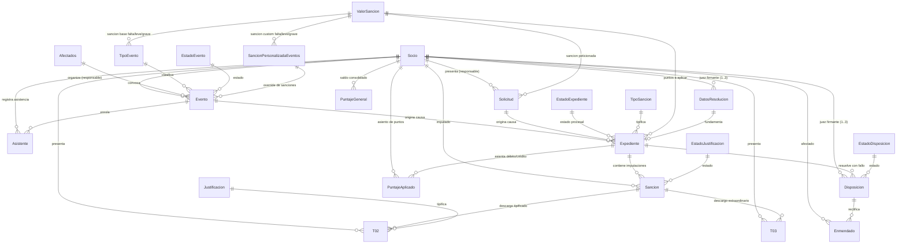

# Sistema Actual Preexistente (Legado) — Stack Tecnológico, Modelos de Datos y Brechas Funcionales

> [!IMPORTANT]
> **DOCUMENTO EXCLUSIVO DE REFERENCIA DEL SISTEMA ACTUAL A REEMPLAZAR (LEGADO / AS-IS)**  
> **Alcance y propósito institucional:** Este informe documenta exhaustivamente la arquitectura técnica, dependencias (`Python 3.5`, `Django 2.2`, `Angular 9.1`, `MySQL 5.7`), interfaces y modelos de datos preexistentes (`svaveit/tribunal/models.py` y `svaveit/socios/models.py`) de la plataforma interna histórica de la Asociación Vocacional de Estudiantes e Ingenieros Tecnológicos (**A.V.E.I.T.** - UTN FRC).  
> 
> **Pautas metodológicas innegociables:**
> 1. **Reemplazo integral ("Borrón y cuenta nueva"):** Este documento describe el **sistema legado que el nuevo proyecto SGD-AVEIT viene a sustituir por completo**. El nuevo desarrollo no es un parche ni una refactorización sobre esta base, sino una reingeniería integral con stack moderno (`Python 3.12`, `Django 4.2+ LTS`, `Angular 14.2+`, `MySQL 8.0`).
> 2. **Análisis de requerimientos 100% independiente:** La arquitectura del nuevo sistema, sus procesos de negocio, flujos operativos, formularios tipificados y modelo de dominio se diseñan desde cero a partir de entrevistas directas, observación empírica y la normativa del **Reglamento Procesal 2026**. Ninguna limitación, convención viciada o deuda técnica del sistema legado aquí expuesta debe asumirse como requerimiento o restricción para el nuevo sistema sin pasar por la especificación formal de ingeniería (`docs/especificaciones/`).
> 3. **Valor arqueológico y de compatibilidad:** La utilidad de este documento y de su esquema SQL asociado radica en servir como consulta histórica, arqueología de software, comprensión profunda del negocio previo y base técnica para formular estrategias de migración de datos o auditoría retrospectiva.

---

## 1. Stack Tecnológico del Sistema Legado

### 1.1 Backend

| Componente | Tecnología | Versión | Notas de entorno y deuda técnica |
|---|---|---|---|
| Lenguaje | Python | 3.5 | Imagen Docker de producción basada en `python:3.5-slim` (EOL alcanzado) |
| Framework web | Django | 2.2.4 | Versión obsoleta sin soporte oficial de seguridad |
| API REST | Django REST Framework (DRF) | 3.10.1 | Se utilizan serializers y paginación, pero las vistas son funciones estándar |
| Conector de BD | MySQL client | `mysqlclient` | Conexión directa a MySQL 5.7 |
| Cabeceras CORS | django-cors-headers | — | Utilizado para habilitar consumo cross-origin en desarrollo |
| Logging en BD | django-db-logger | — | Registro de excepciones no capturadas en tabla MySQL |
| Utilidades de modelos | django-model-utils | — | Campos con seguimiento de cambios (`TimeStampedModel`, etc.) |
| Generación de PDFs | LaTeX | TeX Live | `texlive-latex-base`, `texlive-lang-spanish`, `texlive-latex-extra`, `texlive-pstricks`, `texlive-science` + paquete `latex` |
| Notificaciones | Slack + Email | slacker / Django mail | Integración con Webhooks de Slack y SMTP institucional |
| Métricas | InfluxDB | influxdb-python | Almacenamiento de series temporales |
| Storage externo | Dropbox | dropbox-sdk | Respaldo remoto de comprobantes |
| Procesamiento tabular | pandas | 0.25.3 | Manipulación de datos en memoria |
| Lectura de planillas | xlrd | ≥ 1.0.0 | Importación de listados de asistencia |
| Resiliencia | retrying | 1.3.3 | Decoradores de reintentos para llamadas de red |
| Contenerización | Docker | Dockerfile | Basado en Debian buster (archive) |

### 1.2 Frontend

| Componente | Tecnología | Versión | Notas de entorno |
|---|---|---|---|
| Framework SPA | Angular | 9.1.13 | Arquitectura monolítica previa a standalone components |
| Tooling CLI | @angular/cli | 9.1.15 | Compilador Ivy heredado |
| Librería UI | Angular Material | 8.0.1 | Componentes Material Design v1 |
| Primitivas UI | Angular CDK | ^8.0.1 | Manejo de overlay, accesibilidad y tablas |
| Framework CSS | Bootstrap + BMD | 4.3.1 / 4.1.2 | Bootstrap Material Design sobre Bootstrap 4 |
| Programación reactiva | RxJS | 6.6.7 | Incompatible de forma directa con operadores RxJS 7+ |
| Visualización gráfica | Chartist | 0.11.2 | Gráficos estáticos básicos |
| Sesión y Cookies | ngx-cookie-service | ^2.4.0 | Manejo de cookie de sesión de Django |
| Lenguaje | TypeScript | 3.8.3 | Tipado permisivo sin `strict` habilitado |
| Runtime Node.js | Node.js | 16.13.2 | Motor en `DockerfileAngular` (en `package.json` figuraba desactualizado `6.11.1`) |
| Testing | Karma + Jasmine + Protractor | 4.1.0 / 3.4.0 / 5.4.2 | Suite de pruebas E2E y unitarias legadas |
| Plantilla base | Material Dashboard Angular | 2.3.0 | Template comercial adaptado ad-hoc |

> **Nota sobre coexistencia frontend:** Además de la SPA Angular (`angular-src/`), el sistema legado conservaba paneles históricos servidos como HTML y JavaScript planos (`http_public/panel/tribunal/*`, `controller-tribunal.js`), parcialmente migrados al momento del relevamiento.

### 1.3 Infraestructura de Ejecución

- Contenedores Docker desacoplados para backend (`Dockerfile`) y frontend (`DockerfileAngular`).
- Servidor web Apache (`httpd`) para el panel legado y Nginx (`sameersbn/nginx:1.10.2-1`) como reverse proxy perimetral.
- Gestor de base de datos MySQL 5.7 con persistencia en volumen local (`./database/mysql`).
- Servidor administrativo phpMyAdmin (`phpmyadmin:5.2.1`) habilitado exclusivamente para depuración local.
- Separación de entornos mediante archivos de configuración locales: `settings_local_dev.py` (desarrollo) y `settings_local_aveit.py` (producción).

---

## 2. Estructura de Modelos — App `tribunal` (Django)

Ubicación del código fuente legado: `svaveit/tribunal/models.py`.  
Todas las referencias de clave foránea hacia los socios apuntan al modelo de padrón central: `svaveit.socios.models.Socio` (tabla física `socio_lista`).

### 2.0 Convenciones del Esquema Físico (MySQL 5.7 / Django 2.2)

1. **Nomenclatura de columnas y claves foráneas:** En la app `tribunal` **no se utilizó `db_column`**, por lo cual Django infiere los nombres de columna directamente de los atributos del modelo, agregando el sufijo **`_id`** en todas las claves foráneas (p. ej., el campo `estadoJustificacion` genera la columna `estadoJustificacion_id`). Esto contrasta abiertamente con la app `socios` (ver sección 6).
2. **Nombres de tablas:** Siguen la convención estándar `tribunal_<nombre_modelo_en_minusculas>`, a excepción de cuatro modelos que declaran `db_table` explícito: `Disposicion` (`tribunal_disposicion`), `Enmendado` (`tribunal_enmendado`), `PuntajeAplicado` (`tribunal_puntajeaplicado`) y `PuntajeGeneral` (`tribunal_puntajegeneral`).
3. **Comportamiento de claves primarias:** `AutoField` genera columnas `int(11) NOT NULL AUTO_INCREMENT PRIMARY KEY`. El atributo `max_length` asignado en varios modelos en Python es ignorado por el motor de base de datos.
4. **Tipos de datos físicos:**
   - Fechas y horas con microsegundos: `datetime(6)`.
   - Fechas puras: `date`.
   - Banderas lógicas: `tinyint(1)` (1 = True, 0 = False).
   - Textos extensos: `longtext`.
   - Números de coma flotante: `double`.

---

### 2.1 Catálogos y Tablas de Referencia

#### A) Catálogos Homogéneos (`id`, `nombre`, `descripcion`)

| Modelo | Tabla MySQL | Clave Primaria | Campo `nombre` | Campo `descripcion` | Propósito institucional |
|---|---|---|---|---|---|
| `Afectados` | `tribunal_afectados` | `idAfectados` int(11) AI | varchar(30) | varchar(80) | Convocatoria/alcance de eventos (áreas, subcomisiones, grupos) |
| `EstadoEvento` | `tribunal_estadoevento` | `idEstadoEvento` int(11) AI | varchar(30) | varchar(80) | Ciclo de eventos: PorNotificar, Esperando, PorSancionar, Emitido |
| `EstadoExpediente` | `tribunal_estadoexpediente` | `idEstadoExpediente` int(11) AI | varchar(30) | varchar(80) | 6 estados: Creado, Justificando, EnRevision, PorEmitir, MailPendiente, Emitido |
| `EstadoJustificacion` | `tribunal_estadojustificacion` | `idEstadoJustificacion` int(11) AI | varchar(30) | varchar(80) | Calificación de descargos: Pendiente, EnRevision, Aprobada, Desaprobada |
| `EstadoDisposicion` | `tribunal_estadodisposicion` | `idEstadoDisposicion` int(11) AI | varchar(30) | varchar(80) | Fases de la resolución formal: Creada, Emitida |
| `TipoSancion` | `tribunal_tiposancion` | `idTipoSancion` int(11) AI | varchar(30) | varchar(80) | Tipificación: Llegada tarde / Salida anticipada / Ausencia / Sin marcación |
| `Justificacion` | `tribunal_justificacion` | `idJustificacion` int(11) AI | varchar(30) | varchar(80) | Causales T02: Enfermedad, Laboral, Académico, Viaje, Catástrofe, etc. |

#### B) Catálogos Estructurados con Lógica Propia

**`ValorSancion`** — Tabla `tribunal_valorsancion`  
Define los puntos a sumar o restar en el escalafón disciplinario.
| Columna MySQL | Campo Django | Tipo de Dato | Null | Descripción / Regla |
|---|---|---|---|---|
| `idSancion` | `idSancion` | int(11) AI | NO | **PK**. *Nota:* comparte nombre con la PK de la tabla operativa `tribunal_sancion`. |
| `nombre` | `nombre` | varchar(30) | NO | Nombre legible (p. ej., "Falta Injustificada", "Reconocimiento"). |
| `valor` | `valor` | double | NO | Magnitud de puntos (+/-). Admite decimales (`0.33`, `0.5`, `1.0`, etc.). |

**`Reglamento`** — Tabla `tribunal_reglamento`  
Almacena los artículos normativos citados en los dictámenes y resoluciones.
| Columna MySQL | Campo Django | Tipo de Dato | Null | Descripción / Regla |
|---|---|---|---|---|
| `idReglamento` | `idReglamento` | int(11) AI | NO | **PK**. Identificador único del artículo. |
| `titulo` | `titulo` | varchar(45) | NO | Título o denominación del cuerpo normativo. |
| `seccion` | `seccion` | int(11) | NO | Número de sección o título del estatuto. |
| `articulo` | `articulo` | int(11) | NO | Número de artículo reglamentario. |
| `inciso` | `inciso` | varchar(11) | NO | Inciso normativo (por defecto `"-"`). |
| `descripcion` | `descripcion` | longtext | SÍ | Texto completo o extracto de la norma legal interna. |

**`TipoEvento`** — Tabla `tribunal_tipoevento`  
Clasifica las actividades institucionales y asocia las sanciones punitorias por defecto.
| Columna MySQL | Campo Django | Tipo de Dato | Null | Descripción / Regla |
|---|---|---|---|---|
| `idTipoEvento` | `idTipoEvento` | int(11) AI | NO | **PK**. Tipo de evento institucional. |
| `nombre` | `nombre` | varchar(128) | NO | Nombre (Asamblea General, Reunión de Socios, Limpieza, etc.). |
| `sancionFalta_id` | `sancionFalta` | int(11) | NO | **FK →** `tribunal_valorsancion.idSancion`. Puntos por inasistencia injustificada. |
| `sancionLeve_id` | `sancionLeve` | int(11) | NO | **FK →** `tribunal_valorsancion.idSancion`. Puntos por retraso de 15 a 30 min. |
| `sancionGrave_id` | `sancionGrave` | int(11) | NO | **FK →** `tribunal_valorsancion.idSancion`. Puntos por retraso superior a 30 min. |

> *Nota histórica de migración:* Los campos `sancionLeve` y `sancionGrave` se denominaban originalmente `sancion15a30` y `sancionMas30` antes de la migración `0013_rename_sancion_leve_grave`.

---

### 2.2 Eventos y Asistencia

**`SancionPersonalizadaEventos`** — Tabla `tribunal_sancionpersonalizadaeventos`  
Mecanismo que permite a los organizadores sobreescribir las penalidades por defecto de un evento concreto.
| Columna MySQL | Campo Django | Tipo de Dato | Null | Descripción / Regla |
|---|---|---|---|---|
| `idSancionPersonalizada` | `idSancionPersonalizada` | int(11) AI | NO | **PK**. |
| `sancionFaltaPersonalizada_id` | `sancionFaltaPersonalizada` | int(11) | NO | **FK →** `tribunal_valorsancion.idSancion`. |
| `sancionLevePersonalizada_id` | `sancionLevePersonalizada` | int(11) | NO | **FK →** `tribunal_valorsancion.idSancion`. |
| `sancionGravePersonalizada_id` | `sancionGravePersonalizada` | int(11) | NO | **FK →** `tribunal_valorsancion.idSancion`. |

**`Evento`** — Tabla `tribunal_evento`  
Actividad institucional que demanda control de presentismo.
| Columna MySQL | Campo Django | Tipo de Dato | Null | Descripción / Regla |
|---|---|---|---|---|
| `idEvento` | `idEvento` | int(11) AI | NO | **PK**. |
| `nombre` | `nombre` | varchar(128) | NO | Denominación del evento. |
| `afectados_id` | `afectados` | int(11) | NO | **FK →** `tribunal_afectados.idAfectados`. Colectivo convocado. |
| `fechaHoraInicio` | `fechaHoraInicio` | datetime(6) | SÍ | Inicio programado (permite nulos en borradores). |
| `fechaHoraFin` | `fechaHoraFin` | datetime(6) | SÍ | Conclusión del evento. |
| `tieneHoraFin` | `tieneHoraFin` | tinyint(1) | NO | Booleano que indica si el evento ya fue formalmente cerrado. |
| `responsable_id` | `responsable` | int(11) | NO | **FK →** `socio_lista.nroSocio`. Socio a cargo de la organización. |
| `estadoEvento_id` | `estadoEvento` | int(11) | NO | **FK →** `tribunal_estadoevento.idEstadoEvento`. |
| `tipoEvento_id` | `tipoEvento` | int(11) | SÍ | **FK →** `tribunal_tipoevento.idTipoEvento`. |
| `sancionPersonalizada_id` | `sancionPersonalizada` | int(11) | SÍ | **FK →** `tribunal_sancionpersonalizadaeventos` (`ON DELETE SET NULL`). |
| `toleranciaLeveMinutos` | `toleranciaLeveMinutos` | int(10) unsigned | NO | Minutos de gracia leve (default: 15). |
| `toleranciaGraveMinutos` | `toleranciaGraveMinutos` | int(10) unsigned | NO | Minutos límite antes de sanción grave (default: 30). |

> En el modelo Django, `cantidadAsistentes` es una `@property` calculada en tiempo de ejecución (`SELECT COUNT(*) FROM tribunal_asistente WHERE evento_id = ...`). Los métodos `get_sancion_falta()`, `get_sancion_leve()` y `get_sancion_grave()` evalúan dinámicamente si aplicar el esquema personalizado o el base.

**`Asistente`** — Tabla `tribunal_asistente`  
Registro físico individual de marcación de asistencia (originalmente vinculado al reloj biométrico de huellas).
| Columna MySQL | Campo Django | Tipo de Dato | Null | Descripción / Regla |
|---|---|---|---|---|
| `idAsistente` | `idAsistente` | int(11) AI | NO | **PK**. |
| `evento_id` | `evento` | int(11) | NO | **FK →** `tribunal_evento.idEvento`. |
| `socio_id` | `socio` | int(11) | NO | **FK →** `socio_lista.nroSocio`. |
| `fechaHoraLlegada` | `fechaHoraLlegada` | datetime(6) | SÍ | Timestamp de ingreso registrado por el socio. |
| `fechaHoraSalida` | `fechaHoraSalida` | datetime(6) | SÍ | Timestamp de salida registrado por el socio. |
| `notificado` | `notificado` | tinyint(1) | NO | Indicador de envío de correo de pre-aviso de falta. |
| `fechaNotificacion` | `fechaNotificacion` | date | SÍ | Fecha en que se emitió el aviso automático. |

---

### 2.3 Solicitudes, Sanciones y Expedientes (Núcleo Procesal)

**`Solicitud`** (Formulario **T01**) — Tabla `tribunal_solicitud`  
Petición formal de sanción o reconocimiento elevada por una autoridad estatutaria.
| Columna MySQL | Campo Django | Tipo de Dato | Null | Descripción / Regla |
|---|---|---|---|---|
| `idSolicitud` | `idSolicitud` | int(11) AI | NO | **PK**. |
| `fechaHora` | `fechaHora` | datetime(6) | NO | `auto_now=True` (*Defecto detectado:* se actualiza en cada modificación). |
| `titulo` | `titulo` | longtext | NO | Asunto o carátula de la solicitud. |
| `motivoSancion` | `motivoSancion` | longtext | NO | Hechos descriptos que fundan la imputación. |
| `responsable_id` | `responsable` | int(11) | NO | **FK →** `socio_lista.nroSocio`. Autoridad peticionante. |
| `sancionSolicitada_id` | `sancionSolicitada` | int(11) | NO | **FK →** `tribunal_valorsancion.idSancion`. Puntos peticionados. |
| `reglamento` | `reglamento` | varchar(300) | NO | Artículo invocado (*Defecto:* almacenado como texto plano, sin FK). |

**`Expediente`** — Tabla `tribunal_expediente`  
Entidad agregadora del procedimiento disciplinario.
| Columna MySQL | Campo Django | Tipo de Dato | Null | Descripción / Regla |
|---|---|---|---|---|
| `idExpediente` | `idExpediente` | int(11) AI | NO | **PK**. |
| `nroExpediente` | `nroExpediente` | varchar(9) | NO | Código de expediente con formato anual `NN/AAAA`. |
| `estadoExpediente_id` | `estadoExpediente` | int(11) | SÍ | **FK →** `tribunal_estadoexpediente.idEstadoExpediente`. |
| `solicitud_id` | `solicitud` | int(11) | SÍ | **FK →** `tribunal_solicitud.idSolicitud` (si proviene de T01). |
| `evento_id` | `evento` | int(11) | SÍ | **FK →** `tribunal_evento.idEvento` (si proviene de presentismo). |
| `tipoSancion_id` | `tipoSancion` | int(11) | SÍ | **FK →** `tribunal_tiposancion.idTipoSancion`. |
| `fechaHora` | `fechaHora` | datetime(6) | SÍ | `auto_now_add=True`. Momento exacto de apertura procesal. |
| `puntos_id` | `puntos` | int(11) | NO | **FK →** `tribunal_valorsancion.idSancion`. Puntos definitivos en juego. |
| `dataRes_id` | `dataRes` | int(11) | SÍ | **FK →** `tribunal_datosresolucion.idDatosResolucion`. |

**`Sancion`** — Tabla `tribunal_sancion`  
Imputación nominal individual hacia un socio dentro de la causa del expediente.
| Columna MySQL | Campo Django | Tipo de Dato | Null | Descripción / Regla |
|---|---|---|---|---|
| `idSancion` | `idSancion` | int(11) AI | NO | **PK**. |
| `socio_id` | `socio` | int(11) | NO | **FK →** `socio_lista.nroSocio`. Socio imputado. |
| `expediente_id` | `expediente` | int(11) | NO | **FK →** `tribunal_expediente.idExpediente`. |
| `estadoJustificacion_id` | `estadoJustificacion` | int(11) | NO | **FK →** `tribunal_estadojustificacion.idEstadoJustificacion`. |
| `fechaLimiteEnvio` | `fechaLimiteEnvio` | datetime(6) | SÍ | Límite perentorio (5 días hábiles) para ejercer el derecho a descargo. |
| `notificacionSancion` | `notificacionSancion` | tinyint(1) | NO | Booleano que certifica el acuse del correo al socio. |
| `aprobada` | `aprobada` | tinyint(1) | NO | Booleano de ratificación o desestimación de la sanción. |
| `responsable_id` | `responsable` | int(11) | SÍ | **FK →** `socio_lista.nroSocio`. Miembro del TD interviniente. |

**`DatosResolucion`** — Tabla `tribunal_datosresolucion`  
Contenido jurídico formal de los VISTOS y CONSIDERANDOS del expediente.
| Columna MySQL | Campo Django | Tipo de Dato | Null | Descripción / Regla |
|---|---|---|---|---|
| `idDatosResolucion` | `idDatosResolucion` | int(11) AI | NO | **PK**. |
| `reglamento1` | `reglamento1` | varchar(300) | NO | Cita legal principal (texto libre). |
| `reglamento2` | `reglamento2` | varchar(300) | SÍ | Cita legal accesoria 1. |
| `reglamento3` | `reglamento3` | varchar(300) | SÍ | Cita legal accesoria 2. |
| `responsable1_id` | `responsable1` | int(11) | SÍ | **FK →** `socio_lista.nroSocio`. Vocal/Juez firmante 1. |
| `responsable2_id` | `responsable2` | int(11) | SÍ | **FK →** `socio_lista.nroSocio`. Vocal/Juez firmante 2. |
| `responsable3_id` | `responsable3` | int(11) | SÍ | **FK →** `socio_lista.nroSocio`. Vocal/Juez firmante 3. |
| `responsable1Text` | `responsable1Text` | varchar(128) | SÍ | Nombre ad-hoc del firmante 1 (para contingencias o no socios). |
| `responsable2Text` | `responsable2Text` | varchar(128) | SÍ | Nombre ad-hoc del firmante 2. |
| `responsable3Text` | `responsable3Text` | varchar(128) | SÍ | Nombre ad-hoc del firmante 3. |
| `consideracion` | `consideracion` | longtext | NO | Cuerpo fundacional del dictamen disciplinario. |

**`T02`** (Descargo Ordinario Tipificado) — Tabla `tribunal_t02`  
Presentación del socio alegando causales estándar con comprobante obligatorio.
| Columna MySQL | Campo Django | Tipo de Dato | Null | Descripción / Regla |
|---|---|---|---|---|
| `idT02` | `idT02` | int(11) AI | NO | **PK**. |
| `justificacion_id` | `justificacion` | int(11) | NO | **FK →** `tribunal_justificacion.idJustificacion`. Causal tipificada. |
| `observacion` | `observacion` | varchar(400) | SÍ | Comentario complementario del socio. |
| `socio_id` | `socio` | int(11) | NO | **FK →** `socio_lista.nroSocio`. |
| `sancion_id` | `sancion` | int(11) | NO | **FK →** `tribunal_sancion.idSancion`. |
| `fechaHora` | `fechaHora` | datetime(6) | NO | `auto_now=True`. Timestamp de envío. |
| `justificativo` | `justificativo` | varchar(100) | SÍ | Ruta en disco del archivo PDF/comprobante adjunto. |

**`T03`** (Descargo Extraordinario) — Tabla `tribunal_t03`  
Descargo libre para situaciones fácticas no encuadrables en los incisos tipificados.
| Columna MySQL | Campo Django | Tipo de Dato | Null | Descripción / Regla |
|---|---|---|---|---|
| `idT03` | `idT03` | int(11) AI | NO | **PK**. |
| `justificacion` | `justificacion` | longtext | NO | Exposición circunstanciada de los hechos. |
| `socio_id` | `socio` | int(11) | NO | **FK →** `socio_lista.nroSocio`. |
| `sancion_id` | `sancion` | int(11) | NO | **FK →** `tribunal_sancion.idSancion`. |
| `fechaHora` | `fechaHora` | datetime(6) | NO | `auto_now=True`. |
| `justificativo` | `justificativo` | varchar(100) | SÍ | Ruta en disco de la prueba documental adjunta. |

---

### 2.4 Disposiciones (Sentencias y Resoluciones Formales)

**`Disposicion`** — Tabla `tribunal_disposicion` (`db_table` explícito)  
Instrumento público que concluye el expediente y aplica las sanciones efectivas.
| Columna MySQL | Campo Django | Tipo de Dato | Null | Descripción / Regla |
|---|---|---|---|---|
| `idDisposicion` | `idDisposicion` | int(11) AI | NO | **PK**. |
| `nroDisposicion` | `nroDisposicion` | varchar(9) | NO | Numeración anual correlativa `NN/AAAA`. |
| `expediente_id` | `expediente` | int(11) | NO | **FK →** `tribunal_expediente.idExpediente`. |
| `fechaHora` | `fechaHora` | datetime(6) | NO | `auto_now_add=True`. Fecha y hora de emisión formal. |
| `estadoDisposicion_id` | `estadoDisposicion` | int(11) | NO | **FK →** `tribunal_estadodisposicion.idEstadoDisposicion`. |
| `responsable1_id` | `responsable1` | int(11) | NO | **FK →** `socio_lista.nroSocio`. Firmante obligatorio. |
| `responsable2_id` | `responsable2` | int(11) | SÍ | **FK →** `socio_lista.nroSocio`. Firmante 2. |
| `responsable3_id` | `responsable3` | int(11) | SÍ | **FK →** `socio_lista.nroSocio`. Firmante 3. |
| `responsable1Text` | `responsable1Text` | varchar(128) | SÍ | Nombre en texto plano firmante 1. |
| `responsable2Text` | `responsable2Text` | varchar(128) | SÍ | Nombre en texto plano firmante 2. |
| `responsable3Text` | `responsable3Text` | varchar(128) | SÍ | Nombre en texto plano firmante 3. |
| `resolucion` | `resolucion` | longtext | NO | Parte dispositiva del fallo ("RESUELVE: Art. 1..."). |
| `reglamento` | `reglamento` | varchar(300) | NO | Disposiciones estatutarias aplicadas. |

**`Enmendado`** — Tabla `tribunal_enmendado` (`db_table` explícito)  
Registro de rectificaciones, adendas o aclaratorias sobre una disposición ya promulgada.
| Columna MySQL | Campo Django | Tipo de Dato | Null | Descripción / Regla |
|---|---|---|---|---|
| `idEnmendado` | `idEnmendado` | int(11) AI | NO | **PK**. |
| `disposicion_id` | `disposicion` | int(11) | NO | **FK →** `tribunal_disposicion.idDisposicion`. |
| `socio_id` | `socio` | int(11) | NO | **FK →** `socio_lista.nroSocio`. Socio alcanzado por la enmienda. |
| `notificado` | `notificado` | tinyint(1) | NO | Estado de notificación del nuevo texto modificado. |
| `justificacion` | `justificacion` | longtext | NO | Fundamentación jurídica del acto de enmienda. |

---

### 2.5 Cómputo de Puntajes y Libro Mayor

**`PuntajeAplicado`** — Tabla `tribunal_puntajeaplicado` (`db_table` explícito)  
Libro mayor transaccional. Representa cada débito o crédito de puntos asentado a un socio.
| Columna MySQL | Campo Django | Tipo de Dato | Null | Descripción / Regla |
|---|---|---|---|---|
| `idPuntajeAplicado` | `idPuntajeAplicado` | int(11) AI | NO | **PK**. |
| `puntajeAplicado` | `puntajeAplicado` | double | NO | Magnitud algebraica: `±0.33` (reconocimiento/llamado de atención), `≥ 0.5` (puntos plenos). |
| `socio_id` | `socio` | int(11) | NO | **FK →** `socio_lista.nroSocio`. Socio beneficiario/sancionado. |
| `expediente_id` | `expediente` | int(11) | SÍ | **FK →** `tribunal_expediente.idExpediente`. Expediente causal. |

> **Vulnerabilidad de diseño:** La tabla `PuntajeAplicado` **carece de columna de timestamp o fecha de aplicación propia**. El cálculo cronológico o la delimitación por períodos depende exclusivamente del join hacia `tribunal_expediente.fechaHora`, campo que es nulo si el movimiento fue ingresado por ajuste administrativo sin expediente.

**`PuntajeGeneral`** — Tabla `tribunal_puntajegeneral` (`db_table` explícito)  
Tabla de balance derivado. Actúa como caché consolidada del escalafón por socio.
| Columna MySQL | Campo Django | Tipo de Dato | Null | Descripción / Regla |
|---|---|---|---|---|
| `idPuntajeGeneral` | `idPuntajeGeneral` | int(11) AI | NO | **PK**. |
| `socio_id` | `socio` | int(11) | NO | **FK →** `socio_lista.nroSocio`. Socio rankeado. |
| `puntos` | `puntos` | double | NO | Saldo neto acumulado de sanciones plenas (magnitud $\ge 0.5$). |
| `felicitaciones` | `felicitaciones` | int(11) | NO | Contador acumulado de movimientos positivos $+0.33$. |
| `llamadosAtencion` | `llamadosAtencion` | int(11) | NO | Contador acumulado de movimientos negativos $-0.33$. |

> **Regla de integridad:** `PuntajeGeneral` **nunca debe modificarse directamente mediante sentencias `UPDATE`**. Su contenido es un agregado recalculado desde `PuntajeAplicado` según las fórmulas descritas en la sección 6.2.

---

## 3. Relaciones Clave y Flujo Procesal del Sistema Legado

```
[Área / Autoridad]                [Reloj Biométrico / Asistencia]
         │                                       │
         ▼                                       ▼
  Solicitud (T01)                         Evento ──< Asistente
         │                                       │
         └───────────────┐       ┌───────────────┘
                         ▼       ▼
                     Expediente (6 Estados)
                         │
                         ├───────> DatosResolucion (Vistos y Considerandos)
                         ├───────> ValorSancion (Puntos asignados)
                         ├───────> TipoSancion
                         │
                         ├───< Sancion (1 por socio imputado)
                         │         │
                         │         ├───< Formulario T02 (Justificación Tipificada)
                         │         └───< Formulario T03 (Descargo Extraordinario)
                         │
                         ├───< Disposicion (Fallo colegiado con firmas 1..3)
                         │         │
                         │         └───< Enmendado (Corrección posterior)
                         │
                         └───< PuntajeAplicado (Asiento contable inmutable)
                                   │
                                   ▼
                             PuntajeGeneral (Caché de saldo y ranking)
```

### Ciclo Operativo Histórico
1. **Iniciación:** Un expediente se originaba por una `Solicitud` (formulario T01 cargado por un Presidente de Subcomisión o miembro de CD) o por el cierre administrativo de un `Evento` con socios en infracción horaria (`Asistente`).
2. **Imputación y Descargo:** El expediente agrupaba una o más `Sancion` individuales. Cada sanción abría un plazo perentorio de 5 días hábiles (`fechaLimiteEnvio`) para que el socio ingresara un descargo tipificado (`T02`) con comprobante o un descargo extraordinario (`T03`).
3. **Sustanciación:** Los miembros del Tribunal con rol `tribunal_alto` evaluaban las pruebas y redactaban el dictamen en `DatosResolucion`.
4. **Fallo:** La sentencia se formalizaba en una `Disposicion` numerada, que impactaba en el libro mayor (`PuntajeAplicado`) y actualizaba el saldo del socio en `PuntajeGeneral`.

---

## 4. Diagrama Entidad-Relación (Modelo As-Is)



---

## 5. Catálogo de Endpoints de la API REST Legada

Prefijo de enrutamiento base: `/tribunal/` (mapeado desde `svaveit/urls.py` hacia `svaveit.tribunal.urls`).

| Método(s) | Endpoint | Vista Django | Nivel de Permiso | Descripción Funcional |
|---|---|---|---|---|
| `GET` | `/reglamentos/` | `gestionar_reglamento` | `tribunal_bajo` | Listado completo de artículos del estatuto |
| `POST`, `PATCH` | `/reglamentos/` | `gestionar_reglamento` | `tribunal_alto` | Creación y actualización de articulado normativo |
| `GET` | `/reglamentos/permisos` | `permisos_reglamento` | Autenticado | Chequeo de capacidades de edición normativa |
| `GET`, `POST`, `PATCH`, `DELETE` | `/eventos/` | `gestionar_evento` | `tribunal_medio` | Operaciones CRUD sobre eventos institucionales |
| `GET` | `/afectados/` | `afectados` | `tribunal_bajo` | Catálogo de subcomisiones y grupos convocables |
| `GET` | `/valorsancion/` | `valores_sancion` | `tribunal_bajo` | Catálogo de valores de sanción vigentes |
| `GET` | `/estadosevento/` | `estados_evento` | `tribunal_bajo` | Catálogo de estados de ciclo de vida de eventos |
| `GET` | `/tiposevento/` | `tipos_evento` | `tribunal_bajo` | Catálogo de tipos de eventos y sanciones base |
| `POST` | `/asistentes/<id_evento>/` | `crear_asistentes` | `tribunal_medio` | Carga de registros de entrada/salida de socios |
| `GET`, `POST`, `PATCH` | `/solicitudes/` | `gestionar_solicitud` | `tribunal_bajo` / `alto` | Emisión y edición de solicitudes de sanción (T01) |
| `GET` | `/missolicitudes/` | `mis_solicitudes` | `tribunal_bajo` | Solicitudes T01 promovidas por el usuario logueado |
| `GET` | `/misinvolucrados/<id_solicitud>/` | `mis_solicitudes_involucrados` | `tribunal_bajo` | Socios denunciados en un T01 específico |
| `GET` | `/imprimirt02/<id_t02>` | `imprimir_T02` | `tribunal_bajo` | Renderizado y compilación LaTeX del formulario T02 |
| `GET` | `/imprimirt03/<id_t03>` | `imprimir_T03` | `tribunal_bajo` | Renderizado y compilación LaTeX del formulario T03 |
| `GET` | `/imprimirres/<id_expediente>` | `imprimir_res` | `tribunal_alto` | Generación PDF de la resolución del expediente |
| `GET` | `/imprimirdisp/<id_disposicion>` | `imprimir_disp` | `tribunal_alto` | Generación PDF de la disposición oficial numerada |
| `GET` | `/justificaciones/` | `justificaciones_a_aprobar` | `tribunal_alto` | Bandeja de descargos T02 y T03 pendientes |
| `GET`, `POST` | `/justificaciones/t02/` | `creacion_T02` | `tribunal_bajo` | Alta de descargo ordinario tipificado con adjunto |
| `GET`, `POST`, `PATCH` | `/justificaciones/t03/` | `creacion_T03` | `tribunal_bajo` | Alta y edición de descargo extraordinario libre |
| `GET`, `PATCH` | `/justificaciones/t02/<id_expediente>` | `gestionar_t02` | `tribunal_alto` | Dictamen y calificación sobre el formulario T02 |
| `GET`, `PATCH` | `/justificaciones/t03/<id_expediente>` | `gestionar_t03` | `tribunal_alto` | Dictamen y calificación sobre el formulario T03 |
| `GET` | `/justificaciones/tipos/` | `tipos_justificaciones` | `tribunal_bajo` | Catálogo de causales tipificadas |
| `GET`, `POST` | `/justificaciones/archivo/<idTipo>/<idForm>/` | `justificativo_archivo` | Autenticado | Subida y descarga de archivos de prueba adjuntos |
| `GET`, `PATCH` | `/eventoshorafin/` | `definir_hora_fin` | `tribunal_medio` | Registro de horario de finalización real del evento |
| `GET` | `/expedientes/<id_estado>` | `gestionar_expedientes` | `tribunal_medio` | Bandeja de expedientes filtrada por estado procesal |
| `GET` | `/expedientes/estados/` | `estado_expedientes` | `tribunal_bajo` | Catálogo de estados procesales del expediente |
| `POST` | `/expedientes/filtrar/` | `expedientes_filtrar` | `tribunal_medio` | Búsqueda multicriterio de expedientes |
| `GET` | `/expedientes/sanciones/<id_exp>/` | `sanciones_expediente` | `tribunal_medio` | Imputaciones nominales asociadas al expediente |
| `GET` | `/expedientes/enmendados/<id_exp>/` | `disposiciones_expediente` | `tribunal_medio` | Historial de disposiciones y enmiendas |
| `GET` | `/sanciones/` | `sanciones_socio` | Autenticado | Historial disciplinario propio del socio logueado |
| `GET` | `/misjustificaciones/` | `mis_justificaciones` | Autenticado | Descargos presentados por el usuario logueado |
| `GET`, `POST`, `PATCH` | `/disposiciones/` | `gestionar_disposicion` | `tribunal_alto` | Emisión formal del fallo disciplinario |
| `POST`, `PATCH` | `/resolucion/` | `resolucion` | `tribunal_alto` | Redacción de VISTOS y CONSIDERANDOS |
| `GET` | `/puntaje/<nro_socio>/` | `puntaje` | Socio / `tribunal_medio` | Consulta de saldo de puntos individual |

---

## 6. Anexo Técnico — Integración con el Sistema Central (`svaveit`)

### 6.1 Estructura del Padrón de Socios (`svaveit/socios/models.py`)

La tabla matriz es `socio_lista` (modelo Django `Socio`).  
> ⚠️ **Discrepancia arquitectónica:** A diferencia de la app `tribunal`, la app `socios` define `db_column` explícito en casi todas sus relaciones, por lo cual los nombres en SQL **no llevan el sufijo `_id`**.

**Tabla `socio_lista` (Modelo `Socio`)**
| Columna MySQL | Campo Django | Tipo MySQL | Null | Notas de Negocio |
|---|---|---|---|---|
| `nroSocio` | `nroSocio` | int(11) AI | NO | **PK**. Número social; coincide con el `username` de autenticación |
| `apellido` | `apellido` | varchar(45) | NO | Apellido del socio |
| `nombre` | `nombre` | varchar(45) | NO | Nombre del socio |
| `fechaIngreso` | `fechaIngreso` | date | NO | Fecha de alta social |
| `codTipoDoc` | `tipoDoc` | int(11) | NO | **FK →** `socio_tipodocumento.codTipoDoc` |
| `nroDoc` | `nroDoc` | int(11) | NO | Número de DNI / pasaporte |
| `fechaNac` | `fechaNac` | date | NO | Fecha de nacimiento |
| `codSexo` | `sexo` | int(11) | NO | **FK →** `socio_sexo.codSexo` |
| **`codSubcomision`** | `codSubcomision` | int(11) | NO | **FK →** `socio_tiposubcomision.codSubcomision`. Estado actual (sin historial) |
| `codEstadoCivil` | `estadoCivil` | int(11) | SÍ | **FK →** `socio_estadocivil.codEstadoCivil` |
| `fechaBaja` | `fechaBaja` | date | SÍ | Fecha de baja social institucional |
| `anoSocial` | `anoSocial` | int(11) | NO | Año social numérico |
| `ingresante` | `ingresante` | tinyint(1) | NO | Flag de socio ingresante |
| **`idTipoSocio`** | `tipoSocio` | int(11) | NO | **FK →** `socio_tipoSocio.idTipoSocio`. **Representa el cargo** (ver 6.1.3) |
| `user_id` | `user` | int(11) | SÍ | **FK →** `auth_user.id`. Vínculo con el usuario de sesión de Django |
| `forzarCambioClave` | `forzarCambioClave` | tinyint(1) | NO | Flag de seguridad para reseteo de contraseña |

#### Tablas Satélite de `Socio`
Todas implementan el artificio de clave primaria sintética `compositeKey = nroSocio * 100 + <codigo_tipo>`, imposibilitando que un socio posea dos registros del mismo tipo:
1. **`socio_estadoHistorial` (`EstadoHistorial`):** Historial transaccional de estados del socio. Columnas: `idEstadoHistorial` (PK), `idGrupo` (FK `grupo_lista`), `nroSocio` (FK `socio_lista`), `fechaHora`, `codEstadoSocio` (FK `socio_estado`), `socio_motivoCambioEstado` (FK `socio_motivoCambioEstado`). *Es la fuente de verdad de las properties `grupo` y `estadoSocio`.*
2. **`socio_estudio` (`EstudioSocio`):** Datos académicos donde reside el **legajo universitario**. Columnas: `compositeKey` (PK), `nroSocio` (FK), `nroLegajo` int(11) (**Legajo UTN**), `codEspecialidad` (FK), `curso`, `aula`, `codTurno` (FK).
3. **`socio_email` (`EmailSocio`):** Correos institucionales. Columnas: `compositeKey`, `nroSocio`, `idEmail`, `email`, `comprobado` (tinyint), `habilitado` (tinyint). Utilizados por el despachador de emails del TD.
4. **`socio_telefono` (`TelefonoSocio`):** Teléfonos de contacto. Columnas: `compositeKey`, `nroSocio`, `idTelefono`, `telefono`, `codTipoTelefono` (FK).
5. **`socio_domicilio` (`DomicilioSocio`):** Direcciones. Columnas: `compositeKey`, `nroSocio`, `direccion`, `barrio`, `ciudad`, `provincia`, `codTipoDomicilio` (FK).
6. **`socio_medio` (`MedioSocio`):** Redes sociales y canales digitales. Columnas: `compositeKey`, `nroSocio`, `codMedio` (FK), `descripcion`.
7. **`socio_induccion` / `socio_induccionencuesta`:** Evaluaciones de postulación a subcomisiones.

#### 6.1.1 Pertenencia a la Subcomisión (Pérdida de Trazabilidad)
La pertenencia a una subcomisión es una **FK directa sobre `Socio` (`codSubcomision`) sin tabla histórica de membresía**. Cuando un socio se transfiere de área, el valor se sobreescribe.  
> **Impacto en auditoría:** Si el Tribunal debe juzgar un hecho ocurrido hace 6 meses, no es posible deducir por base de datos a qué subcomisión pertenecía el socio en esa fecha exacta, salvo que el dato se desnormalice en el expediente.

**Catálogo de Subcomisiones Vigentes (`const_id_tipo_subcomision`):**  
`1` Cómputos · `2` Recursos Humanos · `3` Relaciones Institucionales · `4` Prensa · `5` Mantenimiento · `6` Gestión Social y Ambiental · `7` Eventos · `8` Rifas · `9` Comisión Directiva · `10` Tribunal de Disciplina · `11` Ex Viajeros · `99` Sin Subcomisión.

#### 6.1.2 Grupo Social y Categorías Estatutarias Junior / Senior
- El grupo social no es columna directa: se deduce del registro con fecha más reciente en `socio_estadoHistorial`.
- Los grupos activos se deducen por aritmética temporal sobre el año en curso (`svaveit/tribunal/funciones.py`):
  ```python
  tercer_grupo_activo  = date.today().year - 1965 - 1
  segundo_grupo_activo = date.today().year - 1965 - 2
  primer_grupo_activo  = date.today().year - 1965 - 3
  grupo_viajero        = date.today().year - 1965 - 4
  ```
- **Inexistencia de Junior/Senior:** La distinción estatutaria entre categoría *Junior* (1° y 2° año) y *Senior* (3° a 6° año) **no está modelada en la base de datos**; figuraba únicamente como regla hardcodeada en el frontend de tesorería.

#### 6.1.3 Cargos Oficiales e Incompatibilidades
No existe tabla separada de autoridades: el cargo reside en `Socio.tipoSocio` (`socio_tipoSocio`):
| ID | Cargo Estatutario | ID | Cargo Estatutario |
|---|---|---|---|
| 1 | Presidente de Subcomisión | 9 | Prosecretario |
| 2 | Vicepresidente de Subcomisión | 10 | **Titular del Tribunal de Disciplina** |
| 3 | Presidente de AVEIT | 11 | **Suplente del Tribunal de Disciplina** |
| 4 | Vicepresidente de AVEIT | 12 | Socio Ordinario |
| 5 | Tesorero | 13 | Secretario |
| 6 | Protesorero | 14 | Revisor de Cuentas |
| 7 | Secretario de Actas | 15 | Revisor de Cuentas Suplente |
| 8 | Secretario General | | |

*Regla crítica:* El cargo no confiere permisos de software automáticamente; la seguridad se administra por grupos y permisos de Django.

#### 6.1.4 Inconsistencia entre `tribunal.Afectados` y `TipoSubcomision`
Existen dos catálogos inconexos y desfasados: `tribunal_afectados` mezcla subcomisiones, convocatorias globales (`Aveit`, `xSocios`) y grupos específicos (`G53`-`G56`) con IDs numéricos distintos a `TipoSubcomision` (p. ej., Cómputos es ID 2 en Afectados y ID 1 en TipoSubcomision).

---

### 6.2 Motor de Ranking, Balances y Puntos

#### 6.2.1 Diagnóstico de Endpoints de Ranking
- No existía un endpoint dedicado para el ranking consolidado.
- La consulta de saldos en lote se realizaba mediante `POST /socios/filtrar`, el cual serializaba el saldo como un **string concatenado** (`"puntos *felicitaciones ºllamados"`), impidiendo su ordenamiento numérico en frontend.
- `filtrar_socios()` operaba en memoria mediante *list comprehensions* de Python con patrón N+1, recalculando y guardando `PuntajeGeneral` socio por socio.

#### 6.2.2 Cómputo Matemático y Regla del Tercio
1. `PuntajeGeneral` es una **tabla caché** recalculada a partir de `PuntajeAplicado`.
2. Las sanciones con valor absoluto $\ge 0.5$ se suman directamente a `puntos`.
3. Los valores de $\pm 0.33$ se acumulan en los contadores `felicitaciones` y `llamadosAtencion`.
4. En el cálculo consolidado:
   $$\text{Saldo Final} = \text{puntos} + \left\lfloor\frac{\text{felicitaciones}}{3}\right\rfloor - \left\lfloor\frac{\text{llamados}}{3}\right\rfloor$$
   Los restos no múltiplos de 3 (`% 3`) permanecen como felicitaciones o llamados de atención residuales.
5. **Carencia de corte temporal:** El sistema acumulaba los puntos históricamente sin posibilidad de emitir Balances Cuatrimestrales (Art. 137) por falta de fecha en `PuntajeAplicado`.

---

### 6.3 Autenticación, Sesión y Niveles de Acceso

1. **Relación `User` ↔ `Socio`:** Foreign Key nullable en `Socio` hacia `auth_user`. La vinculación se resolvía asumiendo que `User.username == Socio.nroSocio`.
2. **Sesión:** Basada en cookies de sesión de Django (`sessionid`), sin tokens JWT. En desarrollo, Angular consumía la API mediante proxy same-origin (`proxy.conf.json`).
3. **Jerarquía de Permisos del Tribunal:**
   - **`tribunal_bajo` (`tribunal.bajo`):** Acceso para socios y autoridades peticionantes. Permite consultar reglamentos, cargar y ver solicitudes T01 propias y presentar descargos.
   - **`tribunal_medio` (`tribunal.medio`):** Acceso para secretaría y organizadores de eventos. Permite gestionar eventos, cargar asistencias biométricas, fijar hora de fin y filtrar expedientes.
   - **`tribunal_alto` (`tribunal.alto`):** Acceso para Jueces/Miembros del Tribunal. Permite dictaminar T01, calificar descargos T02/T03, dictar resoluciones y emitir disposiciones firmadas.

---

### 6.4 Servicios de Búsqueda de Socios

- `POST /socios/buscar` (payload `{"pal": "<texto>"}`): Búsqueda con operador `icontains` en `nombre`, `apellido` y `nroSocio`.
- **Deficiencia identificada:** **No permitía buscar por legajo universitario** debido a que `nroLegajo` reside en la tabla satélite `socio_estudio`.

---

## 7. Matriz de Brechas Técnicas del Sistema Actual (Gap Analysis)

Puntos críticos donde el sistema actual **no cumple** con los estándares y requerimientos del nuevo proyecto **SGD-AVEIT**:

| # | Área / Objetivo SGD-AVEIT | Limitación del Sistema Legado (As-Is) | Acción Requerida en SGD-AVEIT (Borrón y Cuenta Nueva) |
|---|---|---|---|
| **1** | **Escalafón y Ranking** | No existe endpoint de ranking; el puntaje se devolvía como string formateado con cálculo N+1 en Python. | Endpoint nativo paginado y ordenable en SQL sobre proyecciones indexadas. |
| **2** | **Categorías Estatutarias** | Categoría Junior / Senior ausente en base de datos. | Tipificación explícita de categorías estatutarias con cálculo determinista de antigüedad. |
| **3** | **Buscador de Padrón** | `/socios/buscar` no busca por legajo universitario ni filtra por subcomisión. | Buscador optimizado con indexación full-text sobre `legajo`, `subcomision`, `dni` y `nombres`. |
| **4** | **Balances Cuatrimestrales (Art. 137)** | `PuntajeAplicado` carece de fecha propia; depende de `Expediente.fechaHora` (que es nullable). | Inclusión obligatoria de timestamp `created_at` e identificador de ciclo lectivo/cuatrimestre en cada asiento. |
| **5** | **Trazabilidad de Subcomisión** | Pertenencia a subcomisión es un campo plano sin historial (se sobreescribe al transferirse). | Modelo inmutable de membresías y desnormalización de subcomisión de origen al labrar expedientes. |
| **6** | **Sistema de Alarmas Tempranas** | No existen alertas automáticas al alcanzar los umbrales de 7 y 10 puntos de sanción. | Motor de eventos de dominio con disparadores de notificación inmediata multicanal. |
| **7** | **Votación y Firma Colegiada** | La pertenencia al Tribunal es un permiso de software informal; no existen votos nominales modelados. | Entidad `VotoNominal` por magistrado con quorum, cómputo formal de mayorías y firma criptográfica. |
| **8** | **Integridad de Catálogos** | `Afectados` duplica subcomisiones con IDs divergentes y grupos hardcodeados por año. | Normalización relacional unificada hacia el padrón de comisiones y cohortes. |
| **9** | **Reproducibilidad y DevOps** | Catálogos sin migraciones de datos; sistema no levantable en frío sin dump externo. | Esquema DDL declarativo versionado con migraciones de datos y fixtures deterministas. |

---

## 8. Pautas de Seguridad, Privacidad y Uso Académico

1. **Datos Personales Sensibles:** El padrón de socios, los registros de asistencia y los expedientes disciplinarios constituyen datos personales sujetos a estricta confidencialidad. Cualquier entorno de desarrollo o prueba debe operar exclusivamente con bases sanitizadas y datos sintéticos.
2. **Exclusión de Secretos:** Este documento y su esquema SQL no contienen claves criptográficas, credenciales de conexión ni direcciones productivas.
3. **Divulgación Responsable:** Cualquier falla de seguridad identificada en la plataforma histórica debe tratarse bajo protocolo de reporte privado ante la Subcomisión de Cómputos de A.V.E.I.T.
