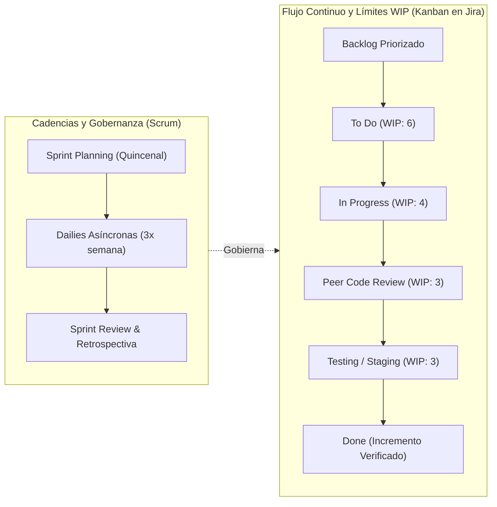
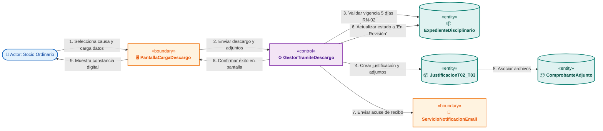
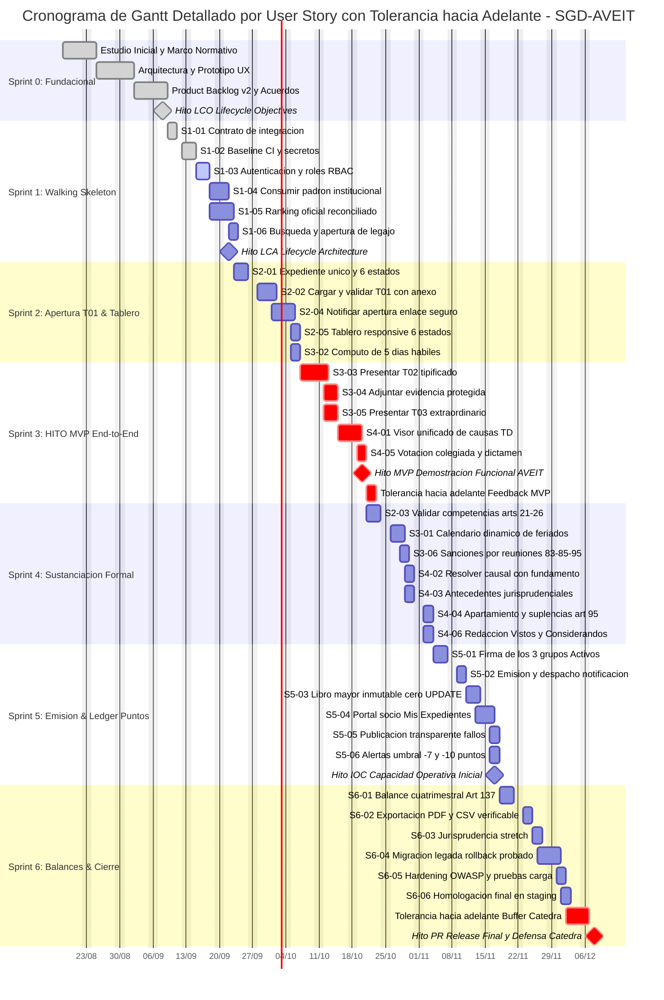

# UNIVERSIDAD TECNOLÓGICA NACIONAL
## FACULTAD REGIONAL CÓRDOBA
### Carrera: Analista Desarrollador Universitario de Sistemas de Información
### Cátedra: Seminario Integrador
**Ciclo Lectivo:** 2026  
**Curso:** 3K2  
**Grupo de Proyecto:** Nº 04  

---

# PLAN DE PROYECTO DE SOFTWARE
## Sistema de Gestión del Tribunal de Disciplina y Premiaciones de A.V.E.I.T. (SGD-AVEIT)

---

### DATOS FORMALES DEL PROYECTO Y EQUIPO DE TRABAJO

| Campo | Detalle Institucional |
| :--- | :--- |
| **Organización Patrocinante** | Asociación Vocacional de Estudiantes e Ingenieros Tecnológicos (A.V.E.I.T.) - UTN FRC |
| **Nombre Oficial del Producto** | **SGD-AVEIT** (Sistema de Gestión del Tribunal de Disciplina y Premiaciones de AVEIT) |
| **Tipo de Proyecto** | Proyecto de Software de Impacto Institucional / Tesina de Título Intermedio (ADUSI) |
| **Modalidad Presupuestaria** | Desarrollo y Donación Ad Honorem (Costo de Licencias y Mano de Obra: $0 Pesos) |
| **Metodología de Trabajo** | Metodología Ágil Adaptativa (**Scrumban**) alineada con Hitos de Ciclo de Vida de Software |
| **Líder de Proyecto / Product Owner** | **Sanchez, Diego Gabriel** (Legajo: 87414) - diegogabriel.stm@gmail.com |
| **Scrum Master** | **Guillén, Lucas Martín** (Legajo: 85194) |
| **Equipo de Desarrollo (Full-Stack)** | • **Rosales, Nicolás** (Legajo: 408917)<br>• **Gastiaburu, Lucas** (Legajo: 74907)<br>• **Villegas, Axel Rene** (Legajo: 403655)<br>• **Urviola, Luis** (Legajo: 409953)<br>• **Quiroz, Tomas Augusto** (Legajo: 415327) |
| **Cátedra Evaluadora** | Seminario Integrador - Departamento de Ingeniería en Sistemas de Información - UTN FRC |

---

## CONTROL DE VERSIONES / HISTORIAL DE REVISIONES

| Versión | Fecha | Autor / Responsable | Descripción de Modificaciones y Resoluciones de Cátedra |
| :---: | :---: | :--- | :--- |
| **1.0.0** | 18/08/2026 | Equipo de Proyecto SGD-AVEIT | Elaboración inicial del Plan de Proyecto y alcances generales. |
| **2.0.0** | 03/09/2026 | Equipo de Proyecto SGD-AVEIT | **Reestructuración y Adecuación Integral ante Observaciones de Cátedra:**<br>1. Incorporación de carátula formal, equipo y matriz de habilidades full-stack polivalentes con rotación.<br>2. Aplicación de `/systemClassifier`: taxonomía de sistemas de información (TPS, MIS, DSS, EIS) y articulación de Scrumban con hitos formales.<br>3. Aplicación de `/requirementsExtractor`: desglose granular de requerimientos funcionales (`RF-01` a `RF-15`), catálogo de reglas de negocio (`RN-01` a `RN-10`) con cálculo matemático exacto de saldos (erradicando 'cómputo algorítmico'), separación estricta de Requerimientos No Funcionales (ISO 25010) de Restricciones Tecnológicas (`RES`), y matriz de trazabilidad normativa bidireccional contra el Estatuto 2026 y reglamentos.<br>4. Aclaración conceptual de 'Firma Electrónica Interna / Aprobación Colegiada Autenticada', descartando compromisos con Ley 25.506 (Firma Digital con token/AC).<br>5. Reformulación de 'no UPDATE' como Requisito No Funcional de Integridad y Trazabilidad Transaccional del Saldo (triggers en MySQL + tabla de auditoría + lógica en backend).<br>6. Detalle operativo del marco Scrumban (cadencias Scrum quincenales, límites WIP en Jira, code review obligatoria por pares y métricas de flujo).<br>7. Aplicación de `/useCaseExtractor`: catálogo de casos de uso (`CU-01` a `CU-12`), especificación formal Cockburn en 2 columnas con postcondiciones duales y criterios BDD Gherkin, y análisis de robustez BCE. |

---

## ÍNDICE GENERAL

1. [Propósito y Enfoque del Documento](#1-propósito-y-enfoque-del-documento)
2. [Identificación del Producto y Organización Patrocinante](#2-identificación-del-producto-y-organización-patrocinante)
3. [Equipo de Trabajo, Roles y Matriz de Habilidades](#3-equipo-de-trabajo-roles-y-matriz-de-habilidades)
4. [Diagnóstico Sistémico y Taxonomía de Sistemas de Información (systemClassifier)](#4-diagnóstico-sistémico-y-taxonomía-de-sistemas-de-información)
5. [Marco Metodológico de Trabajo: Scrumban en la Práctica](#5-marco-metodológico-de-trabajo-scrumban-en-la-práctica)
6. [Definición de Actores del Sistema y Matriz de Permisos RBAC](#6-definición-de-actores-del-sistema-y-matriz-de-permisos-rbac)
7. [Especificación Detallada de Requerimientos Funcionales (RF)](#7-especificación-detallada-de-requerimientos-funcionales-rf)
8. [Matriz de Trazabilidad Normativa Bidireccional](#8-matriz-de-trazabilidad-normativa-bidireccional)
9. [Catálogo Formal de Reglas de Negocio (RN)](#9-catálogo-formal-de-reglas-de-negocio-rn)
10. [Especificación de Requerimientos No Funcionales (RNF - ISO/IEC 25010)](#10-especificación-de-requerimientos-no-funcionales-rnf---isoiec-25010)
11. [Restricciones Tecnológicas, Supuestos y Dependencias](#11-restricciones-tecnológicas-supuestos-y-dependencias)
12. [Especificación de Casos de Uso Críticos y Realización BCE (useCaseExtractor)](#12-especificación-de-casos-de-uso-críticos-y-realización-bce)
13. [Cronograma Macro, Hitos y Gestión de Riesgos](#13-cronograma-macro-hitos-y-gestión-de-riesgos)

---

## 1. PROPÓSITO Y ENFOQUE DEL DOCUMENTO

El presente **Plan de Proyecto de Software** establece la línea base formal de ingeniería, gobernanza metodológica y especificación técnica para la construcción y transferencia del **Sistema de Gestión del Tribunal de Disciplina y Premiaciones de AVEIT (SGD-AVEIT)**. 

Este plan responde integralmente a los requerimientos de la cátedra de Seminario Integrador de la UTN Facultad Regional Córdoba, definiendo con exactitud matemática y jurídica el alcance funcional del producto, su articulación con la infraestructura preexistente de la institución y el marco de trabajo ágil adaptativo que guiará el desarrollo.

---

## 2. IDENTIFICACIÓN DEL PRODUCTO Y ORGANIZACIÓN PATROCINANTE

* **Nombre Oficial:** Sistema de Gestión del Tribunal de Disciplina y Premiaciones de A.V.E.I.T.
* **Acrónimo Institucional:** **SGD-AVEIT**
* **Organización Destinataria:** Asociación Vocacional de Estudiantes e Ingenieros Tecnológicos (A.V.E.I.T.) - UTN Facultad Regional Córdoba.
* **Misión del Software:** Centralizar, auditar y transparentar la sustanciación de expedientes disciplinarios y propuestas de mérito conforme a la **Circular Normativa 001/2026** y al **Estatuto Social 2026**, proveyendo un portal web responsive mobile-first que erradique las planillas de cálculo desconectadas en Google Sheets, garantice la sumatoria inmutable de saldos de puntos y automatice la emisión de los Balances Cuatrimestrales de Auditoría Interna (Art. 137 del Reglamento Interno de Disciplina de AVEIT).

---

## 3. EQUIPO DE TRABAJO, ROLES Y MATRIZ DE HABILIDADES

El equipo de proyecto está compuesto por siete (7) integrantes, estudiantes de la carrera de Ingeniería en Sistemas de Información / ADUSI. Siguiendo las mejores prácticas de la ingeniería de software ágil, el equipo adopta un modelo de **Desarrolladores Full-Stack Polivalentes** con asignación de **responsabilidades rotativas por sprint** en backend, frontend responsive, bases de datos relacionales y aseguramiento de calidad (QA).

```
+-------------------------------------------------------------------------------------------------+
|                                 GOBERNANZA DEL EQUIPO SGD-AVEIT                                 |
+-------------------------------------------------------------------------------------------------+
|   PRODUCT OWNER / LÍDER DE PROYECTO               SCRUM MASTER (SM)                             |
|   Diego Gabriel Sánchez                           Lucas Martín Guillén                          |
|   (Legajo: 87414)                                 (Legajo: 85194)                               |
+-------------------------------------------------------------------------------------------------+
|                       EQUIPO DE DESARROLLO FULL-STACK POLIVALENTE (ROTATIVO)                    |
|                                                                                                 |
|   • Nicolás Rosales (Legajo: 408917)              • Lucas Gastiaburu (Legajo: 74907)            |
|   • Axel Rene Villegas (Legajo: 403655)           • Luis Urviola (Legajo: 409953)               |
|   • Tomas Augusto Quiroz (Legajo: 415327)                                                       |
+-------------------------------------------------------------------------------------------------+
```

### 3.1. Ficha Individual de Integrantes y Habilidades Técnicas

1. **Sanchez, Diego Gabriel (Legajo: 87414) — Product Owner & Full-Stack Developer**
   - *Rol Principal:* Product Owner / Líder de Proyecto / Nexo Institucional.
   - *Habilidades y Dominio:* Amplio conocimiento del dominio institucional y normativo de AVEIT (Ex-Secretario General de Comisión Directiva y actual Autoridad de la Subcomisión de Gestión Social y Ambiental - GSA); arquitectura de software; backend Python; diseño relacional de bases de datos MySQL; articulación de requerimientos con el Tribunal de Disciplina y la Subcomisión de Cómputos.
2. **Guillén, Lucas Martín (Legajo: 85194) — Scrum Master & Full-Stack Developer**
   - *Rol Principal:* Scrum Master / Coordinador de Flujo Scrumban.
   - *Habilidades y Dominio:* Gestión del tablero ágil en Jira Software; facilitación de ceremonias (Dailies, Planning, Retrospectivas); remoción proactiva de impedimentos; métricas de flujo continuo (Lead Time, Cycle Time); desarrollo backend Python y APIs RESTful.
3. **Rosales, Nicolás (Legajo: 408917) — Full-Stack Developer**
   - *Especialidades Rotativas:* Frontend Web Responsive; maquetación HTML5/CSS3 moderno y Tailwind CSS; diseño mobile-first adaptativo; integración de servicios web asíncronos en JavaScript.
4. **Gastiaburu, Lucas (Legajo: 74907) — Full-Stack Developer**
   - *Especialidades Rotativas:* Lógica de negocio backend en Python; control de autenticación y sesiones RBAC; validación de reglas de negocio en controladores de API; integración transaccional con base de datos.
5. **Villegas, Axel Rene (Legajo: 403655) — Full-Stack Developer**
   - *Especialidades Rotativas:* Administración de bases de datos MySQL; diseño de esquemas entidad-relación; implementación de triggers de auditoría transaccional e inmutabilidad; scripts de migración y respaldos.
6. **Urviola, Luis (Legajo: 409953) — Full-Stack Developer**
   - *Especialidades Rotativas:* Aseguramiento de Calidad (QA) y Testing; diseño y ejecución de casos de prueba funcionales; verificación de criterios de aceptación BDD Gherkin; pruebas de interfaces de usuario y usabilidad responsive.
7. **Quiroz, Tomas Augusto (Legajo: 415327) — Full-Stack Developer**
   - *Especialidades Rotativas:* Infraestructura de staging independiente; configuración de entornos de ejecución; pipelines de integración continua (CI) en GitHub; control de versiones Git y documentación técnica de entrega.

---

## 4. DIAGNÓSTICO SISTÉMICO Y TAXONOMÍA DE SISTEMAS DE INFORMACIÓN (systemClassifier)

Aplicando el marco analítico de la skill `systemClassifier`, el sistema SGD-AVEIT se diagnostica bajo la **Teoría General de Sistemas (TGS)** y se clasifica según la **Taxonomía de Sistemas de Información**.

### 4.1. Diagnóstico mediante Teoría General de Sistemas (TGS)
* **Suprasistema:** Asociación Vocacional de Estudiantes e Ingenieros Tecnológicos (A.V.E.I.T.) inserta en el ecosistema universitario de la UTN Facultad Regional Córdoba.
* **Sistema:** Plataforma Integral de Gestión del Tribunal de Disciplina y Premiaciones (SGD-AVEIT).
* **Subsistemas Nucleares:**
  1. *Subsistema de Entrada y Trámite Procesal (TPS):* Captura de solicitudes T01, notificaciones y carga digital de formularios T02/T03 con comprobantes.
  2. *Subsistema de Jurisprudencia y Deliberación Colegiada (KMS/DSS):* Consulta de antecedentes disciplinarios, emisión nominal de votos y suscripción de resoluciones.
  3. *Subsistema de Integridad Transaccional y Saldos (TPS):* Sumatoria de puntos auditada mediante ledger histórico y disparador de alarmas preventivas y críticas.
  4. *Subsistema de Transparencia y Rendición Cuatrimestral (MIS/EIS):* Portal público de consulta societaria y motor de compilación de Balances Cuatrimestrales (Art. 137).
* **Frontera del Sistema:** Comprende desde la detección de la infracción/mérito y solicitud formal hasta la consolidación del balance cuatrimestral y la publicación transparente del fallo. Excluye el cobro de cuotas societarias (Tesorería) y la gestión de la Gran Rifa.
* **Entorno:** Masa de más de 500 socios con membresía vigente, de categorías Pasivo y Activo, Comisión Directiva, Comisión Fiscalizadora, Subcomisiones operativas, servidores de correo SMTP y red Wi-Fi de la UTN FRC.
* **Homeostasis:** El sistema mantiene el equilibrio normativo institucional garantizando el debido proceso en 5 días hábiles y aplicando automáticamente la cláusula estatutaria de exclusión societaria al alcanzarse 10 puntos negativos netos.
* **Negentropía:** Reemplazo de planillas Google Sheets degradables y sentencias manuales `UPDATE` en MySQL por transacciones registradas mediante triggers de auditoría inmutables en base de datos.

### 4.2. Taxonomía de Sistemas de Información (SI)

| Módulo Funcional | Clasificación SI | Nivel Organizacional | Grado de Estructuración | Justificación Operativa |
| :--- | :---: | :---: | :---: | :--- |
| **Módulo de Expedientes y Formularios (T01, T02, T03)** | **TPS** *(Transaction Processing)* | Operativo | Totalmente Estructurada | Procesa transacciones cotidianas de solicitudes, acuses, plazos preclusivos de 5 días hábiles y recepción de adjuntos. |
| **Motor de Sumatoria de Saldos y Auditoría Histórica** | **TPS / Ledger** | Operativo | Totalmente Estructurada | Suma algebraica auditable de puntos (+/-), cálculo de fracciones de 0.5 y disparo de triggers transaccionales. |
| **Módulo de Balances Cuatrimestrales y Estadísticas** | **MIS** *(Management Info)* | Táctico / Supervisión | Semiestructurada | Consolida periódicamente (cuatrimestral) el rendimiento disciplinario por subcomisión y grupo social (Art. 137). |
| **Tablero de Estados de Causas y Alertas Escalonadas** | **DSS** *(Decision Support)* | Táctico / Directivo | Semiestructurada | Alerta al Tribunal y a CD ante socios en zona de riesgo (-7 pts) y sugiere antecedentes jurisprudenciales análogos. |
| **Portal de Transparencia Societaria y Rendición** | **EIS / Portal** | Estratégico / Asamblea | No Estructurada | Presenta el estado de transparencia de la Asociación, visualización global del padrón y rendición ante Asambleas. |

---

## 5. MARCO METODOLÓGICO DE TRABAJO: SCRUMBAN EN LA PRÁCTICA

Para optimizar la coordinación asíncrona y la entrega continua de valor, el equipo adopta formalmente el marco ágil adaptativo **Scrumban** (combinación estructurada de la gobernanza rítmica de Scrum con el control de flujo continuo de Kanban).



### 5.1. Reglas Operativas y Mecanismos de Control Scrumban

1. **Cadencia de Iteraciones (Sprints Quincenales):**  
   Ciclos de desarrollo de 2 semanas estructurados para entregar incrementos de software desplegables en el entorno de staging propio.
2. **Ceremonias Ágiles Adaptadas:**
   - **Sprint Planning (Quincenal):** Definición del objetivo del hito (*Sprint Goal*) y extracción de ítems del Product Backlog hacia el tablero Kanban.
   - **Daily Standup Asíncrona (Lunes, Miércoles y Viernes):** Cada integrante registra en el canal de desarrollo de Discord sus avances, tareas en curso y bloqueos mediante el formato estándar de 3 preguntas antes de las 13:00 hs.
   - **Sprint Review & Retrospectiva (Fin de Sprint):** Demostración funcional al Product Owner y análisis de desvíos en el ciclo de trabajo para mejora continua.
3. **Límites de Trabajo en Progreso (WIP Limits en Jira Software):**
   - *In Progress:* Máximo **4 tareas simultáneas** en todo el equipo (no más de 1 tarea activa por desarrollador o 2 en pair-programming).
   - *Peer Code Review:* Máximo **3 tareas en revisión**. Si la columna se satura, el equipo detiene la toma de nuevas tareas para desbloquear revisiones pendientes (*Stop starting, start finishing*).
   - *Testing / Staging:* Máximo **3 tareas**.
4. **Política de Calidad y Pull Requests (Code Review Obligatoria):**  
   Ningún código se fusiona a la rama principal (`main`) sin la aprobación explícita de al menos un revisor par mediante GitHub Pull Request, verificando estándares de código, pruebas unitarias y consistencia con las reglas de negocio.
5. **Métricas de Flujo Monitoreadas:**
   - **Lead Time:** Tiempo total desde que una necesidad es ingresada al backlog hasta su puesta en staging.
   - **Cycle Time:** Tiempo transcurrido desde que un desarrollador toma la tarea en *In Progress* hasta que se valida en *Done* (meta del equipo: Cycle Time promedio <= 3.5 días hábiles).
   - **Diagrama de Flujo Acumulado (CFD):** Para detectar cuellos de botella tempranos en las columnas de revisión y pruebas.

---

## 6. DEFINICIÓN DE ACTORES DEL SISTEMA Y MATRIZ DE PERMISOS RBAC

El sistema SGD-AVEIT implementa un modelo estricto de **Control de Acceso Basado en Roles (RBAC)** que refleja fielmente las competencias asignadas por el Estatuto Social 2026 y el Reglamento Procesal Disciplinario 2026.

```mermaid
classDiagram
    direction TB
    class SocioOrdinario {
        <<Actor Humano Principal>>
        +consultarSaldoPuntos()
        +verMisExpedientes()
        +presentarFormularioT02()
        +presentarFormularioT03()
        +verResolucionesPublicas()
    }
    class MiembroTD {
        <<Actor Humano Principal - Operador>>
        +gestionarTablero6Estados()
        +consultarRankingGeneral()
        +buscarLegajoSocio()
        +revisarJustificacionesT02_T03()
        +emitirVotoNominal()
        +firmarColegiadamente()
        +generarBalanceCuatrimestral()
    }
    class ComisionDirectiva {
        <<Actor Humano Principal - Ejecutivo>>
        +iniciarFormularioT01General()
        +consultarRankingConsolidado()
        +recibirAlertas7y10Pts()
        +tratarBalanceCuatrimestral()
    }
    class AutoridadSubcomision {
        <<Actor Humano Principal - Solicitante>>
        +iniciarFormularioT01Subcomision()
        +reportarIncumplimientoTareas()
    }
    class AdminComputos {
        <<Actor Humano - Soporte>>
        +gestionarUsuariosRoles()
        +auditarLogsSeguridad()
    }
    class TemporizadorSistema {
        <<Actor No Humano - Daemon/Cron>>
        +controlarPlazo5DiasHabiles()
        +despacharNotificaciones()
    }
```



### 6.1. Matriz de Permisos RBAC Consolidada

| Funcionalidad / Módulo del Sistema | Socio Ordinario | Autoridad Subcomisión | Comisión Directiva (CD) | Miembro Tribunal (TD) | Admin Cómputos |
| :--- | :---: | :---: | :---: | :---: | :---: |
| Consultar saldo individual y expediente propio | **R** | **R** | **R** | **R** | **R** |
| Presentar Justificación (T02) o Descargo (T03) | **C/U** | **C/U** | ❌ | ❌ | ❌ |
| Consultar Resoluciones Públicas Dictadas | **R** | **R** | **R** | **R** | **R** |
| Iniciar Solicitud T01 sobre socios de su área | ❌ | **C** | ❌ | ❌ | ❌ |
| Iniciar Solicitud T01 sobre cualquier socio | ❌ | ❌ | **C** | **C** *(De Oficio)* | ❌ |
| Consultar Ranking General de Socios (filtros Jr/Sr) | ❌ | ❌ | **R** | **R** | **R** |
| Buscar Legajo Integral e Histórico por Socio | ❌ | ❌ | **R** | **R** | **R** |
| Sustanciar Descargos y Aprobar/Rechazar T02/T03 | ❌ | ❌ | ❌ | **C/U** | ❌ |
| Votar nominalmente y redactar Resoluciones | ❌ | ❌ | ❌ | **C/U** | ❌ |
| Firma Electrónica Colegiada de Resoluciones | ❌ | ❌ | ❌ | **C/U** *(Activos)* | ❌ |
| Recibir Alertas Preventivas (-7 pts) y Críticas (-10 pts) | **R** *(Propia)* | ❌ | **R** *(Global)* | **R** *(Global)* | ❌ |
| Generar y Exportar Balances Cuatrimestrales (Art. 137)| ❌ | ❌ | **R** | **C/R/E** | ❌ |
| Gestión de Usuarios, Roles y Pistas de Auditoría DB | ❌ | ❌ | ❌ | ❌ | **C/R/U/D** |

*Referencias: **C** = Create, **R** = Read, **U** = Update (transaccional auditado), **D** = Delete (desactivación lógica), **E** = Export.*

---

## 7. ESPECIFICACIÓN DETALLADA DE REQUERIMIENTOS FUNCIONALES (RF)

Aplicando el pipeline de `/requirementsExtractor`, se desglosan los alcances funcionales globales en requerimientos específicos, verificables y priorizados bajo el estándar **MoSCoW** (*Must Have*, *Should Have*, *Could Have*, *Won't Have*):

| ID | Nombre del Requerimiento Funcional | Descripción Técnica y Funcional Detallada | Prioridad MoSCoW | Actor Primario |
| :--- | :--- | :--- | :---: | :--- |
| **RF-01** | **Gestión de Solicitudes de Infracción/Mérito (T01)** | El sistema permitirá a las autoridades habilitadas (CD, TD o Autoridad de Subcomisión) dar de alta solicitudes de sanción o premiación mediante el Formulario T01 y su Hoja de Anexo, tipificando los hechos e indicando las pruebas y socios involucrados. | **Must Have** | CD / TD / Autoridad Subcomisión |
| **RF-02** | **Apertura y Registro de Expediente Disciplinario** | El sistema creará un expediente disciplinario con identificador unívoco y sellado de tiempo, asociándolo a los involucrados y transicionándolo automáticamente al estado *"Expediente Creado"*. | **Must Have** | Sistema (Automático) |
| **RF-03** | **Despacho Automatizado de Acuses de Sanción** | El sistema enviará un correo electrónico fehaciente al socio imputado notificando la imputación, los hechos circunstanciados y la apertura formal del plazo de descargo. | **Must Have** | Temporizador / Sistema |
| **RF-04** | **Control Automatizado de Plazo Preclusivo de 5 Días** | El sistema computará de forma continua el plazo improrrogable de **cinco (5) días hábiles** desde la notificación. Al expirar las 23:59:59 del 5º día hábil sin descargo, cerrará la recepción y transicionará el expediente a *"Las justificaciones están siendo revisadas"*. | **Must Have** | Temporizador (Daemon) |
| **RF-05** | **Carga Digital de Justificación Tipificada (Formulario T02)** | El sistema proveerá una interfaz web responsive para que el socio imputado complete el Formulario T02 seleccionando una causal reglamentaria tipificada y adjunte comprobantes probatorios digitales (PDF/JPG/PNG). | **Must Have** | Socio Ordinario |
| **RF-06** | **Carga Digital de Descargo Extraordinario (Formulario T03)** | El sistema proveerá una interfaz web responsive para que el socio imputado complete el Formulario T03 ante situaciones excepcionales no tipificadas, redactando los hechos y adjuntando pruebas documentales. | **Must Have** | Socio Ordinario |
| **RF-07** | **Tablero de Control y Seguimiento de los 6 Estados Procesales** | El sistema dispondrá de un panel de control interactivo para los miembros del TD que visualizará y gestionará los expedientes clasificados en sus 6 estados oficiales según el Art. 12 del Reglamento Procesal 2026. | **Must Have** | Miembro TD |
| **RF-08** | **Evaluación y Sustanciación de Descargos** | El sistema permitirá a las miembros del TD visualizar los comprobantes adjuntos, emitir dictamen de aprobación o rechazo fundado sobre los Formularios T02/T03 y registrar el resultado en el expediente. | **Must Have** | Miembro TD |
| **RF-09** | **Registro Nominal de Votación del Tribunal** | El sistema registrará el voto individual y nominal de cada miembro del Tribunal de Disciplina habilitado, computando la mayoría absoluta estatutaria para habilitar la confección del fallo. | **Must Have** | Miembro TD |
| **RF-10** | **Redacción Estructurada y Generación de Resoluciones** | El sistema guiará la redacción de la Resolución final respetando la estructura legal obligatoria (*Vistos, Considerandos y Resolución*) y consolidando los puntos definitivos asignados (+/-). | **Must Have** | Miembro TD |
| **RF-11** | **Aprobación Colegiada Autenticada (Firma Electrónica)** | El sistema permitirá a los miembros del TD de categoría Activo suscribir colegiadamente la resolución mediante su sesión autenticada, registrando de forma inalterable ID de usuario, rol institucional, categoría, fecha/hora y hash de auditoría. | **Must Have** | Miembro TD |
| **RF-12** | **Sumatoria Transaccional e Inmutable del Saldo de Puntos** | El sistema actualizará el saldo de puntos del socio sumando algebraicamente las transacciones dictaminadas con fracciones mínimas de 0.5 puntos, mediante lógica de backend y triggers en base de datos. | **Must Have** | Sistema (Motor de Reglas) |
| **RF-13** | **Disparo Automático de Alertas Escalonadas (-7 y -10 pts)** | El sistema evaluará el saldo tras cada impacto: si el saldo acumulado es <= -7 pts despachará alerta amarilla preventiva; si es <= -10 pts despachará alerta roja de pérdida de condición de socio a CD y al socio. | **Must Have** | Sistema (Daemon / Reglas) |
| **RF-14** | **Generación de Balances Cuatrimestrales de Auditoría (Art. 137)** | El sistema compilará con un solo clic los Balances Cuatrimestrales de Auditoría Interna de Premiaciones y Sanciones desglosados por Subcomisión y categoría (Pasivos/Activos), exportables a PDF formal. | **Must Have** | Miembro TD |
| **RF-15** | **Portal de Transparencia y Consulta Pública de Resoluciones** | El sistema dispondrá de un portal público accesible por toda la masa societaria para consultar el repositorio de resoluciones firmes dictadas y el legajo de antecedentes individuales. | **Should Have** | Socio Ordinario / Público |

---

## 8. MATRIZ DE TRAZABILIDAD NORMATIVA BIDIRECCIONAL

Cada requerimiento funcional del sistema está estrictamente justificado y delimitado por el marco normativo vigente de A.V.E.I.T.:

| ID Requerimiento | Artículo Normativo de Respaldo | Cuerpo Normativo | Regla de Negocio Asociada |
| :--- | :--- | :--- | :--- |
| **RF-01, RF-02** | Arts. 16 y 16 BIS, Arts. 21 a 26 | Reglamento Procesal Disciplinario 2026 | `RN-01` (Competencia para Inicio de Acciones) |
| **RF-03, RF-04** | Art. 12 inc. 2, Art. 17 | Reglamento Procesal Disciplinario 2026 | `RN-02` (Plazo Preclusivo Improrrogable de 5 Días Hábiles) |
| **RF-05** | Art. 17 | Reglamento Procesal Disciplinario 2026 | `RN-03` (Causales Tipificadas de Justificación T02) |
| **RF-06** | Art. 18 | Reglamento Procesal Disciplinario 2026 | `RN-04` (Sustanciación de Descargo Extraordinario T03) |
| **RF-07, RF-08** | Art. 12 (Estados 1 al 4) | Reglamento Procesal Disciplinario 2026 | `RN-05` (Ciclo de Vida de 6 Estados del Expediente) |
| **RF-09, RF-10** | Art. 96 | Estatuto Social de A.V.E.I.T. 2026 | `RN-06` (Quórum y Mayoría Absoluta del Tribunal) |
| **RF-11** | Arts. 12 inc. 5, Art. 13 | Reglamento Procesal Disciplinario 2026 | `RN-07` (Validez de la Firma Colegiada Autenticada) |
| **RF-12** | Arts. 20 y 20 BIS; Circular 001/2026 | Reg. Procesal 2026 / Circular TD 2026 | `RN-08` (Cálculo de Saldos y Fracciones Mínimas de 0.5) |
| **RF-13** | Art. 93 | Reglamento Interno de Disciplina de AVEIT | `RN-09` (Cláusula de Pérdida de Condición de Socio a -10 Pts) |
| **RF-14** | Art. 137 | Reglamento Interno de Disciplina de AVEIT | `RN-10` (Obligatoriedad de Balances Cuatrimestrales de Auditoría) |
| **RF-15** | Art. 96 | Estatuto Social de A.V.E.I.T. 2026 | `RN-05` (Publicidad y Transparencia de Fallos Firmes) |

---

## 9. CATÁLOGO FORMAL DE REGLAS DE NEGOCIO (RN)

En respuesta a la observación de la cátedra de reemplazar expresiones vagas como *"cómputo algorítmico"* por especificaciones inequívocas, se formaliza el catálogo de reglas que rigen la lógica de dominio:

* **`RN-01` — Competencia Exclusiva para Apertura de Acciones (Arts. 21-26 Reg. Procesal 2026):**  
  Una solicitud T01 solo es válida si es originada por: 1) Comisión Directiva sobre cualquier socio (salvo sus propios miembros); 2) Comisión Fiscalizadora sobre directivos y órganos; 3) Tribunal de Disciplina de oficio; 4) Presidentes o Vicepresidentes de Subcomisión exclusivamente sobre miembros ordinarios a su cargo; 5) Jefes de Equipo sobre integrantes de su equipo.
* **`RN-02` — Cómputo del Plazo Preclusivo Improrrogable de 5 Días Hábiles (Art. 12 inc. 2 Reg. Procesal 2026):**  
  El plazo para ingresar formularios T02/T03 expira exactamente a las 23:59:59 horas del quinto (5º) día hábil posterior a la emisión del acuse de sanción. No se computan sábados, domingos ni feriados nacionales o provinciales. Vencido el plazo, el sistema bloquea irreversiblemente la posibilidad de carga.
* **`RN-03` — Validez Probatoria del Formulario T02:**  
  La justificación tipificada solo es admisible bajo las causales del Reglamento Interno: enfermedad certificada por profesional médico con matrícula, exámenes universitarios en UTN FRC con constancia sellada, o motivos de fuerza mayor con comprobantes fehacientes (pasajes, constancia policial).
* **`RN-04` — Descargo Extraordinario T03 bajo Sana Crítica:**  
  El Formulario T03 habilita descargos por causas atípicas. No admite aprobación automática; requiere dictamen fundado del TD basado en antecedentes y jurisprudencia interna.
* **`RN-05` — Transición Unidireccional de los 6 Estados Procesales:**  
  Un expediente transiciona de forma secuencial y sin retrocesos: E1(Creado) -> E2(En Justificación) -> E3(En Revisión) -> E4(En Espera Resolución) -> E5(Pendiente Firma) -> E6(Emitido).
* **`RN-06` — Quórum y Mayoría Absoluta del TD (Art. 96 Estatuto 2026):**  
  Las resoluciones requieren la deliberación de al menos tres (3) miembros habilitados y el voto favorable de al menos dos (2) miembros (mayoría absoluta). Si un miembro es recusado por parentesco o conflicto de interés (Art. 95 Estatuto), asume automáticamente un miembro suplente.
* **`RN-07` — Suscripción Colegiada por Socios Activos:**
  La resolución definitiva solo adquiere estado firme y validez cuando ha sido suscripta de manera colegiada por al menos dos integrantes habilitados del TD pertenecientes a la categoría estatutaria de Socios Activos (4º a 6º año social).
* **`RN-08` — Fórmula de Sumatoria de Saldo y Cuantificación de Puntos:**
  El saldo neto individual de un socio se calcula estrictamente mediante la suma algebraica:
  $$\text{SaldoNeto} = \sum \text{PuntosPositivos} - \sum \text{PuntosNegativos}$$
  Todas las cantidades se expresan en **múltiplos y fracciones mínimas de 0.5 puntos**. Escala aplicable:
  - Sanciones: inasistencia a reunión (-1.0 pto); inasistencia a asamblea (-2.0 pts); omisión de limpieza (-2.0 pts); omisión de tareas asignadas en subcomisiones (apercibimiento a -2.0 pts); tardanzas (-0.5 pts).
  - Premios: leves (+0.5 a +1.0 pto); medios (+1.0 a +2.0 pts); sobresalientes (+2.0 a +4.0 pts).
* **`RN-09` — Umbrales Críticos y Pérdida Automática de Condición de Socio (Art. 93 Reg. Interno):**  
  - Si SaldoNeto <= -7.0 puntos: El sistema dispara automáticamente la **Alerta Amarilla Preventiva** hacia el socio y Comisión Directiva.
  - Si SaldoNeto <= -10.0 puntos: El sistema dispara de inmediato la **Alerta Roja de Pérdida Automática de la Condición de Socio**, notificando fehacientemente al imputado, a Comisión Directiva y a la Comisión Fiscalizadora para la revocación formal del alta asociativa.
* **`RN-10` — Balances Cuatrimestrales de Auditoría Interna (Art. 137 Reg. Interno):**  
  Se deben emitir obligatoriamente dos (2) balances al año social, con fecha de corte al finalizar el 1º y el 2º cuatrimestre institucional, agrupando sanciones y méritos por Subcomisión y categoría (Pasivo/Activo).

---

## 10. ESPECIFICACIÓN DE REQUERIMIENTOS NO FUNCIONALES (RNF - ISO/IEC 25010)

Los Requerimientos No Funcionales se especifican formalmente bajo el estándar **ISO/IEC 25010:2023** y la matriz de medición cuantitativa **Planguage (Tom Gilb)**:

### 10.1. Fichas Planguage de Calidad

```text
TAG: RNF-01 (Usabilidad y Responsive Mobile-First)
DIMENSIÓN ISO 25010: Usabilidad / Adaptabilidad
ENUNCIADO: La interfaz web debe ser 100% responsiva y operativa en dispositivos móviles (smartphones y tablets) y computadoras de escritorio.
SCALE: Puntuación System Usability Scale (SUS) y renderizado sin desbordamiento horizontal en anchos desde 360px hasta 4K.
METER: Auditoría con Google Lighthouse Mobile y prueba de usabilidad con 10 socios en dispositivos Android/iOS.
BASELINE: Interfaz no adaptable (Google Sheets requiere zoom manual en móvil).
TARGET_PLAN: Puntuación SUS >= 85 puntos; Lighthouse Mobile Accessibility >= 90/100.
```

```text
TAG: RNF-02 (Requisito de Integridad y Trazabilidad Transaccional del Saldo)
DIMENSIÓN ISO 25010: Seguridad / Integridad y No Repudio
ENUNCIADO: El saldo de puntos no podrá ser modificado mediante mutación directa o sentencias manuales 'UPDATE'. Toda alteración debe generarse a través de un asiento histórico con auditoría.
SCALE: Porcentaje de operaciones de modificación que cuentan con registro histórico de autoría, timestamp, motivo y valor previo.
METER: Trigger en MySQL (BEFORE UPDATE / INSERT) sobre tablas de puntos que valida sesión y registra fila en tabla 'auditoria_puntos'.
BASELINE: Modificaciones directas en Google Sheets o mediante SQL 'UPDATE' manual sin registro de autor ni motivo.
TARGET_PLAN: 100% de trazabilidad; cero modificaciones directas no auditadas admitidas por el motor.
```

```text
TAG: RNF-03 (Firma Electrónica Interna / Aprobación Colegiada Autenticada)
DIMENSIÓN ISO 25010: Seguridad / Autenticidad y No Repudio
ENUNCIADO: Los miembros del TD suscribirán las resoluciones mediante un mecanismo de firma electrónica interna dentro de su sesión autenticada con registro de hash criptográfico.
ACLARACIÓN LEGAL: No se compromete validez legal bajo Ley Nacional 25.506 (Firma Digital con token de hardware o Autoridad Certificante licenciada). Se implementa firma electrónica interna con valor probatorio institucional interno según los Arts. 94 a 96 del Estatuto Social de AVEIT.
SCALE: Registro unívoco del identificador de usuario, timestamp fehaciente del servidor y hash SHA-256 del contenido del dictamen.
METER: Verificación de integridad del hash en el registro de firmas de la base de datos MySQL.
TARGET_PLAN: 100% de resoluciones emitidas asociadas a al menos dos firmas electrónicas válidas con hash verificado.
```

```text
TAG: RNF-04 (Eficiencia de Desempeño y Tiempos de Respuesta)
DIMENSIÓN ISO 25010: Rendimiento / Comportamiento Temporal
ENUNCIADO: El sistema debe responder ágilmente ante consultas concurrentes de saldos y carga de descargos.
SCALE: Tiempo de respuesta HTTP (latencia P95) medido en segundos desde la petición del cliente hasta la respuesta del servidor.
METER: Prueba de carga con herramienta automatizada simulando 50 usuarios concurrentes sobre el servidor de staging.
BASELINE: Tiempos de carga de Google Sheets superiores a 6 segundos en redes móviles.
TARGET_PLAN: Latencia P95 <= 1.5 segundos en consultas generales; <= 3.0 segundos en subida de adjuntos de hasta 5 MB.
```

```text
TAG: RNF-05 (Seguridad de Acceso y Control RBAC)
DIMENSIÓN ISO 25010: Seguridad / Confidencialidad y Control de Acceso
ENUNCIADO: El acceso a módulos administrativos y expedientes estará estrictamente restringido según el rol institucional del usuario.
SCALE: 100% de endpoints protegidos por autenticación de sesión y verificación de privilegios RBAC en backend.
METER: Suite de pruebas de penetración automatizadas (OWASP Top 10) sobre control de acceso a rutas protegidas.
TARGET_PLAN: Cero vulnerabilidades de elevación de privilegios (IDOR / Broken Object Level Authorization).
```

---

## 11. RESTRICCIONES TECNOLÓGICAS, SUPUESTOS Y DEPENDENCIAS

Para cumplir estrictamente con la indicación del docente de **separar requerimientos no funcionales de restricciones tecnológicas**, se explicitan los límites técnicos e institucionales innegociables:

### 11.1. Restricciones Tecnológicas e Institucionales (RES)
* **`RES-01` — Restricción de Backend Institucional (Python):**  
  El backend del sistema debe desarrollarse obligatoriamente en lenguaje **Python** para asegurar la compatibilidad con el ecosistema web preexistente de AVEIT y permitir su eventual absorción por la Subcomisión de Cómputos.
* **`RES-02` — Restricción de Motor de Base de Datos (MySQL):**  
  La base de datos relacional debe ser **MySQL** (versión compatible con el motor instalado en el servidor central de AVEIT), respetando las estructuras de claves foráneas con las tablas de socios y usuarios preexistentes.
* **`RES-03` — Restricción Presupuestaria y Costo de Licenciamiento ($0):**  
  El proyecto cuenta con un presupuesto financiero asignado de **Cero Pesos ($0)**. No se permite la contratación de licencias propietarias pagas ni servicios cloud pagos obligatorios para la operación base. Todo el stack debe sustentarse en tecnologías de código abierto (Open Source).
* **`RES-04` — Entorno de Desarrollo y Staging Aislado (Cero Riesgo en Producción):**  
  El desarrollo, pruebas e integración continua se realizarán en una infraestructura externa provista y administrada por el equipo de desarrollo, trabajando con una copia de respaldo anonimizada de la base de datos provista por Cómputos. **Queda estrictamente prohibido realizar pruebas o ejecuciones sobre el servidor de producción de AVEIT**.
* **`RES-05` — Despliegue en Servidor Central Sujeto a Aprobación Institucional:**  
  La instalación final del sistema en el servidor central de AVEIT dependerá de la decisión y acuerdo explícito entre la Subcomisión de Cómputos y el Tribunal de Disciplina al término de las pruebas piloto. En caso de no acordarse, la entrega final se formalizará sobre el entorno propio del equipo con la base de datos de respaldo.
* **`RES-06` — Formato de Comprobantes Adjuntos:**  
  El almacenamiento de adjuntos probatorios estará restringido a formatos estándar (`.pdf`, `.jpg`, `.jpeg`, `.png`) con un límite de tamaño máximo de 5 MB por archivo.

### 11.2. Supuestos del Proyecto (SUP)
* **`SUP-01`:** La Subcomisión de Cómputos proveerá oportunamente la copia de respaldo del esquema y datos anonimizados de la base de datos MySQL de socios.
* **`SUP-02`:** Los socios con membresía vigente de AVEIT cuentan con casillas de correo electrónico operativas registradas en el padrón para la recepción de acuses y notificaciones.
* **`SUP-03`:** Las reuniones deliberativas del Tribunal de Disciplina continuarán desarrollándose bajo modalidad predominantemente virtual quincenal.

### 11.3. Dependencias Externas (DEP)
* **`DEP-01`:** Servicio de servidor de correo SMTP para el despacho de acuses de sanción y notificaciones.
* **`DEP-02`:** Enlace de conectividad y DNS institucional provisto por la UTN FRC para el acceso web de la comunidad asociativa.

---

## 12. ESPECIFICACIÓN DE CASOS DE USO CRÍTICOS Y REALIZACIÓN BCE (useCaseExtractor)

Aplicando el estándar de la skill `useCaseExtractor`, se detalla a continuación la realización del caso de uso nuclear del sistema:

### 12.1. Catálogo Preliminar de Casos de Uso del Sistema

| Código CU | Nombre del Caso de Uso | Actor Principal | Requerimiento Trazado |
| :--- | :--- | :--- | :--- |
| **CU-01** | **Presentar Descargo o Justificación Disciplinaria (T02/T03)** | Socio Ordinario | `RF-05`, `RF-06`, `RF-04` |
| **CU-02** | **Sustanciar y Emitir Resolución Colegiada de Expediente** | Miembro Tribunal (TD) | `RF-08`, `RF-09`, `RF-10`, `RF-11` |
| **CU-03** | **Iniciar Solicitud de Sanción / Premiación (Formulario T01)** | CD / Autoridad Subcomisión | `RF-01`, `RF-02` |
| **CU-04** | **Consultar Ranking General y Legajo de Socio** | Miembro TD / CD | `RF-15`, `RF-07` |
| **CU-05** | **Generar Balance Cuatrimestral de Auditoría Interna** | Miembro Tribunal (TD) | `RF-14` |
| **CU-06** | **Controlar Vencimiento de Plazos y Transición de Estados** | Temporizador (Daemon) | `RF-04`, `RF-03` |

---

### 12.2. Especificación Formal de Caso de Uso: CU-01

# CU-01: Presentar Descargo o Justificación Disciplinaria (T02/T03)

## 1. Ficha Técnica

| Atributo | Detalle |
| :--- | :--- |
| **Identificador** | **CU-01** |
| **Nombre** | Presentar Descargo o Justificación Disciplinaria |
| **Módulo** | Módulo de Trámite Procesal y Descargos |
| **Actor Principal** | Socio Ordinario (imputado) |
| **Actores Secundarios** | Temporizador del Sistema, Servidor SMTP |
| **Propósito** | Permitir al socio imputado ejercer su derecho de defensa dentro del término de 5 días hábiles, ingresando una justificación tipificada (T02) o descargo extraordinario (T03) con comprobantes digitales adjuntos. |
| **Tipo de Ejecución** | En línea (Web Responsive Mobile / Desktop) |
| **Frecuencia** | Periódica (ante cada expediente disciplinario abierto) |
| **Trazabilidad** | `RF-04`, `RF-05`, `RF-06`, `RN-02`, `RN-03`, `RN-04` |

## 2. Precondiciones
1. El socio debe encontrarse autenticado en la plataforma con credenciales válidas.
2. Debe existir un expediente disciplinario activo en estado *"En período de subida de justificaciones"* vinculado al socio.
3. El plazo de cinco (5) días hábiles reglamentarios no debe haber expirado (`RN-02`).

## 3. Disparador (Trigger)
El socio accede al enlace notificado en su acuse de sanción o ingresa a su panel en la sección *"Mis Expedientes"*.

## 4. Postcondiciones Duales (Cockburn Guarantees)
- **Garantía de Éxito:** El formulario T02 o T03 queda registrado en la base de datos con sellado de tiempo inalterable; los comprobantes digitales quedan vinculados unívocamente al expediente; el expediente transiciona al estado *"Las justificaciones están siendo revisadas"*; se emite constancia digital al correo del socio.
- **Garantía Mínima (Fallo):** Ningún archivo corrupto es persistido; si la transacción falla, la base de datos ejecuta rollback y el expediente mantiene su estado original sin alterar los plazos.

## 5. Flujo Principal (Happy Path)

| Paso | Actor (Socio Ordinario) | Sistema (SGD-AVEIT) |
| :---: | :--- | :--- |
| **1** | Selecciona el expediente disciplinario notificado en su módulo *"Mis Expedientes"*. | |
| **2** | | Recupera el detalle de la imputación (Formulario T01, Anexo, causal y fecha) y presenta la pantalla de descargo responsive con la cuenta regresiva del plazo de 5 días hábiles. |
| **3** | Selecciona el tipo de presentación a realizar: **Formulario T02** (Justificación Tipificada) o **Formulario T03** (Descargo Extraordinario). | |
| **4** | | Presenta los campos del formulario seleccionado según `RN-03` (causales tipificadas) o `RN-04` (exposición circunstanciada). |
| **5** | Completa los motivos circunstanciados, adjunta los comprobantes probatorios digitales (certificado médico, pasajes o constancia en PDF/JPG) y solicita confirmar la entrega. | |
| **6** | | Valida formato y tamaño de los adjuntos (`RES-06`), verifica la vigencia del plazo de 5 días hábiles (`RN-02`), persiste la justificación y almacena los archivos con hash de verificación. |
| **7** | | Actualiza el estado del expediente a *"Las justificaciones están siendo revisadas"*. |
| **8** | | Despacha comprobante de entrega digital al correo electrónico del socio y presenta confirmación de recepción fehaciente en pantalla. |

## 6. Flujos Alternativos y de Excepción

### 6.1. Flujos Alternativos (FA)
- **FA-01.1: Presentación de Formulario T03 por Causal Extraordinaria**  
  - *Condición:* En el paso 3, el socio indica que el motivo de incumplimiento no responde a las causales tipificadas del reglamento.
  - *Secuencia:* El sistema habilita el Formulario T03 con campos abiertos de argumentación de hechos y antecedentes jurisprudenciales, advirtiendo que quedará sujeto a la sana crítica del Tribunal (`RN-04`). Retorna al paso 5.

### 6.2. Flujos de Excepción (FE)
- **FE-01.1: Expiración del Plazo Preclusivo de 5 Días Hábiles (`RN-02`)**  
  - *Condición:* En el paso 1 o 6, el reloj del sistema detecta que el plazo perentorio de 5 días hábiles ha vencido.
  - *Secuencia:* El sistema bloquea los controles de carga, notifica en pantalla: *"El plazo reglamentario para presentar justificaciones ha expirado el día [Fecha/Hora]"*, y transiciona el expediente a revisión del Tribunal en rebeldía.
- **FE-01.2: Archivo Probatorio Inválido o Excedido de Tamaño (`RES-06`)**  
  - *Condición:* En el paso 6, el comprobante supera 5 MB o no es PDF/JPG/PNG.
  - *Secuencia:* El sistema rechaza el archivo, informa las restricciones admitidas y solicita reingresar el adjunto sin salir del formulario.

## 7. Criterios de Aceptación BDD (Gherkin)

```gherkin
Escenario: Presentación exitosa de Formulario T02 dentro del plazo de 5 días hábiles
  Dado que el socio con legajo "87414" posee un expediente abierto por "Inasistencia a Reunión"
  Y el plazo de 5 días hábiles no ha expirado
  Cuando ingresa al módulo "Mis Expedientes", selecciona Formulario T02 y adjunta "certificado_medico.pdf" de 1.2 MB
  Y solicita confirmar la presentación
  Entonces el sistema registra la justificación en la base de datos con sellado de tiempo
  Y el expediente cambia al estado "Las justificaciones están siendo revisadas"
  Y el socio recibe un correo con el acuse de recibo fehaciente
```

---

### 12.3. Diagrama de Robustez BCE (Boundary-Control-Entity) para CU-01



---

## 13. CRONOGRAMA MACRO, HITOS Y GESTIÓN DE RIESGOS

El proyecto se estructura a lo largo del segundo semestre del Ciclo Lectivo 2026, combinando los sprints de Scrumban con los cuatro hitos formales del ciclo de vida del software:



### 13.1. Detalle Operativo de Fases, Sprints y Tolerancias hacia Adelante (Buffers)

1. **Fase 1: Inicio (Sprint 0 - 18/08 al 08/09):** Relevamiento, diagnóstico sistémico, constitución SDD, diseño UX preliminar, acuerdos de equipo y formulación de historias de usuario. Culmina con el **Hito LCO**.
2. **Fase 2: Elaboración (Sprint 1 - 09/09 al 22/09):** Construcción del *Walking Skeleton*: integración de autenticación RBAC, adaptación de sólo lectura del padrón de ~515 socios, búsqueda insensible y ranking oficial reconciliado. Culmina con el **Hito LCA**.
3. **Fase 3: Construcción (Sprints 2 a 5 - 23/09 al 17/11):**
   - **Sprint 2 (23/09 al 06/10 - 18 pts):** Apertura formal de Formulario T01 con anexo opcional, notificaciones con token seguro al socio, tablero Kanban de 6 estados reglamentarios y cálculo del plazo preclusivo de 5 días hábiles.
   - **Sprint 3 (07/10 al 20/10 - 20 pts) — HITO MVP:** Carga de descargos T02 (tipificado) y T03 (extraordinario) con comprobantes protegidos, visor unificado de causa para vocales del Tribunal, deliberación y voto colegiado nominal, y emisión del dictamen resolutivo en pantalla.
   - **Tolerancia hacia Adelante MVP (Buffer de 3 días - 21/10 al 23/10):** Ventana de contingencia y estabilización en paralelo para demostración a Comisión Directiva y Tribunal de Disciplina de AVEIT y procesamiento de feedback temprano.
   - **Sprint 4 (21/10 al 03/11 - 20 pts):** Sustanciación formal y reglas normativas avanzadas: validación de competencias estatutarias (arts. 21–26), calendario dinámico de feriados institucionales, propuestas por reuniones (arts. 83, 85, 95), suplencias del art. 95 y considerandos jurídicos estructurados.
   - **Sprint 5 (04/11 al 17/11 - 20 pts):** Multi-firma colegiada por los 3 grupos Activos representados (4.º, 5.º, 6.º), despacho de notificaciones fehacientes, registro en libro mayor de puntos inmutable e idempotente (cero `UPDATE` manual), portal de autoservicio "Mis Expedientes" y alertas de riesgo (-7 y -10 puntos). Culmina con el **Hito IOC**.
4. **Fase 4: Transición y Cierre (Sprint 6 - 18/11 al 01/12):**
   - **Sprint 6 (18/11 al 01/12 - 24 pts):** Consolidación y exportación de Balances Cuatrimestrales (Art. 137) en PDF institucional y CSV abierto, migración y reconciliación de datos legados con rollback probado, hardening de seguridad OWASP, pruebas de carga (50 usuarios concurrentes), accesibilidad WCAG y homologación en staging.
   - **Tolerancia hacia Adelante Final (Buffer de 5 días - 02/12 al 07/12):** Colchón de contingencia para imprevistos técnicos o demoras de Cátedra previo a la defensa formal del proyecto.
   - **Hito PR (08/12/2026):** Entrega del producto 100% operativo, transferido a AVEIT y defendido ante la Cátedra de Seminario Integrador.

### 13.1. Matriz de Gestión y Mitigación de Riesgos

| Riesgo Identificado | Prob. | Impacto | Estrategia de Mitigación y Plan de Contingencia |
| :--- | :---: | :---: | :--- |
| **R-01: Objeción institucional a la normativa 2026** | Baja | Alto | **Mitigado:** Se formalizó que el Tribunal de Disciplina posee facultades estatutarias autónomas (Circular 001/2026) para validar su procedimiento interno. |
| **R-02: Demora en la provisión del dump de MySQL por Cómputos** | Media | Alto | **Mitigado:** Se generó un esquema DDL equivalente con datos sintéticos para avanzar en el entorno de staging sin depender del dump oficial. |
| **R-03: Corrupción o ambigüedad en el cálculo de saldos de puntos** | Baja | Crítico | **Mitigado:** Reemplazo de sentencias manuales por triggers de auditoría inmutables en base de datos y validación de reglas en backend con tests unitarios. |
| **R-04: Resistencia o falta de uso del módulo responsive por socios** | Media | Medio | **Mitigado:** Diseño mobile-first optimizado, envío de links directos por correo electrónico con token de acceso seguro para simplificar la carga. |
| **R-05: Confusión legal sobre el alcance de la firma electrónica** | Baja | Medio | **Mitigado:** Se explicitó formalmente que es una aprobación interna autenticada y que no persigue la figura de firma digital bajo Ley 25.506. |

---
*Documento aprobado y consolidado para la Cátedra de Seminario Integrador - Curso 3K2 - UTN Facultad Regional Córdoba - Año 2026.*
