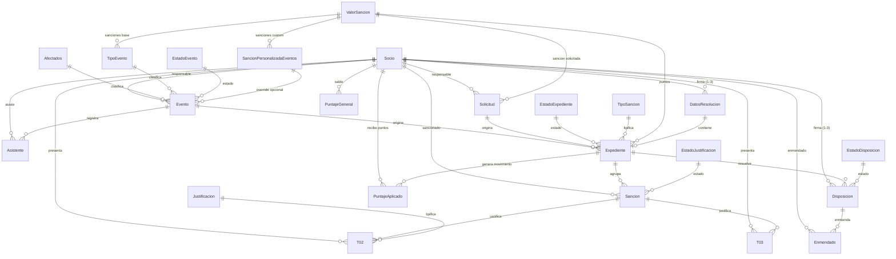

# Módulo Tribunal de Disciplina — Stack Tecnológico y Estructura de Datos

Documento de referencia técnica para el equipo encargado, en el marco del proyecto de Tesina sobre la plataforma web de gestión del Tribunal de Disciplina de A.V.E.I.T.

---

## 1. Stack Tecnológico

### Backend

| Componente | Tecnología | Versión |
|---|---|---|
| Lenguaje | Python | 3.5 (imagen Docker de producción `python:3.5-slim`) |
| Framework web | Django | 2.2.4 |
| API REST | Django REST Framework | 3.10.1 |
| Base de datos | MySQL | (vía `mysqlclient`) |
| CORS | django-cors-headers | — |
| Logging en BD | django-db-logger | — |
| Utilidades de modelos | django-model-utils | — |
| Generación de PDFs | LaTeX (texlive-latex-base, texlive-lang-spanish, texlive-latex-extra, texlive-pstricks, texlive-science) + paquete `latex` | — |
| Notificaciones | slacker (Slack), correo electrónico (Django mail) | — |
| Series temporales / métricas | influxdb | — |
| Almacenamiento externo | dropbox | — |
| Procesamiento de datos | pandas | 0.25.3 |
| Lectura de Excel | xlrd | ≥ 1.0.0 |
| Reintentos | retrying | 1.3.3 |
| Contenerización | Docker (`Dockerfile`) | Debian buster (archive) |

### Frontend

| Componente | Tecnología | Versión |
|---|---|---|
| Framework | Angular | 9.1.13 |
| CLI / Build | @angular/cli | 9.1.15 |
| UI Components | Angular Material | 8.0.1 |
| CDK | @angular/cdk | ^8.0.1 |
| Estilos base | Bootstrap + Bootstrap Material Design | 4.3.1 / 4.1.2 |
| Reactive Extensions | RxJS | 6.6.7 |
| Gráficos | Chartist | 0.11.2 |
| Manejo de cookies | ngx-cookie-service | ^2.4.0 |
| Lenguaje | TypeScript | 3.8.3 |
| Runtime Node.js (build) | Node.js | 16.13.2 (`DockerfileAngular`) — motor declarado en `package.json`: 6.11.1 (desactualizado respecto al Dockerfile real) |
| Testing | Karma + Jasmine + Protractor | 4.1.0 / 3.4.0 / 5.4.2 |
| Template previo (legado) | Material Dashboard Angular (plantilla base del proyecto) | 2.3.0 |

> Nota: además del frontend Angular (`angular-src/`), existe una versión legada de paneles servidos como HTML/JS estático (`http_public/panel/tribunal/*`, `controller-tribunal.js`), en proceso de reemplazo por los módulos Angular (`angular-src/src/app/tribunal/*`).

### Infraestructura

- Contenedores separados para backend (`Dockerfile`) y frontend (`DockerfileAngular`).
- Base de datos MySQL (motor `django.db.backends.mysql`), con esquemas separados para ambiente de desarrollo (`settings_local_dev.py`) y producción/AVEIT (`settings_local_aveit.py`).

---

## 2. Estructura de Modelos — App `tribunal` (Django)

Ubicación: `svaveit/tribunal/models.py`. Todas las claves foráneas hacia `Socio` referencian el modelo de socios (`svaveit.socios.models.Socio`).

### 2.1 Catálogos / tablas de referencia

| Modelo | Campos principales | Descripción |
|---|---|---|
| `Afectados` | `idAfectados`, `nombre`, `descripcion` | Subcomisiones/áreas afectadas por un evento (Cómputos, RRHH, Rifas, grupos G53-G56, etc.) |
| `EstadoEvento` | `idEstadoEvento`, `nombre`, `descripcion` | Estados del ciclo de vida de un evento (PorNotificar, Esperando, PorSancionar, Emitido, etc.) |
| `TipoEvento` | `idTipoEvento`, `nombre`, `sancionFalta`, `sancionLeve`, `sancionGrave` (FK a `ValorSancion`) | Tipos de evento (Asamblea, Reunión de Socios, Reunión de Grupo, Limpieza, etc.) con sus sanciones base |
| `TipoSancion` | `idTipoSancion`, `nombre`, `descripcion` | Tipifica la sanción (LlegaTardeGrave/Leve, SaleTempranoGrave/Leve, Ausencia, NoMarcoEntrada/Salida) |
| `EstadoExpediente` | `idEstadoExpediente`, `nombre`, `descripcion` | Los 6 estados oficiales del expediente (Creado, Justificando, EnRevision, PorEmitir, MailPendiente, Emitido) |
| `EstadoJustificacion` | `idEstadoJustificacion`, `nombre`, `descripcion` | Pendiente, EnRevision, Aprobada, Desaprobada |
| `EstadoDisposicion` | `idEstadoDisposicion`, `nombre`, `descripcion` | Creada, Emitida |
| `Justificacion` | `idJustificacion`, `nombre`, `descripcion` | Tipos de justificación (Enfermedad, Laboral, Académico, Viaje, Catástrofe, Gobierno, Deceso, Transporte) |
| `ValorSancion` | `idSancion`, `nombre`, `valor` (float) | Catálogo de valores de puntos (+/-) aplicables |
| `Reglamento` | `idReglamento`, `titulo`, `seccion`, `articulo`, `inciso`, `descripcion` | Artículos del Reglamento Interno citados en resoluciones |

### 2.2 Eventos y asistencia

| Modelo | Campos principales | Descripción |
|---|---|---|
| `SancionPersonalizadaEventos` | `idSancionPersonalizada`, `sancionFaltaPersonalizada`, `sancionLevePersonalizada`, `sancionGravePersonalizada` (FKs a `ValorSancion`) | Permite anular las sanciones por defecto de un `TipoEvento` puntual |
| `Evento` | `idEvento`, `nombre`, `afectados` (FK), `fechaHoraInicio`, `fechaHoraFin`, `tieneHoraFin`, `responsable` (FK Socio), `estadoEvento` (FK), `tipoEvento` (FK), `sancionPersonalizada` (FK opcional), `toleranciaLeveMinutos`, `toleranciaGraveMinutos` | Evento sujeto a control de asistencia. Método `cantidadAsistentes`; helpers `get_sancion_falta/leve/grave()` que resuelven sanción personalizada vs. base |
| `Asistente` | `idAsistente`, `evento` (FK), `socio` (FK), `fechaHoraLlegada`, `fechaHoraSalida`, `notificado`, `fechaNotificacion` | Registro de marcación de entrada/salida de un socio a un evento (lector de huellas) |

### 2.3 Solicitudes, sanciones y expedientes (núcleo del módulo)

| Modelo | Campos principales | Descripción |
|---|---|---|
| `Solicitud` | `idSolicitud`, `fechaHora`, `titulo`, `motivoSancion`, `responsable` (FK Socio), `sancionSolicitada` (FK ValorSancion), `reglamento` | Formulario **T01**: solicitud de premiación/sanción presentada por una autoridad competente |
| `Sancion` | `idSancion`, `socio` (FK), `expediente` (FK), `estadoJustificacion` (FK), `fechaLimiteEnvio`, `notificacionSancion`, `aprobada`, `responsable` (FK Socio) | Sanción individual imputada a un socio dentro de un expediente; controla el plazo perentorio de justificación (5 días hábiles) |
| `Expediente` | `idExpediente`, `nroExpediente` (auto-generado formato `NN/AAAA`), `estadoExpediente` (FK), `solicitud` (FK, nullable — origen por T01), `evento` (FK, nullable — origen por evento/asistencia), `tipoSancion` (FK), `fechaHora` (auto), `puntos` (FK ValorSancion), `dataRes` (FK DatosResolucion) | Expediente disciplinario. Método `generarNroExpediente()` calcula el correlativo anual; puede originarse desde una `Solicitud` (T01) o desde un `Evento` (control de asistencia) |
| `DatosResolucion` | `idDatosResolucion`, `reglamento1/2/3`, `responsable1/2/3` (FK Socio), `responsable1/2/3Text`, `consideracion` | VISTOS/CONSIDERANDOS de la resolución del expediente, con hasta 3 firmantes y 3 artículos reglamentarios citados |
| `T02` | `idT02`, `justificacion` (FK Justificacion), `observacion`, `socio` (FK), `sancion` (FK), `fechaHora`, `justificativo` (FileField) | Formulario **T02**: justificación tipificada con comprobante adjunto |
| `T03` | `idT03`, `justificacion` (texto libre), `socio` (FK), `sancion` (FK), `fechaHora`, `justificativo` (FileField) | Formulario **T03**: descargo extraordinario (justificación no tipificada) |

### 2.4 Disposiciones (resoluciones formales)

| Modelo | Campos principales | Descripción |
|---|---|---|
| `Disposicion` (`db_table: tribunal_disposicion`) | `idDisposicion`, `nroDisposicion` (auto-generado `NN/AAAA`), `expediente` (FK), `fechaHora` (auto), `estadoDisposicion` (FK), `responsable1/2/3` (FK Socio) + `...Text`, `resolucion` (texto), `reglamento` | Resolución oficial emitida sobre un expediente, con firma colegiada (hasta 3 responsables) |
| `Enmendado` (`db_table: tribunal_enmendado`) | `idEnmendado`, `disposicion` (FK), `socio` (FK), `notificado`, `justificacion` | Registro de enmiendas/correcciones sobre una disposición ya emitida |

### 2.5 Cómputo de puntajes (auditoría e inalterabilidad)

| Modelo | Campos principales | Descripción |
|---|---|---|
| `PuntajeAplicado` (`db_table: tribunal_puntajeaplicado`) | `idPuntajeAplicado`, `puntajeAplicado` (float), `socio` (FK), `expediente` (FK, nullable) | Registro transaccional e inmutable de cada movimiento de puntos (+/-) aplicado a un socio, vinculado a su expediente de origen — es la pista de auditoría que reemplaza los `UPDATE` manuales |
| `PuntajeGeneral` (`db_table: tribunal_puntajegeneral`) | `idPuntajeGeneral`, `socio` (FK), `puntos` (float), `felicitaciones` (int), `llamadosAtencion` (int) | Saldo consolidado por socio (ranking general), derivado de la suma de `PuntajeAplicado` |

---

## 3. Relaciones clave (resumen del flujo)

```
Evento ──< Asistente (marca entrada/salida por socio)
Evento ──> TipoEvento ──> ValorSancion (sanciones base)
Solicitud (T01) ──> ValorSancion (sanción solicitada)

Expediente ──> Solicitud (origen T01)  [opcional]
Expediente ──> Evento                  [opcional]
Expediente ──> EstadoExpediente (6 estados oficiales)
Expediente ──> DatosResolucion (VISTOS/CONSIDERANDOS)
Expediente ──> ValorSancion (puntos)
Expediente ──< Sancion ──< T02 / T03 (justificaciones con adjuntos)
Expediente ──< Disposicion ──< Enmendado
Expediente ──< PuntajeAplicado ──> PuntajeGeneral (saldo consolidado)
```

- Un **Expediente** se origina desde una **Solicitud** (T01, iniciada por una autoridad) o automáticamente desde un **Evento** (control de asistencia).
- Cada **Sancion** dentro de un expediente habilita al socio a presentar **T02** (justificación tipificada) o **T03** (descargo extraordinario) dentro del plazo perentorio (`fechaLimiteEnvio`).
- La resolución final se documenta en **DatosResolucion** (contenido) y se formaliza en **Disposicion** (documento numerado, firmado).
- Todo movimiento de puntos queda registrado de forma inmutable en **PuntajeAplicado**, y el saldo vigente se refleja en **PuntajeGeneral** (usado para el ranking y las alarmas de 7/10 puntos).

---

## 4. Diagrama Entidad-Relación



---

## 5. Endpoints de la API (Django REST Framework)

Prefijo base: `/tribunal/` (ver `svaveit/urls.py` → `include('svaveit.tribunal.urls')`).

| Método(s) | Endpoint | Vista | Descripción |
|---|---|---|---|
| GET | `/reglamentos/` | `gestionar_reglamento` | Listado de reglamentos |
| POST, PATCH | `/reglamentos/` | `gestionar_reglamento` | Alta/edición de artículos del reglamento |
| GET | `/reglamentos/permisos` | `permisos_reglamento` | Permisos de edición del reglamento |
| GET, POST, PATCH, DELETE | `/eventos/` | `gestionar_evento` | CRUD de eventos |
| GET | `/afectados/` | `afectados` | Catálogo de subcomisiones/áreas afectadas |
| GET | `/valorsancion/` | `valores_sancion` | Catálogo de valores de sanción |
| GET | `/estadosevento/` | `estados_evento` | Catálogo de estados de evento |
| GET | `/tiposevento/` | `tipos_evento` | Catálogo de tipos de evento |
| POST | `/asistentes/<id_evento>/` | `crear_asistentes` | Registro de asistencia (marcación) a un evento |
| GET, POST, PATCH | `/solicitudes/` | `gestionar_solicitud` | Gestión del formulario **T01** |
| GET | `/missolicitudes/` | `mis_solicitudes` | Solicitudes T01 presentadas por el usuario actual |
| GET | `/misinvolucrados/<id_solicitud>/` | `mis_solicitudes_involucrados` | Socios involucrados en una solicitud T01 |
| GET | `/imprimirt02/<id_t02>` | `imprimir_T02` | Genera PDF (LaTeX) del formulario T02 |
| GET | `/imprimirt03/<id_t03>` | `imprimir_T03` | Genera PDF (LaTeX) del formulario T03 |
| GET | `/imprimirres/<id_expediente>` | `imprimir_res` | Genera PDF de la resolución del expediente |
| GET | `/imprimirdisp/<id_disposicion>` | `imprimir_disp` | Genera PDF de la disposición |
| GET | `/justificaciones/` | `justificaciones_a_aprobar` | Listado de justificaciones pendientes de revisión |
| GET, POST | `/justificaciones/t02/` | `creacion_T02` | Alta de justificación tipificada (T02) |
| GET, POST, PATCH | `/justificaciones/t03/` | `creacion_T03` | Alta de descargo extraordinario (T03) |
| GET, PATCH | `/justificaciones/t02/<id_expediente>` | `gestionar_t02` | Revisión/aprobación de T02 por expediente |
| GET, PATCH | `/justificaciones/t03/<id_expediente>` | `gestionar_t03` | Revisión/aprobación de T03 por expediente |
| GET | `/justificaciones/tipos/` | `tipos_justificaciones` | Catálogo de tipos de justificación |
| GET, POST | `/justificaciones/archivo/<idTipoFormulario>/<idFormulario>/` | `justificativo_archivo` | Descarga/carga de comprobantes adjuntos (T02/T03) |
| GET, PATCH | `/eventoshorafin/` | `definir_hora_fin` | Carga de hora de finalización de un evento |
| GET | `/expedientes/<id_estado_expediente>` | `gestionar_expedientes` | Tablero: expedientes filtrados por estado |
| GET | `/expedientes/estados/` | `estado_expedientes` | Catálogo de estados de expediente |
| POST | `/expedientes/filtrar/` | `expedientes_filtrar` | Buscador de expedientes (por socio, legajo, subcomisión, etc.) |
| GET | `/expedientes/sanciones/<id_expediente>/` | `sanciones_expediente` | Sanciones asociadas a un expediente |
| GET | `/expedientes/enmendados/<id_expediente>/` | `disposiciones_expediente` | Disposiciones/enmiendas de un expediente |
| GET | `/sanciones/` | `sanciones_socio` | Sanciones de un socio |
| GET | `/misjustificaciones/` | `mis_justificaciones` | Justificaciones presentadas por el usuario actual |
| GET, POST, PATCH | `/disposiciones/` | `gestionar_disposicion` | Gestión de disposiciones (resoluciones formales) |
| POST, PATCH | `/resolucion/` | `resolucion` | Carga/edición de VISTOS y CONSIDERANDOS (`DatosResolucion`) |
| GET | `/puntaje/<nro_socio>/` | `puntaje` | Saldo de puntos consolidado de un socio (ranking individual) |

---

